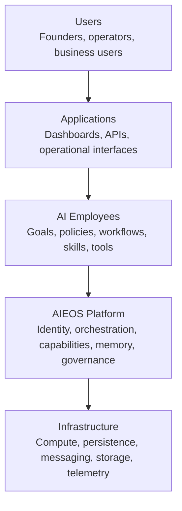

# Engineering Blueprint

## Purpose

This is the master architecture document for AIEOS Version 1. It defines the platform's layers, core responsibilities, dependency boundaries, principles, intentional exclusions, and architectural success criteria. [System Architecture](SystemArchitecture.md) describes the corresponding actors, system interactions, trust boundaries, and operating qualities.

## What is AIEOS?

AIEOS—the AI Employee Operating System—is a reusable platform for defining, running, governing, observing, and improving autonomous AI Employees. It combines probabilistic AI capabilities with deterministic control of identity, permissions, workflow state, validation, external effects, and auditability.

An **AI Employee** is a goal-directed application that owns a bounded business responsibility. It combines workflows, skills, memory, policies, and tools, and is measured by an operating outcome.

AIEOS is not the YouTube Employee. The **YouTube Employee** is the first application built on AIEOS and the evidence source for deciding which platform capabilities deserve implementation. AIEOS must remain reusable in its boundaries, but Version 1 work is justified by the needs of one internal YouTube news channel, not hypothetical future employees.

## Core terminology

| Term | Definition |
| --- | --- |
| **Platform** | Shared control and execution capabilities used by AI Employee applications. |
| **Employee** | A bounded application responsible for a measurable business outcome. |
| **Workflow** | A versioned, resumable definition of ordered and conditional work. |
| **Skill** | A reusable, bounded unit of behavior with an explicit contract. |
| **Capability** | A provider-neutral description of an ability required by a skill or workflow. |
| **Service** | A logical owner of a platform responsibility and its contracts; it need not be a separately deployed process. |
| **Tool** | A controlled interface through which an AI Employee reads data or causes an external effect. |

## Layered architecture

### Users

People define goals, policies, permissions, approvals, and acceptable outcomes. They inspect evidence, handle escalations, and remain accountable for granting consequential authority.

### Applications

Applications expose user and system interfaces without owning orchestration or AI-provider behavior. They translate authenticated intent into platform commands and present state, evidence, costs, and required action.

### AI Employees

Each Employee packages domain-specific goals, policies, workflows, skills, tools, and success measures. Employees use platform contracts and do not reach directly into platform persistence or provider implementations.

### AIEOS Platform

The platform governs execution: identity, scope, workflow state, capability resolution, model access, memory, events, schedules, validation, observability, and notifications. Shared services remain logically separated inside a Version 1 modular monolith.

### Infrastructure

Infrastructure supplies compute, durable data, object storage, messaging primitives, secrets, networking, and telemetry transport. It implements platform needs without defining business behavior. Vendor selection remains outside this blueprint.

## Core platform components

The following are logical services. Version 1 does not require separate deployments.

### Authentication

- **Responsibility:** Establish and verify human and service identity; manage authentication sessions and credential lifecycle boundaries.
- **Inputs:** Credentials, identity-provider assertions, session renewal and revocation requests.
- **Outputs:** Verified identity context, session state, authentication audit events.
- **Dependencies:** Configuration, secure credential storage, Logging; an external identity provider when selected.
- **Must never:** Decide business authorization, expose credentials to AI context, or treat model output as identity proof.

### Workspace

- **Responsibility:** Own the organizational boundary for users, Employees, channels, policies, resources, and permissions, even while Version 1 exposes one workspace.
- **Inputs:** Authenticated actor, workspace commands, membership and policy changes.
- **Outputs:** Workspace context, resource ownership, authorization decisions or policy references, lifecycle events.
- **Dependencies:** Authentication, Configuration, Logging.
- **Must never:** Execute workflows, call AI providers, or bypass resource ownership because Version 1 has one user.

### Manager

- **Responsibility:** Interpret an Employee goal within policy, choose or adjust approved workflows, coordinate progress, and decide bounded recovery or escalation.
- **Inputs:** Employee goals, workflow state, events, policy, memory, analytics summaries, failure information.
- **Outputs:** Workflow commands, approved decisions with evidence, escalation requests, decision events.
- **Dependencies:** Workflow Engine, Capability Registry, Skill Registry, Memory Service, Analytics, Configuration.
- **Must never:** Directly perform every skill, grant itself authority, mutate durable state outside owning services, or override deterministic safety gates.

### Workflow Engine

- **Responsibility:** Orchestrate versioned workflow definitions; own durable workflow state, transitions, checkpoints, retry decisions, cancellation, and compensation.
- **Inputs:** Start, pause, resume, cancel, and transition commands; events; workflow definitions; validated task results.
- **Outputs:** Task execution commands to Skill Runtime, state and workflow lifecycle events, checkpoint records, typed failures.
- **Dependencies:** Skill Runtime, Event Bus, Scheduler, Configuration, Logging.
- **Must never:** Execute Skills, call the AI Gateway or Tools directly, embed domain content generation, infer permissions from prompts, or report completion before required durable effects are confirmed.

### Capability Registry

- **Responsibility:** Define provider-neutral capabilities and resolve eligible implementations against requirements such as modality, quality, policy, availability, and cost limits.
- **Inputs:** Capability definitions, implementation metadata, resolution constraints, health and policy signals.
- **Outputs:** A selected eligible implementation or an explicit unavailable result; resolution evidence.
- **Dependencies:** AI Gateway, Skill Registry, Configuration, Analytics.
- **Must never:** Execute workflows, silently select an implementation that weakens required policy, or promise provider interchangeability that contracts do not support.

### Skill Registry

- **Responsibility:** Catalog versioned skills, their input/output contracts, required capabilities, permitted tools, owners, and compatibility status.
- **Inputs:** Skill definitions, versions, evaluation status, lifecycle changes.
- **Outputs:** Resolved skill definition, contract metadata, compatibility and availability events.
- **Dependencies:** Capability Registry, Configuration, Logging.
- **Must never:** Execute Skills, store workflow instance state, dispatch tasks, or let a Skill expand its own permissions. It owns metadata and catalog lifecycle only.

### Skill Runtime

- **Responsibility:** Execute versioned Skills within a restricted execution context while enforcing their approved contracts, capabilities, Tools, limits, and correlation requirements.
- **Inputs:** Task execution commands from the Workflow Engine; approved Skill identifier and version; validated task input; execution policy; timeout, cancellation, idempotency, and correlation context.
- **Outputs:** Typed Skill results or failures; validated output; usage and correlation metadata; task started, completed, failed, timed-out, and cancelled lifecycle events.
- **Dependencies:** Skill Registry, Capability Registry, AI Gateway, Event Bus, Configuration, Logging, and controlled Tools.
- **Must never:** Define workflow order or durable workflow state, change retry policy, execute an unapproved Skill version, expand a Skill's permissions, invoke undeclared capabilities or Tools, bypass input or output validation, expose credentials, or bypass platform authorization and safety controls.

The Skill Runtime resolves the approved definition from the Skill Registry before execution, validates inputs against that definition, and constrains the execution context to declared capabilities and Tools. It invokes the AI Gateway or controlled third-party Tools as permitted, validates the result, and publishes correlated task lifecycle events. Timeout, cancellation, and retry-safe behavior apply at the execution-attempt boundary; the Workflow Engine remains responsible for workflow-level retry decisions and state transitions.

### AI Gateway

- **Responsibility:** Provide normalized access to approved AI capabilities, including request validation, provider adaptation, model configuration, structured response handling, usage accounting, bounded retries, and policy-compliant fallback.
- **Inputs:** Capability request, prompt identifier and version, validated context, output schema, execution constraints.
- **Outputs:** Normalized structured result or typed failure; usage, latency, provider, model, and policy metadata.
- **Dependencies:** Capability Registry, Configuration, Analytics, Logging, external AI providers.
- **Must never:** Own workflow or business rules, expose provider credentials, accept provider output without validation, or weaken safety during fallback.

### Memory Service

- **Responsibility:** Own durable operational, business, and AI-context memory as logical domains; enforce provenance, access, retention, and retrieval contracts.
- **Inputs:** Authorized write, retrieval, update, archival, and deletion requests with provenance and scope.
- **Outputs:** Scoped memory records, retrieval results, lifecycle and audit events.
- **Dependencies:** Authentication and Workspace context, Configuration, Logging, durable storage.
- **Must never:** Treat retrieved content as trusted instruction, provide cross-workspace data, become an unbounded transcript store, or make business decisions.

### Event Bus

- **Responsibility:** Deliver versioned domain and workflow events, preserve correlation and causation, and support duplicate-safe consumption and failure handling.
- **Inputs:** Validated event envelopes from authorized producers.
- **Outputs:** Events to subscribed consumers, delivery outcomes, retry and dead-letter records.
- **Dependencies:** Configuration, Logging, messaging persistence appropriate to delivery guarantees.
- **Must never:** Contain business decisions, guarantee global ordering without an explicit contract, or use events as unvalidated data dumps.

### Scheduler

- **Responsibility:** Create time-based workflow commands and delayed retries using explicit schedules, time zones, deduplication, and misfire policy.
- **Inputs:** Schedule definitions, activation state, delayed-work requests, calendar and time context.
- **Outputs:** Idempotent due commands, schedule lifecycle events, missed-run status.
- **Dependencies:** Workflow Engine, Event Bus, Configuration, durable schedule storage.
- **Must never:** Execute domain skills, publish content directly, or create duplicate work after restart.

### Analytics

- **Responsibility:** Collect and derive operational, cost, quality, and product-performance measures with declared provenance and definitions.
- **Inputs:** Platform events, workflow outcomes, provider usage, external performance data, metric definitions.
- **Outputs:** Metrics, aggregates, reports, cost attribution, decision-support summaries.
- **Dependencies:** Event Bus, Configuration, external analytics sources, analytical storage.
- **Must never:** Become the authoritative workflow state, silently change success definitions, or let correlation be presented as causal proof.

### Notification

- **Responsibility:** Deliver policy-approved informational, approval, escalation, and incident messages through configured channels.
- **Inputs:** Notification command, recipient and channel policy, template, priority, correlation context.
- **Outputs:** Delivery status, receipt where supported, failure and escalation events.
- **Dependencies:** Authentication and Workspace context, Configuration, Event Bus, external communication providers.
- **Must never:** make the underlying decision, expose protected context unnecessarily, or treat message delivery as approval.

### Logging

- **Responsibility:** Capture structured diagnostic and audit-relevant records with correlation, access controls, redaction, and retention boundaries.
- **Inputs:** Structured log, trace, decision-summary, and audit events.
- **Outputs:** Searchable operational evidence, security records, alert inputs, retention actions.
- **Dependencies:** Configuration, telemetry and durable audit storage.
- **Must never:** store secrets, unrestricted model context, or unnecessary personal data; replace authoritative domain state; or claim hidden model reasoning.

### Configuration

- **Responsibility:** Own versioned, validated settings, policies, feature controls, provider eligibility, limits, and environment-specific values excluding secret material itself.
- **Inputs:** Authorized configuration changes, schemas, activation and rollback commands.
- **Outputs:** Validated configuration snapshots, change and activation events, typed validation failures.
- **Dependencies:** Authentication and Workspace context, secure secret references, Logging.
- **Must never:** contain source-code behavior, expose secret values, permit unreviewed production changes, or use unsafe implicit defaults.

## Architectural principles

### Modular monolith in Version 1

Core services are modules with explicit ownership and contracts but initially share one deployable boundary. This minimizes distributed-system overhead while preserving extraction paths if measured scale, isolation, or team ownership later requires them.

### Event-driven coordination

Events communicate completed facts and decouple long-running workflow stages. This enables observation, retries, and future consumers. Commands remain explicit requests to one owner; event-driven does not mean every interaction must be asynchronous.

### Provider-agnostic AI

Employees request capabilities rather than vendor models. The AI Gateway contains provider differences. This reduces strategic dependency while avoiding premature implementation of providers that are not needed.

### Stateless services

Runtime instances do not rely on process-local state between requests or tasks. Durable state belongs to an owning service. This supports recovery, repeatability, and horizontal scaling. Caches may improve performance but never become the sole record.

### Capability-based skills

A skill declares the capability it needs and its explicit contract. This separates reusable behavior from a provider and distinguishes a Skill from the Employee and Workflow that compose it.

### Human approval when required

Risk policy determines approval, not a model's preference. Approval is a first-class, auditable workflow state for public, irreversible, uncertain, or high-impact actions. Autonomy expands only with evidence.

### Resumable workflows

Checkpoints, idempotency, bounded retries, and compensation prevent one failure from restarting completed expensive work or duplicating external effects.

### Explicit contracts

Commands, events, skills, tools, memory, and provider results use typed, versioned schemas and stable error semantics. Explicit contracts make validation, testing, compatibility, and ownership possible.

### Replaceability

Volatile providers and infrastructure remain behind owned boundaries, and data remains portable where risk warrants it. Replaceability is demonstrated through contracts and tests, not layers without alternatives.

### Security by design

Identity, least privilege, trust-boundary validation, credential isolation, auditability, and safe failure are architectural responsibilities. AI content is untrusted and cannot expand authority.

## Version 1 scope and exclusions

Version 1 supports one founder, one logical workspace, one YouTube Employee, and one internal news channel. The data model may preserve ownership boundaries, but the product will not expose unused SaaS complexity.

| Excluded capability | Reason for postponement |
| --- | --- |
| Multi-region deployment | No validated availability or latency need justifies consistency and operational complexity. |
| Kubernetes or equivalent orchestration platforms | A single modular deployment can validate the workflow with lower operating cost. |
| Distributed microservices | Logical boundaries are sufficient until scale, isolation, or team ownership provides evidence for extraction. |
| Multi-tenant SaaS | Internal operation must validate the product promise before tenant isolation, onboarding, and support are built. |
| Enterprise RBAC | Version 1 needs explicit least-privilege roles, not an enterprise policy product. |
| Billing and subscriptions | Pricing and operating economics are not validated, and there are no external customers in Version 1. |
| Employee or skill marketplace | Discovery, trust, compatibility, and commercial requirements are premature. |
| Autonomous self-modifying agents | Unreviewed modification conflicts with controlled releases, evaluation, auditability, and safe rollback. |
| Multi-region disaster recovery | Backup and recoverability will be defined proportionally; active multi-region operation is not yet justified. |
| General-purpose vector infrastructure | Add semantic retrieval only when a measured use case exceeds structured and full-text retrieval. |
| Support for every AI provider | The boundary is provider-neutral, but integrations are added only for capability, cost, or resilience needs. |
| Sophisticated autonomous learning | Version 1 collects signals; behavior changes remain reviewed and versioned until evidence supports controlled automation. |

## Architecture v1 success criteria

Architecture v1 is successful when:

- a new contributor can distinguish Platform, Employee, Workflow, Skill, Capability, Service, and Tool;
- every core responsibility has one logical owner and prohibited behavior is clear;
- the YouTube Employee can be specified without embedding provider or infrastructure choices in its domain design;
- long-running work can checkpoint, resume, retry safely, and avoid duplicate external effects;
- commands, events, tool calls, AI outputs, and memory cross explicit validation and trust boundaries;
- identity, authorization, approval, audit, observability, and cost attribution are designed into consequential workflows;
- the modular monolith can implement the first internal product without distributed-system requirements;
- detailed API and database designs can be derived without contradicting company strategy or the handbook;
- excluded capabilities remain excluded unless evidence and an ADR justify them; and
- a future Employee could reuse proven platform contracts without requiring the first product to build speculative features.

Approval of this blueprint freezes responsibilities and principles, not technologies. Material changes after approval require an ADR as described in the [Architecture overview](README.md).
