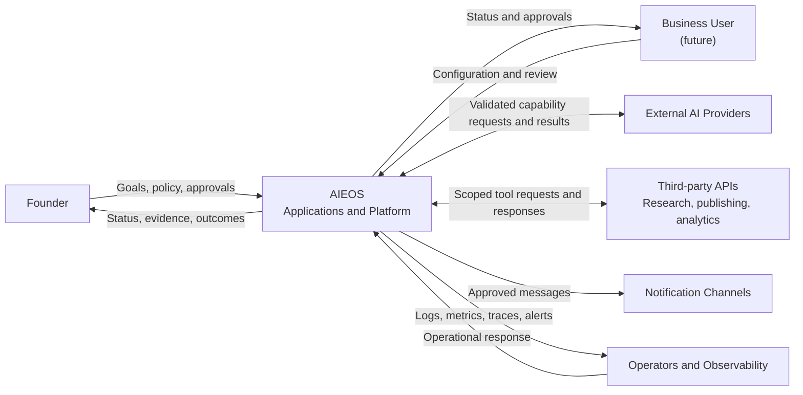
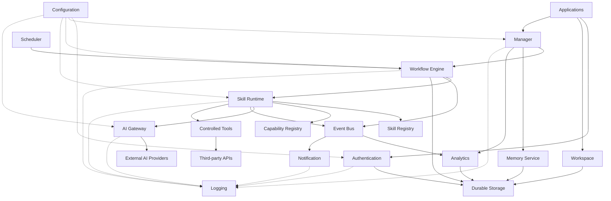
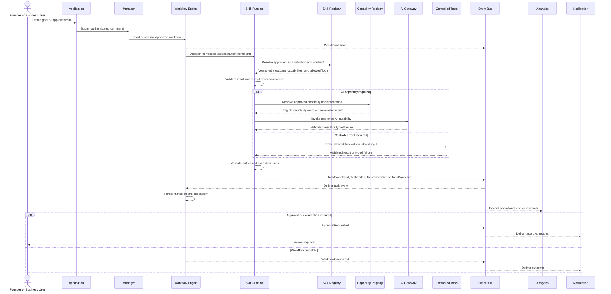

# System Architecture

## Purpose

This document describes AIEOS as a complete system: its actors, major systems, communication model, trust boundaries, and non-functional expectations. It complements the component ownership defined in the [Engineering Blueprint](EngineeringBlueprint.md).

## Actors

### Founder

The initial accountable operator. The Founder defines the first Employee's goals, editorial boundaries, credentials, budgets, schedules, approval policy, and success criteria. The Founder reviews escalations and grants or revokes consequential authority.

### Business User

A future authorized person who configures an Employee, reviews status and evidence, responds to approvals, and evaluates business outcomes. Version 1 has no external Business User, but the actor clarifies that user interaction is separate from platform execution.

### AI Employee

A domain application responsible for a bounded outcome. It composes approved Workflows, Skills, Capabilities, Memory, and Tools under platform policy. It is not a person, security principal with inherent rights, AI provider, or single model invocation.

### Platform Services

Logical services that authenticate actors, govern workspaces, manage and execute workflows, resolve skills and capabilities, access AI providers, store memory, deliver events, schedule work, measure outcomes, notify people, and enforce configuration and audit rules.

### External Systems

Systems outside AIEOS control, including AI providers, identity providers, content and research sources, YouTube and other third-party APIs, notification channels, and analytics sources. Their data, availability, and responses are never implicitly trusted.

## System context

## Major systems

### AI Employees

Employees contain domain-specific goals, policies, workflow selections, skills, tool permissions, and outcome measures. The first is the YouTube Employee. Employees depend on platform contracts and do not own provider adapters, shared identity, or infrastructure.

### Platform

The Platform is the deterministic control and shared execution layer described in the [Engineering Blueprint](EngineeringBlueprint.md). It owns workflow state, authorization enforcement, capability resolution, memory boundaries, events, schedules, AI access, observability, and notifications.

### Storage

Storage provides durable records for identity references, workspace ownership, definitions, workflow instances and checkpoints, memory domains, assets and metadata, configuration versions, analytics, and audit evidence. Object and analytical data may use different physical forms, but data has one logical owner and lifecycle.

Storage is infrastructure, not a shared bypass around service contracts. Version 1 may use physically shared persistence while preserving logical access boundaries.

### External AI providers

External AI providers supply reasoning, text, image, speech, audio, video, or other model capabilities. AIEOS accesses them through the AI Gateway. Requests are scoped and policy-checked; results are normalized, validated, measured, and treated as untrusted.

### Third-party APIs

Third-party APIs supply research, publishing, analytics, identity, or communication functions. Access occurs through controlled Tools or platform adapters with scoped credentials, timeouts, idempotency where available, validation, and audit records.

### Observability

Observability collects correlated logs, metrics, traces, AI execution metadata, cost, and audit evidence. It supports diagnosis and accountability but does not become authoritative workflow or business state. Details follow the [Observability standard](../02-engineering-handbook/Observability.md).

### Security

Security is a cross-cutting control system: identity, authorization, credential isolation, trust-boundary validation, approval, data protection, auditability, and incident response. It is enforced by owning components, not delegated to a model or isolated in one security module. See [Security](../02-engineering-handbook/Security.md).

## Component relationships

Solid lines represent primary commands, events, or controlled data access. Dotted lines represent configuration or telemetry relationships. The Workflow Engine dispatches tasks and owns orchestration state; the Skill Runtime resolves approved Skill metadata, enforces the permitted execution context, and performs the task. The Skill Registry remains a catalog and does not execute Skills. The diagram shows logical relationships, not deployment units or direct database permissions.

## Communication model

### Synchronous requests

Use synchronous request-response communication when the caller needs an immediate validation, query, authorization result, or short operation. The caller sets a timeout and receives a typed result or failure. Synchronous calls must not create hidden, unbounded chains.

Typical examples include authentication, reading workflow status, resolving a Skill definition, checking policy, or validating a command.

### Event-driven communication

An event is a versioned statement that a fact has occurred. The owning component publishes it after the relevant state is durable. Consumers process events independently and tolerate duplicate delivery according to contract.

Events support workflow progression, analytics, notification, audit, and extensibility. They do not replace commands: a request to perform work goes to one responsible owner, while the resulting fact may have many consumers.

### Asynchronous workflows and long-running jobs

Media generation, research, review, publication, and analytics collection may outlive a user request or process. The Workflow Engine persists state and dispatches a correlated task execution command to the Skill Runtime. The Skill Runtime resolves the approved Skill definition, enforces allowed capabilities and Tools, validates inputs and outputs, and publishes task lifecycle events. The Workflow Engine progresses durable state only from validated results or events. Clients observe durable state instead of holding connections open indefinitely.

Each task defines timeout, retry eligibility, maximum attempts, idempotency behavior, and terminal outcomes. The Skill Runtime applies timeout, cancellation, correlation, and retry-safe execution within an attempt; the Workflow Engine owns retry decisions and workflow state. Expensive completed work is referenced from a checkpoint rather than regenerated after unrelated failure.

### Failure recovery

Failures are classified as invalid input, denied authority, conflict, transient dependency, permanent dependency, policy failure, or internal failure. Only recoverable failures are retried, with bounded delay. Duplicate commands and events are safe to process. Exhausted work enters an explicit failed or escalated state with evidence.

Recovery may resume from a checkpoint, switch to an eligible provider without weakening policy, compensate an external effect, pause the Workflow, or request human action. The system never reports success merely because a model produced output.

## Event flow overview

## Trust boundaries

### User boundary

Human input is authenticated but not automatically authorized or valid. The platform verifies identity, workspace scope, role or policy, schema, intent, rate and spend constraints, and approval freshness. A user interface cannot enforce security on behalf of the platform.

### Platform boundary

Platform modules trust only validated internal contracts and verified identity context. A module may trust another module to own its declared state, but must not rely on undocumented fields, direct table access, or process-local state. Shared deployment does not remove logical boundaries.

### AI boundary

Prompts, retrieved context, model output, confidence values, and model-selected tool arguments are untrusted. They are schema-validated, policy-checked, provenance-aware where required, and constrained by platform authorization. Models never receive secrets or decide their own permissions.

### External service boundary

Third-party data and availability are untrusted. Requests use scoped credentials, timeouts, limits, and idempotency where supported. Responses are validated for identity, schema, freshness, provenance, and policy needs. Provider success does not prove the business effect occurred; critical effects require confirmation or reconciliation.

## Non-functional requirements

Architecture v1 defines expectations without numerical service-level objectives. Quantitative targets will be added after workflows and operational evidence exist.

### Scalability

Components must remain stateless at runtime where practical, keep durable state in owned domains, and avoid designs that prevent horizontal scaling. Version 1 optimizes for one internal channel and does not introduce distribution solely for theoretical scale.

### Availability

The system must expose health and dependency state, degrade explicitly, and pause unsafe work when required capabilities are unavailable. Availability of the dashboard, workflow execution, and third-party providers may differ and must not be conflated.

### Reliability

Critical workflows require durable state, idempotency, bounded retries, checkpoints, reconciliation for consequential external effects, and explicit terminal states. Recovery behavior is tested, not assumed.

### Security

All trust boundaries enforce authentication where applicable, authorization, least privilege, input and output validation, credential isolation, protected audit evidence, and safe failure. Sensitive data collection and retention are minimized.

### Maintainability

Responsibilities have one logical owner, contracts are explicit, provider details remain at boundaries, and complexity must be justified by a current need. Documentation and ADRs remain aligned with behavior.

### Extensibility

New Employees compose approved Workflows and Skills through platform contracts. New providers implement capability or tool adapters. Extension must not require bypassing authorization, workflow state, or observability.

### Testability

Components support deterministic substitutes for providers, controllable time and events, isolated contract tests, workflow failure simulation, and versioned AI evaluations. Architecture preserves seams without requiring distributed deployment.

### Observability

Commands, state transitions, events, provider calls, external effects, approvals, failures, cost, and outcome measures carry correlation identifiers and appropriate evidence. Diagnostic detail respects data minimization and secret redaction.

## Architecture review questions

- Are actors, responsibilities, and trust boundaries unambiguous?
- Does each interaction have one accountable owner and a suitable communication mode?
- Can long-running work resume without repeating confirmed effects?
- Can models or external content influence authority outside deterministic policy?
- Are data, events, costs, and decisions observable without logging protected content?
- Does the design serve the first Employee without introducing excluded platform scope?
