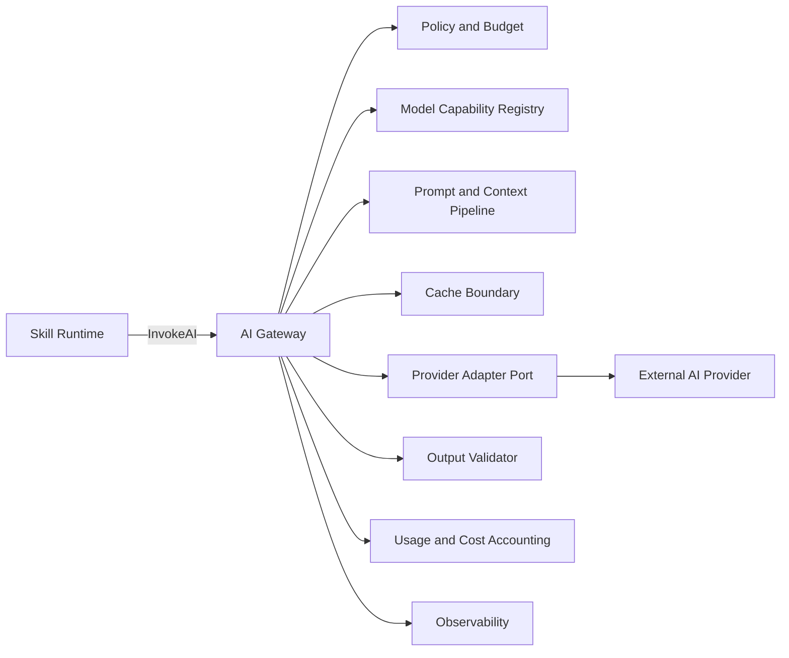
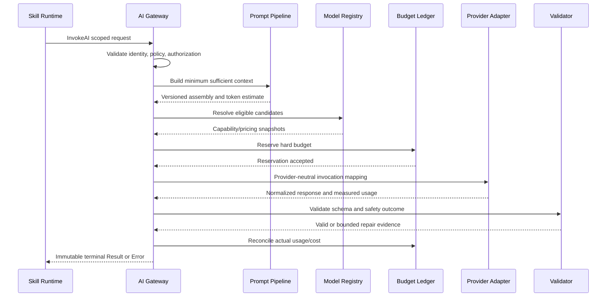
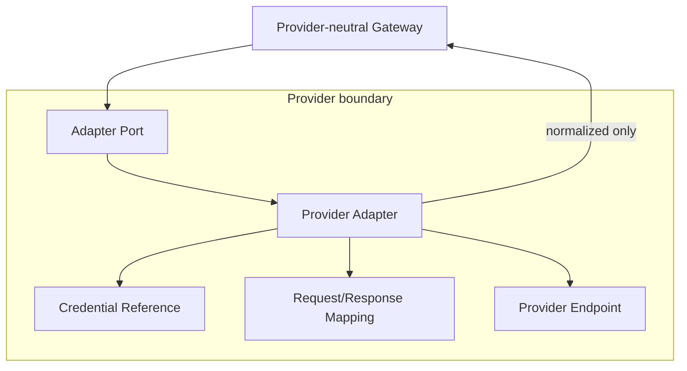
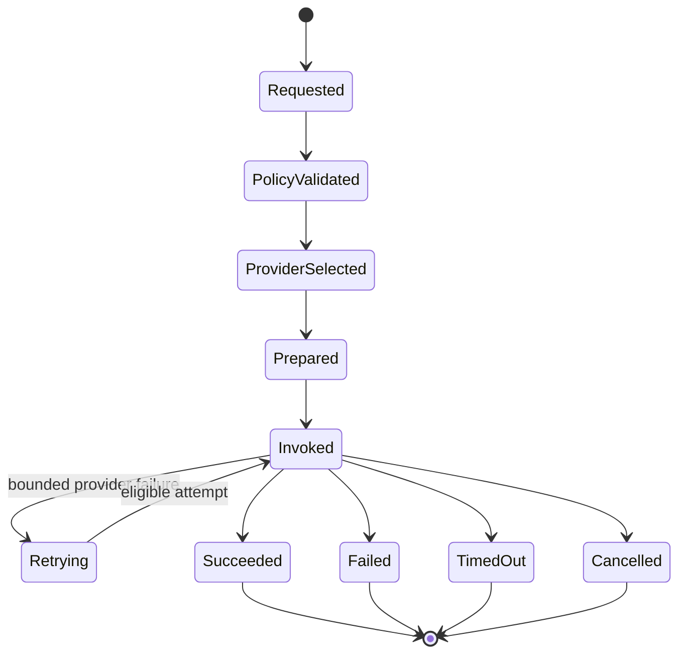
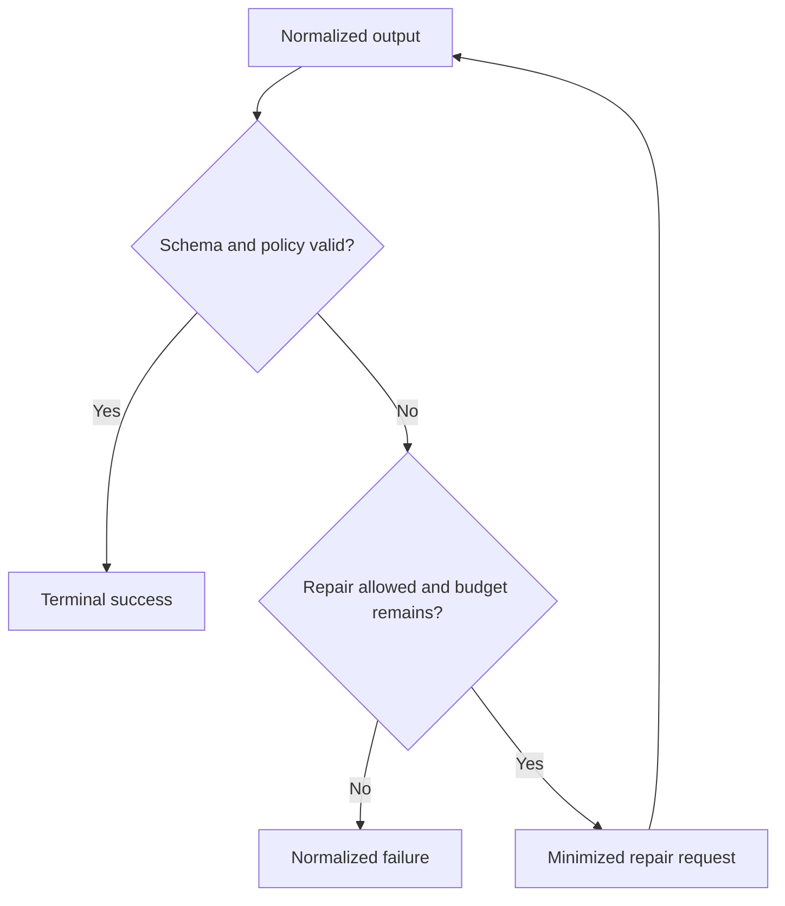
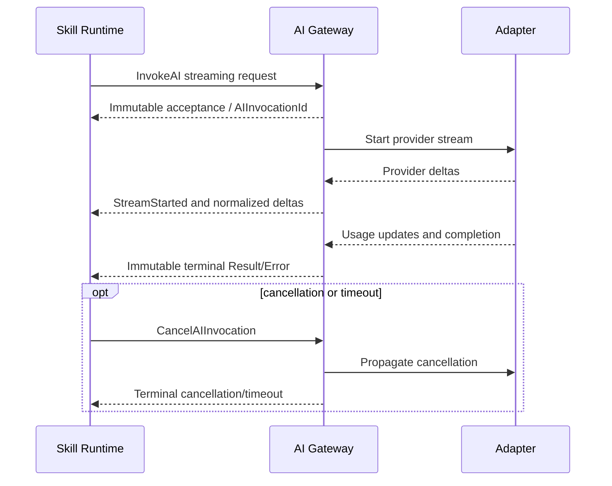
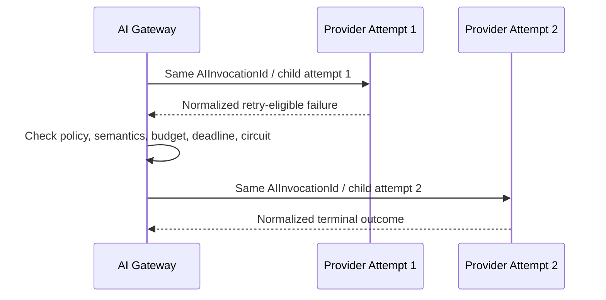

# AI Gateway Architecture v1

## Purpose and authority

This document implements [ES-012](../engineering-specifications/ES-012-AI-Gateway-and-Token-Governance.md) within the frozen [Service Interfaces](../architecture/ServiceInterfaces.md), [Error and Result Model](../architecture/ErrorResultModel.md), and [Observability Model](../architecture/ObservabilityModel.md). It selects no production provider.

## Component boundary

AI Gateway owns provider-neutral invocation acceptance, `AIInvocationId`, policy validation, capability/model resolution, budget reservation, provider adaptation, bounded in-invocation fallback, normalized output/error, usage reconciliation, structured validation, and cancellation/deadline propagation.

It does not own product prompts, Memory, Skill execution, factual verification, workflow progression, or workflow retries.

## End-to-end invocation

## Provider adapter isolation

Adapters own credential use, logical-to-provider model translation, protocol mapping, usage mapping, error translation, streaming conversion, cancellation/timeout, and minimized provider safety metadata. Raw response retention is prohibited by default; an opaque encrypted reference requires explicit diagnostic policy and retention.

## Canonical lifecycle

AI Invocation states remain `Requested`, `PolicyValidated`, `ProviderSelected`, `Prepared`, `Invoked`, `Retrying`, `Succeeded`, `Failed`, `TimedOut`, and `Cancelled`. Provider attempts are child operational records. Their retry/fallback does not create a new `AIInvocationId` or `ExecutionId`.

## Structured output and repair

Repair is finite, separately metered, and cannot weaken the schema or policy. Exhaustion returns an ES-007 failure; Workflow Engine alone decides a workflow retry.

## Streaming contract

Deltas are observations, not authoritative Results. Tool deltas propose arguments only. Late provider data cannot replace a terminal outcome.

## Fallback lineage

Fallback is disabled unless allowed by immutable policy. It has a maximum attempt count and cost ceiling, cannot loop, and cannot relax hard capability, quality, safety, residency, schema, or data-handling constraints.

## Security and failure behavior

- Authorization, Tenant/Workspace scope, data classification, residency, retention compatibility, and budgets fail closed.
- Retrieved/user content is untrusted and cannot change instruction hierarchy or authority.
- Raw prompts/responses and credentials are not logged by default.
- Provider or telemetry failure is normalized without inventing success.
- Accounting reconciliation failure preserves the authoritative provider outcome but creates governed operational evidence; a hard reservation failure prevents invocation.
- Gateway cancellation does not imply provider cancellation until confirmed; terminal semantics follow ES-007.

## Extension and governance

A provider adapter preserving the port is a runtime change with a TDR for its dependency and handling boundary. Any ownership change, new identity, cross-tenant cache, changed retry authority, or provider type leakage requires architecture/contract review.

