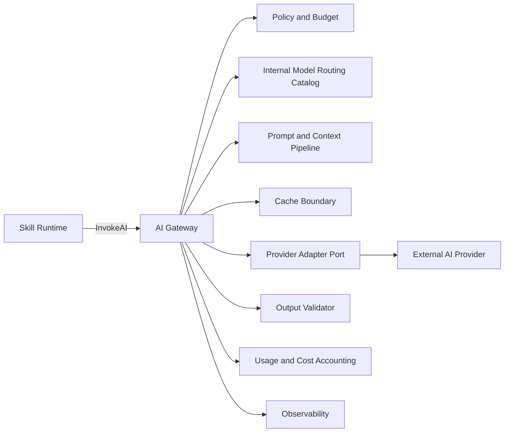
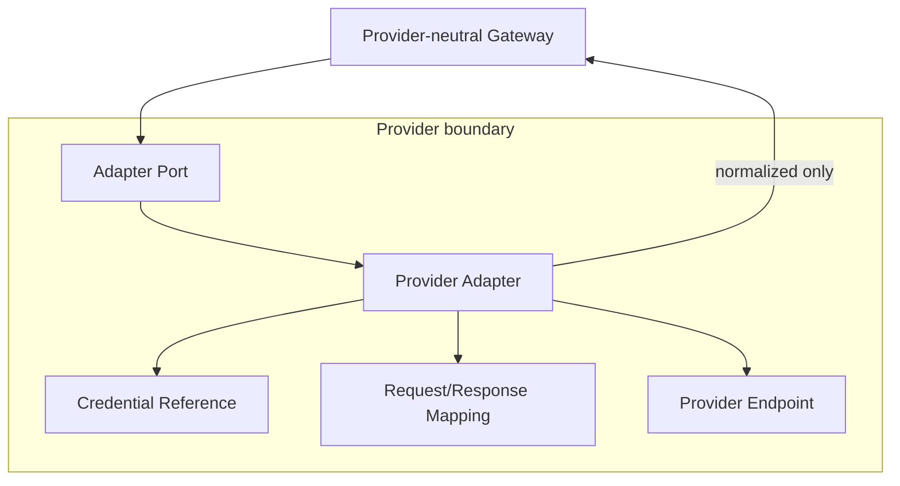
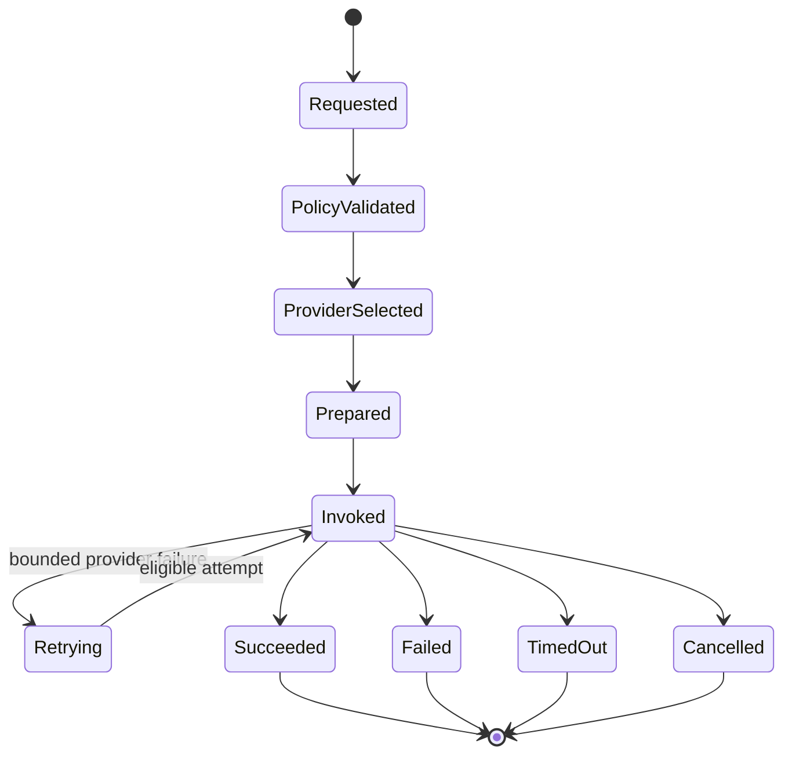
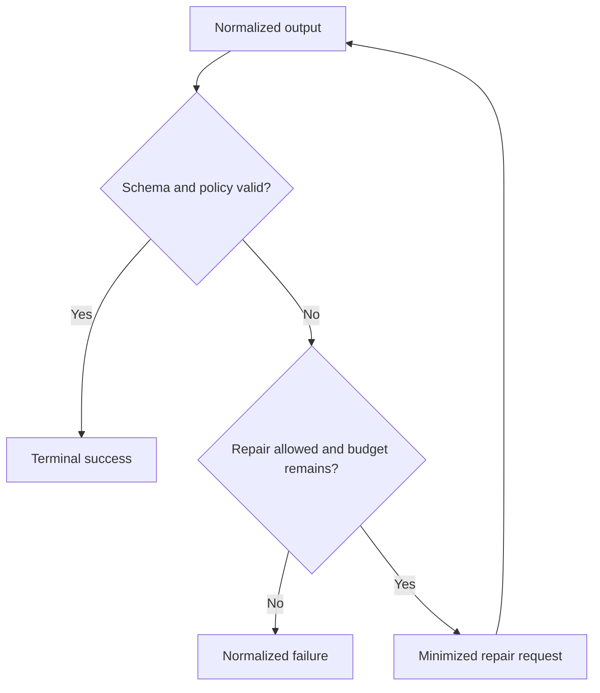
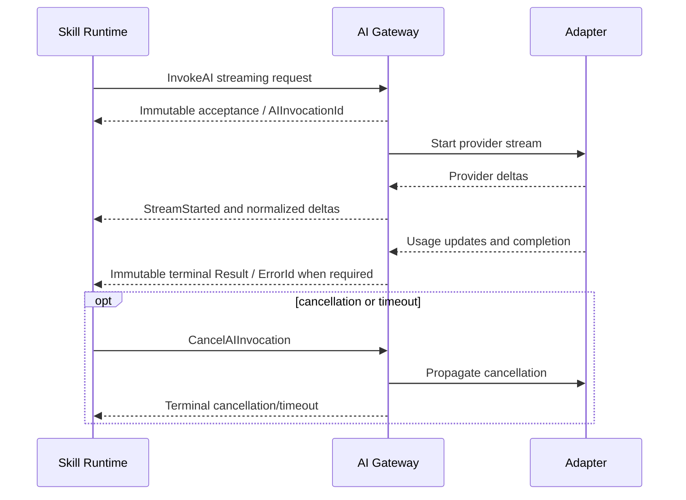
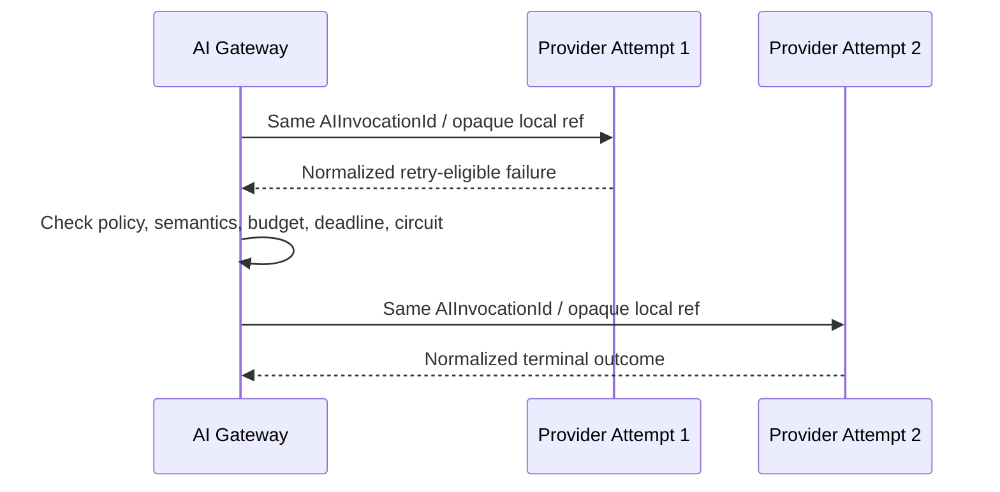

# AI Gateway Architecture v1

## Purpose and authority

This document implements [ES-012](../engineering-specifications/ES-012-AI-Gateway-and-Token-Governance.md) within the frozen [Service Interfaces](../architecture/ServiceInterfaces.md), [Error and Result Model](../architecture/ErrorResultModel.md), and [Observability Model](../architecture/ObservabilityModel.md). It selects no production provider.

## Component boundary

AI Gateway owns provider-neutral invocation acceptance, `AIInvocationId`, policy validation, capability/model resolution, budget reservation, provider adaptation, bounded in-invocation fallback, normalized output/error, usage reconciliation, structured validation, and cancellation/deadline propagation.

It does not own product prompts, Memory, Skill execution, factual verification, workflow progression, or workflow retries.



## End-to-end invocation

```mermaid
sequenceDiagram
    participant S as Skill Runtime
    participant G as AI Gateway
    participant P as Prompt Pipeline
    participant R as Gateway Model Catalog
    participant B as Budget Ledger
    participant A as Provider Adapter
    participant V as Validator
    S->>G: InvokeAI / CommandId + IdempotencyKey
    G->>G: Preflight envelope/schema, scope, admission eligibility
    G->>G: Replay lookup, coarse budget feasibility, admission control
    G->>G: Accept and create AIInvocationId
    G-->>S: Immutable Accepted Result / AIInvocationId
    G->>G: Requested to PolicyValidated
    G->>P: Resolve cache; build minimum sufficient context
    P-->>G: Versioned assembly and context-dependent estimate
    G->>R: Select final eligible model/provider
    R-->>G: Capability/pricing snapshots
    G->>G: PolicyValidated to ProviderSelected
    G->>B: Durably reserve all hard scopes under AIInvocationId
    B-->>G: Reservation accepted
    G->>A: Prepare provider-neutral invocation
    G->>G: ProviderSelected to Prepared
    G->>A: Provider-neutral invocation mapping
    A-->>G: Normalized response and measured usage
    G->>V: Validate schema and safety outcome
    V-->>G: Valid or bounded repair evidence
    G->>B: Reconcile actual usage/cost
    G-->>S: Immutable terminal Result / ErrorId when required
```

## Provider adapter isolation



Adapters own credential use, logical-to-provider model translation, protocol mapping, usage mapping, error translation, streaming conversion, cancellation/timeout, and minimized provider safety metadata. Raw response retention is prohibited by default; an opaque encrypted reference requires explicit diagnostic policy and retention.

## Canonical lifecycle

AI Invocation states remain `Requested`, `PolicyValidated`, `ProviderSelected`, `Prepared`, `Invoked`, `Retrying`, `Succeeded`, `Failed`, `TimedOut`, and `Cancelled`. `Requested` begins when Gateway atomically accepts the request and creates `AIInvocationId`. Pre-acceptance preflight is limited to envelope/schema validation, Tenant/Workspace scope validation, admission eligibility, idempotency/replay lookup, coarse budget feasibility, and minimal admission control required by frozen contracts. It does not assemble context or prompts, make a final model/provider selection, reserve durable budget, prepare or create a provider attempt, perform context-dependent full token estimation, or evaluate accepted-lifecycle policy. Provider attempts are implementation-local operational records with optional opaque references; their retry/fallback creates no canonical child identity and no new `AIInvocationId` or `ExecutionId`.

After acceptance, Gateway follows the lifecycle exactly once: it validates accepted-lifecycle policy, resolves content caches and assembles/budgets context, selects the final model/provider, durably reserves hierarchical budget under `AIInvocationId`, prepares the provider request, and invokes. A post-acceptance reservation failure transitions the invocation to `Failed` and produces the immutable ES-007 terminal `Result` referencing its `ErrorId`; it grants no workflow-retry authority to Gateway.



## Structured output and repair



Repair is finite, separately metered, and cannot weaken the schema or policy. Exhaustion returns an ES-007 failure; Workflow Engine alone decides a workflow retry.

## Streaming contract



Deltas are observations, not authoritative Results. Tool deltas propose arguments only. Late provider data cannot replace a terminal outcome.

## Fallback lineage



Fallback is disabled unless allowed by immutable policy. It has a maximum attempt count and cost ceiling, cannot loop, and cannot relax hard capability, quality, safety, residency, schema, or data-handling constraints.

## Security and failure behavior

- Authorization, Tenant/Workspace scope, data classification, residency, retention compatibility, and budgets fail closed.
- Retrieved/user content is untrusted and cannot change instruction hierarchy or authority.
- Raw prompts/responses and credentials are not logged by default.
- Provider or telemetry failure is normalized without inventing success.
- Accounting reconciliation failure preserves the authoritative provider outcome but creates governed operational evidence; a post-acceptance hard reservation failure prevents provider invocation and terminates the accepted invocation through ES-007 Result/Error semantics.
- Gateway cancellation does not imply provider cancellation until confirmed; terminal semantics follow ES-007.

## Extension and governance

A provider adapter preserving the port is a runtime change with a TDR for its dependency and handling boundary. Any ownership change, new identity, cross-tenant cache, changed retry authority, or provider type leakage requires architecture/contract review.

The model routing catalog is an internal AI Gateway data port with Gateway-owned reviewed updates and atomic version activation. It is neither a platform service nor the frozen Capability Registry, and it does not own product Capability contracts.
