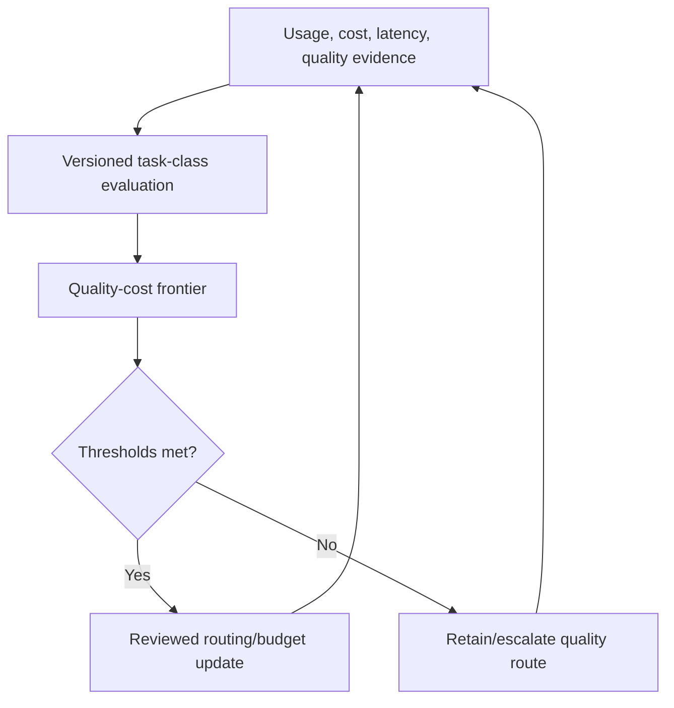

# AI Usage and Cost Accounting

## Purpose

Provide auditable, tenant-scoped estimates, reservations, measured usage, normalized cost, savings, and allocation for every AI decision without making telemetry the source of execution truth.

## Usage record

An immutable usage record contains:

- an implementation-local opaque usage-record reference and `AIInvocationId` (or an existing recorded avoided-invocation decision reference); the opaque reference is not a canonical Domain identity or causation target;
- Tenant/Workspace, Correlation, Workflow, Step, Execution, Skill, Capability, and product/AI Employee allocation references where applicable;
- logical model/version and provider-adapter reference;
- pricing version/effective reference and currency/reference unit;
- measured or estimated input, output, cached, and reasoning tokens with availability/confidence;
- estimated pre-invocation cost and actual normalized post-invocation cost;
- `AIInvocationId` as the authoritative subject for durable reservation replay, recovery, streaming or partial usage updates, reconciliation status, release or expiry, overrun handling, and variance reason; the upstream `CommandId` and scoped `IdempotencyKey` remain admission lineage only, and no canonical reservation identity is introduced;
- cache disposition/savings and context-compression token/cost savings;
- route/budget policy version and decision reason; and
- timestamps, data classification, redaction status, and lineage.

Provider names may be retained as controlled catalog references but not leaked as SDK values or unbounded public metrics.

## Accounting flow

```mermaid
flowchart LR
    ACCEPT["Accepted AIInvocationId"] --> EST["Context-dependent token and cost estimate"]
    EST --> RES["Durable reservation keyed by AIInvocationId"]
    RES --> INV["Provider invocation or accepted cache outcome"]
    INV --> USAGE["Measured/estimated usage"]
    USAGE --> REC["Reconcile reservation"]
    REC --> ALLOC["Allocate workflow/skill/capability/product"]
    ALLOC --> AUDIT["Immutable accounting and safe telemetry"]
```

## Avoided invocation and savings

An avoided-invocation record is created by the accountable Manager/Workflow/Skill/capability owner when deterministic resolution or approved business reuse prevents dispatch to Gateway. It records task class, policy, estimate baseline, reason, and estimated savings as recorded decision evidence without fabricating token usage or an `AIInvocationId`. Gateway exact-cache hits are accepted invocations and therefore do have a new `AIInvocationId` and new Result lineage, while recording zero provider usage.

Before acceptance, `CommandId` and the scoped `IdempotencyKey` support admission checks and replay lookup only: they determine whether the request is new, in progress, completed, or conflicting, and permit only coarse budget-feasibility evaluation without creating a durable reservation. Acceptance atomically creates the Gateway-owned `AIInvocationId`. From that point onward, `AIInvocationId` is the authoritative subject and idempotency key for durable hierarchical reservation, recovery, streaming or partial usage accumulation, actual-cost reconciliation, release or expiry, overrun handling, audit, and observability. `CommandId` and the scoped `IdempotencyKey` are retained solely as upstream request and admission lineage.

A pre-acceptance replay resolves through the scoped `IdempotencyKey`. A post-acceptance recovery resolves the existing `AIInvocationId` and resumes its reservation and reconciliation state. A different `CommandId` replaying the same accepted logical request therefore resolves to the same accepted `AIInvocationId`; it MUST NOT create a second reservation or charge. Reservation under that `AIInvocationId` is atomic across invocation, step, workflow, capability/AI Employee, and Tenant/Workspace scopes. Concurrent attempts cannot overspend, and abandoned reservations expire or release. Actual cost reconciliation is idempotent and monotonic for streams; delayed or missing provider usage retains a conservative estimated charge until evidence arrives. Recovery never double-reserves or double-charges, and a post-acceptance budget failure is represented by an ES-007 terminal Result referencing its Error without provider preparation or Gateway workflow-retry authority.

Compression savings compare approved before/after estimates and include compression cost. Cache savings use the pricing/catalog snapshot that would have routed the request, marked as estimate rather than realized provider billing.

## Unknown usage and pricing changes

If the provider omits usage, the adapter supplies availability status and the approved estimator calculates a conservative amount. Reconciliation remains flagged until authoritative evidence is available or policy closes it as estimated. Historical records retain their pricing version; new pricing creates a new immutable catalog version and never rewrites history.

## Budget failure

Reservation rejection yields a normalized budget Error/Result before provider invocation. Reconciliation overage is recorded and escalated operationally; it does not change an authoritative successful model Result into failure after the fact. Suspected provider/reporting anomalies are quarantined for review and cannot silently increase future budgets.

## Tenant isolation and privacy

All ledgers, reservations, records, queries, caches, and reports require exact Tenant/Workspace scope. Cross-tenant aggregation uses de-identified approved analytics paths. Raw prompts, responses, secrets, PII, and provider credentials are excluded. Cost metadata follows ES-008 classification/redaction rules.

## Metrics and audit

Bounded metrics include normalized cost, tokens, latency, cache rate, avoided invocation rate, context compression, estimate error, budget rejection, fallback, and quality-tier outcome. High-cardinality identities stay in traces/audit records. Mandatory audit acceptance precedes governed budget-policy changes, but accounting observations do not own workflow state or retry decisions.

## Quality-cost review loop

Policy updates require evaluation evidence, accountable approval, versioning, rollback, and staged exposure. Cost savings are invalid if protected accuracy, factuality, safety, compliance, or completeness regresses.

## Retention and compatibility

Retention follows legal, finance, privacy, and tenant policy. Schema versions are explicit; readers tolerate additive fields and reject unknown incompatible major versions. Deletion/anonymization never destroys required financial/audit evidence without approved policy.
