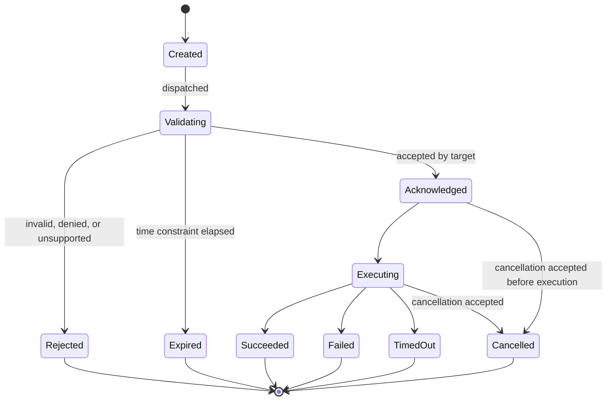
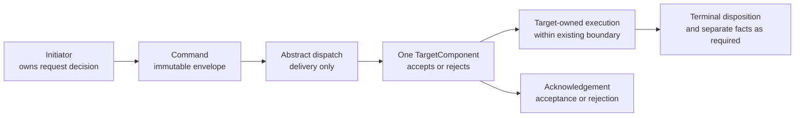
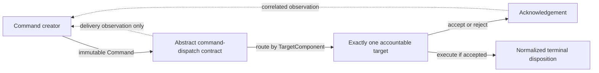
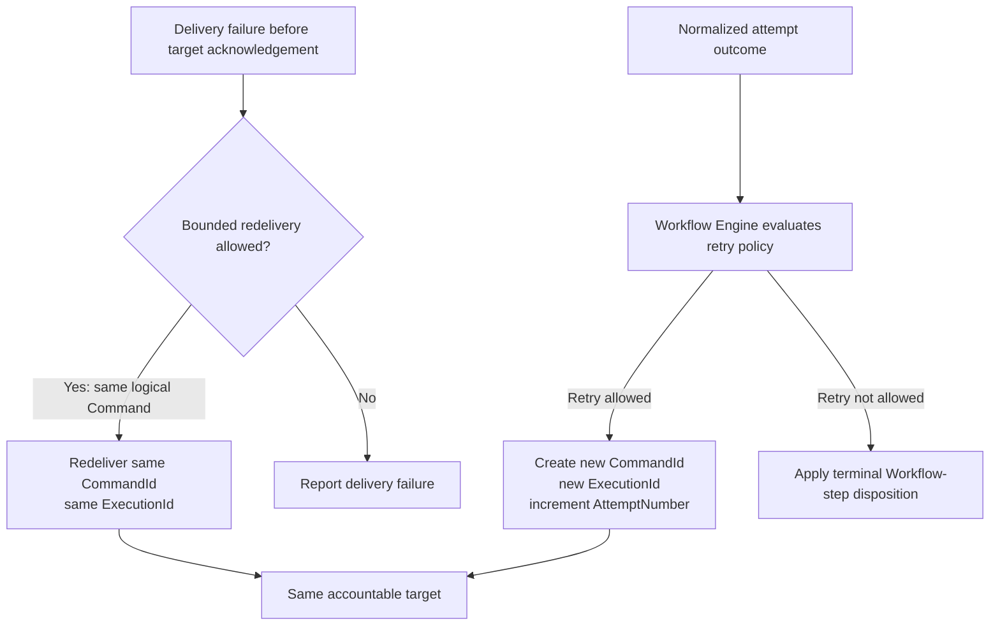
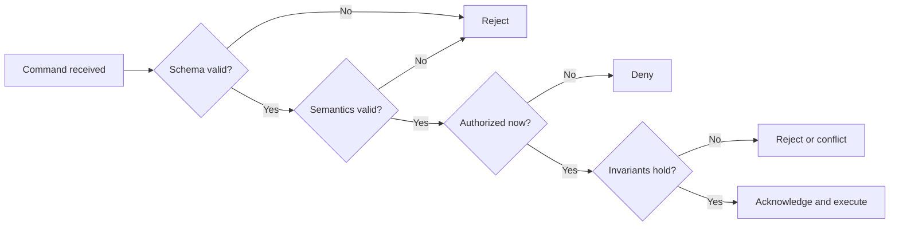
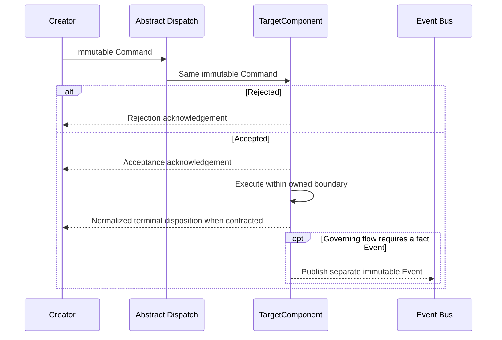
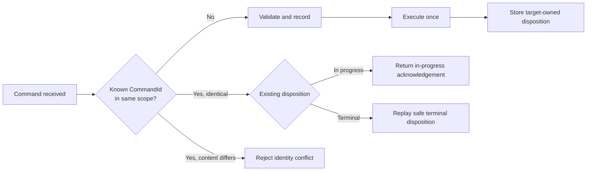

# Command Contract Model

## 1. Purpose

This document defines the canonical, transport-neutral contract for AIEOS Commands. A Command is an immutable directed message record that asks exactly one accountable target to perform an action. It may be rejected. It is not a historical fact, does not pass through the Event Bus, and does not transfer ownership of domain state.

This contract refines the Command model deferred by Architecture v1.0, ES-001, ES-002, and Domain v1.0. It introduces no component, aggregate, service, transport, persistence, or deployment boundary.

Normative terms such as MUST, MUST NOT, SHALL, SHOULD, and MAY are used as requirements.

## 2. Architectural Invariants

1. Every Command has exactly one accountable `TargetComponent`.
2. A Command requests action and may be rejected; an Event records a completed fact.
3. Commands use an abstract command-dispatch contract and MUST NOT pass through the Event Bus.
4. A Command does not grant mutation authority outside the target's existing ownership boundary.
5. The Workflow Engine owns Workflow state, Workflow-step state, retry decisions, and creation of each new Execution Attempt.
6. The Skill Runtime owns the lifecycle of the one Execution Attempt it is instructed to execute and MUST NOT invent another attempt.
7. Redelivery of the same logical Command retains its `CommandId`; a retry that requests a new Execution Attempt uses a new `CommandId` and new `ExecutionId`.
8. Tenant and Workspace scope remains explicit at every applicable boundary.
9. Authorization is revalidated by the accountable target at execution time.
10. Provider, infrastructure, and serialization details remain outside this contract.

## 3. Canonical Command Envelope

The envelope is immutable after creation. Optional means the field MAY be absent only under the condition stated; it does not permit an empty or ambiguous value.

| Field | Presence | Contract |
| --- | --- | --- |
| `CommandId` | Required | Opaque identity of one logical Command. Created when the Command is recorded, immutable, and retained across redelivery. |
| `CommandType` | Required | Stable imperative name using verb plus singular domain object, such as `StartWorkflow` or `DispatchExecutionAttempt`. |
| `CommandVersion` | Required | Version of the complete Command contract: envelope interpretation plus payload schema for this `CommandType`. |
| `CorrelationId` | Required | Stable identifier for the related operation chain. For Workflow work, it remains stable across the Workflow and its retries. |
| `CausationId` | Required | Identifier of the Command, Event, Request, or recorded decision that directly caused this Command. It MUST NOT be self-referential. |
| `WorkflowId` | Conditionally required | Required when the Command addresses or results from an existing Workflow Instance; absent when no Workflow exists yet, including an initial `StartWorkflow`. |
| `WorkflowStepId` | Conditionally required | Required when the Command addresses one Workflow Step. It MUST identify a step in `WorkflowId`. Otherwise absent. |
| `ExecutionId` | Conditionally required | Required when the Command addresses or creates one Execution Attempt. It MUST identify one attempt for `WorkflowStepId`. Otherwise absent. |
| `TargetComponent` | Required | Canonical logical component or approved Tool boundary accountable for accepting or rejecting the Command and performing the requested action. Exactly one value is permitted. |
| `Initiator` | Required | Authenticated actor or component identity that created the Command. It is attribution, not proof of authority. |
| `Timestamp` | Required | UTC instant at which the immutable Command was created. It is not an execution or completion time. |
| `TenantId` | Required for Tenant-scoped work | Explicit Tenant scope. It MUST be present whenever the target or referenced resource is Tenant-scoped. |
| `WorkspaceId` | Required for Workspace-scoped work | Explicit Workspace scope. It MUST be present whenever the target or referenced resource is Workspace-scoped and MUST belong to `TenantId`. |
| `Payload` | Required | Command-type-owned, versioned request data. An empty structured value is permitted only when the Command schema explicitly allows it. |
| `Metadata` | Required | Structured contract metadata required for dispatch, authorization, idempotency, time constraints, observability, and audit. Unknown metadata MUST NOT acquire authority. |

### 3.1 Required metadata

`Metadata` SHALL contain these logical values when applicable to the Command:

| Metadata | Requirement |
| --- | --- |
| Idempotency context | Required for every Command. It identifies the target-owned deduplication scope and distinguishes redelivery from a new logical request. |
| Authorization context | Required when action is protected. It references verified identity, applicable Policy Version, delegated scope, and approval evidence without embedding credentials. |
| Time constraints | Required when execution has an expiry or allowed duration. Expiry is an absolute UTC instant. |
| Request context | Required when the Command is attributable to a platform `Request`; includes `RequestId`. |
| Trace context | Required when trace propagation applies. It supplements, but does not replace, correlation and causation. |
| Attempt context | Required for an Execution Attempt; includes its monotonically increasing `AttemptNumber` and exact `SkillVersionId` when applicable. |
| Contract expectations | Required when the caller requires a defined acknowledgement or normalized result contract. |

Metadata keys are versioned with the Command contract. Extension metadata MAY be ignored only when the receiving version declares it non-authoritative and safe to ignore. Credentials, secret values, raw authorization headers, and mutable delivery observations MUST NOT appear in the immutable envelope.

### 3.2 Field relationships

- `WorkflowStepId` MUST NOT appear without `WorkflowId`.
- `ExecutionId` MUST NOT appear without both `WorkflowId` and `WorkflowStepId`.
- A Workflow retry preserves `CorrelationId` and `WorkflowId`, assigns a new `ExecutionId`, increments `AttemptNumber`, and creates a new logical Command with a new `CommandId`.
- Redelivery preserves the entire immutable envelope, including `CommandId`, `ExecutionId`, and idempotency context.
- `Initiator`, authorization metadata, `TenantId`, and `WorkspaceId` MUST agree; mismatch is an authorization or invariant failure.
- `TargetComponent` MUST name an existing accountable target defined by the governing architecture or domain contract.

## 4. Command Lifecycle

The immutable Command envelope does not change state. The lifecycle below describes target-owned processing observations associated with `CommandId`.

| Stage | Owner and requirement |
| --- | --- |
| **Creation** | The initiating component or authenticated ingress creates and records the immutable envelope before dispatch. It MUST be authorized to issue that Command type. |
| **Validation** | The target validates schema, semantics, authorization, invariants, version support, scope, idempotency context, and time constraints before accepting execution. |
| **Authorization** | The target rechecks current authority and applicable Policy Version. Creation or successful dispatch MUST NOT be treated as authorization. |
| **Dispatch** | The creator, or an infrastructure mechanism acting only on its behalf, presents the Command to the one target without routing it through Event Bus. |
| **Execution** | The target performs only the requested action within its existing ownership boundary. Execution begins only after validation and authorization succeed. |
| **Acknowledgement** | The target returns or records a correlated acceptance or rejection of responsibility for this Command. Acknowledgement does not prove business completion. |
| **Completion** | The target records a normalized terminal disposition: succeeded, rejected, failed, timed out, cancelled, or expired as allowed by the Command contract. Result Events, when required by the governing domain flow, are separate immutable facts. |
| **Cancellation** | An authorized actor issues a distinct cancellation Command to the component that owns the relevant lifecycle. Cancellation is best effort for active downstream work and never mutates the original Command envelope. |
| **Expiry** | A target MUST reject an unaccepted Command whose expiry has passed. If expiry occurs after acknowledgement or execution begins, the governing owner applies its existing timeout/cancellation rules; late results cannot overwrite terminal Workflow state without reconciliation policy. |

This diagram is a Command-processing model, not a new domain Entity lifecycle. For `DispatchExecutionAttempt`, the Execution Attempt lifecycle in Domain v1.0 remains authoritative.

## 5. Ownership Model

### 5.1 Roles

| Role | Accountable party |
| --- | --- |
| Creates | The component that owns the decision to request the action. For example, Workflow Engine creates `DispatchExecutionAttempt`; Manager may create `StartWorkflow`; Scheduler creates only the time-based Workflow Commands already assigned to it. |
| Owns | The single `TargetComponent` owns acceptance, rejection, execution, processing state, and terminal disposition for the Command. It owns only state already assigned to it by architecture. |
| Validates | The target validates the complete Command at its trust boundary. A dispatch mechanism MAY perform non-authoritative preflight checks but cannot replace target validation. |
| Dispatches | The creator owns the dispatch decision. Infrastructure MAY deliver on the creator's behalf but MUST NOT choose business routing, retry policy, or a different target. |
| Consumes | Exactly one logical target consumes the Command. Multiple runtime instances MAY implement that target without creating multiple accountable targets. |
| Acknowledges | The target acknowledges acceptance or rejection. Infrastructure delivery confirmation is not target acknowledgement. |

## 6. Abstract Command-Dispatch Contract

The dispatch contract accepts one immutable Command envelope and attempts delivery to its declared `TargetComponent`. It returns or records a delivery outcome without making a business decision.

### 6.1 Dispatch responsibilities

The dispatch boundary SHALL:

- preserve the envelope exactly;
- resolve only the declared logical target to an eligible target instance;
- refuse unknown, ambiguous, or multiple targets;
- propagate cancellation, expiry, correlation, causation, and trace context;
- expose delivery and acknowledgement observations for audit and operation;
- distinguish failure to deliver from target rejection or execution failure; and
- avoid interpreting payload semantics beyond version-safe routing needs.

The dispatch boundary MUST NOT:

- route Commands through Event Bus;
- infer a target from payload contents;
- fan out one Command to multiple accountable targets;
- change authorization, policy, Tenant, Workspace, or payload data;
- decide Workflow retry, compensation, pause, or escalation; or
- claim execution completion from delivery confirmation.

### 6.2 Ordering expectations

- Global ordering MUST NOT be assumed.
- Ordering between unrelated Commands MUST NOT be assumed.
- A target MUST enforce its own domain invariants using authoritative state, not arrival order alone.
- A Command type MAY declare a target-owned ordering scope when correctness requires it. That declaration is part of the versioned contract and MUST use stable domain identities.
- Redelivery MAY arrive after later Commands. Duplicate safety and invariant validation remain mandatory.

### 6.3 Retry ownership

Delivery redelivery, Workflow retry, and provider retry are distinct:

- the dispatch boundary MAY redeliver the same immutable Command under bounded delivery policy; this preserves `CommandId` and is not a new logical attempt;
- the Workflow Engine alone decides whether a failed or timed-out Workflow Step receives a new Execution Attempt and Command;
- the Skill Runtime executes only the requested attempt and cannot create the next attempt;
- the AI Gateway MAY perform bounded provider-level retry within one AI Invocation under approved policy; and
- a caller MAY create a new logical Command only when its governing contract authorizes a new request.

## 7. Validation Model

Validation is cumulative. Passing one layer does not bypass another.

| Layer | Required checks | Failure ownership |
| --- | --- | --- |
| **Schema validation** | Required fields, types, nullability, supported `CommandType` and `CommandVersion`, payload schema, timestamp form, and metadata structure. | Target rejects with a stable validation failure. |
| **Semantic validation** | Field relationships, command meaning, resource existence where owned, current lifecycle applicability, and payload meaning. | Target rejects with validation or conflict failure as appropriate. |
| **Authorization validation** | Authenticated initiator, delegated scope, Policy Version, approval evidence, Tenant/Workspace access, and execution-time authority. | Target denies without performing the action. |
| **Invariant validation** | Exactly one target, ownership boundary, aggregate rules, state transition validity, retry identities, idempotency scope, and no cross-Workspace access. | Target rejects or reports conflict; it MUST NOT weaken the invariant. |

Validation failures MUST be safe to expose, correlated to `CommandId`, and auditable. Diagnostic cause may be protected. Unknown fields, versions, targets, or authority claims fail closed unless a supported compatibility rule explicitly permits them.

## 8. Acknowledgement and Completion

Acknowledgement answers whether the target accepted responsibility for processing the Command. It does not mean the requested outcome succeeded.

An acknowledgement SHALL identify or reference:

- `CommandId`;
- the acknowledging `TargetComponent`;
- accepted or rejected disposition;
- acknowledgement timestamp;
- supported Command version used for interpretation;
- stable rejection category when rejected; and
- correlation information required by the caller contract.

Completion is a later target-owned terminal disposition. For architecture flows that require lifecycle or result Events, the target publishes separate immutable Events through Event Bus after the relevant fact is authoritative. An acknowledgement, delivery receipt, log entry, or Event publication attempt MUST NOT be treated as the business result.

## 9. Idempotency

Every Command requires a target-owned idempotency strategy. The target SHALL scope duplicate detection by the identities needed to prevent collision across Command type, version, Tenant, Workspace, and owned resource.

For the same `CommandId` and idempotency scope, the target SHALL:

- recognize redelivery;
- avoid repeating uncontrolled side effects;
- return or expose the existing in-progress or terminal disposition when safe;
- reject a reused identity whose immutable content differs; and
- preserve audit evidence of duplicate handling.

Idempotency does not turn two new logical Commands into one. A new Workflow execution retry has a new `CommandId` and `ExecutionId` even when it requests the same Workflow Step.

Retention duration, storage design, and replay representation remain deferred to the shared Idempotency standard.

## 10. Versioning and Compatibility

- `CommandVersion` SHALL identify the version of the complete Command interpretation for one `CommandType`.
- Published Command versions are immutable. A breaking semantic, required-field, validation, or payload change requires a new version.
- Backward-compatible additions MAY remain within a version only when existing consumers already tolerate them under an explicit extension rule and they do not affect authority, routing, ownership, invariants, or idempotency.
- Targets SHALL declare supported versions and reject unsupported versions deliberately.
- Creators SHALL issue only versions supported by the declared target.
- Compatibility MUST be demonstrated by contract tests before a target drops an older version.
- No compatibility adapter may weaken authorization, Tenant/Workspace isolation, validation, or exactly-one-target semantics.

### 10.1 Deprecation

A deprecated version SHALL have an owner, replacement version, affected creators and targets, migration guidance, announcement point, compatibility window, and removal criteria. Deprecation does not change an already-recorded Command. Removal requires evidence that active creators no longer depend on the version and that required historical audit interpretation remains possible.

## 11. Security and Audit

### 11.1 Immutable fields

All canonical envelope fields are immutable after creation. A correction, changed target, changed scope, changed payload, renewed authority, or changed time constraint creates a new logical Command with a new `CommandId` and causation relationship.

### 11.2 Trusted metadata

Metadata is trusted only when its producer and integrity are verified and the target recognizes the key for the supported Command version. Trust is field-specific. Self-asserted roles, permissions, approvals, Tenant or Workspace membership, policy decisions, and delivery annotations are never authoritative merely because they appear in metadata.

The target MUST independently verify authorization and scope. Infrastructure-added observations are separate from the immutable Command and MUST NOT overwrite creator metadata.

### 11.3 Payload ownership

The `CommandType` owner defines the payload contract. The accountable target validates and interprets it. The initiator owns the accuracy and minimization of supplied data but does not gain authority over target-owned state. Payload data MUST be limited to what the action requires, classified by trust, and MUST NOT contain credentials or authority that belongs in verified references.

### 11.4 Audit expectations

Consequential Commands require durable evidence of:

- Command identity, type, version, target, initiator, and scope;
- creation, dispatch, acknowledgement, execution, and terminal timestamps as applicable;
- authorization and Policy Version references;
- idempotency and duplicate-handling outcome;
- cancellation or expiry outcome;
- stable failure category and correlation/causation references; and
- resulting Event or external-effect evidence references when applicable.

Audit evidence is protected from ordinary mutation and is distinct from logs and authoritative domain state. Payloads and metadata are minimized or referenced when recording them would expose sensitive content.

## 12. Non-Goals

This contract does not define or select:

- transport protocols;
- REST;
- gRPC;
- databases or persistence schemas;
- queues, brokers, or messaging products;
- implementation languages or frameworks;
- serialization formats;
- deployment architecture;
- Event, Error, Policy, authorization, or Idempotency standards beyond their Command-facing requirements; or
- product-specific Workflow, waiting, expiry, escalation, or compensation policy.

## 13. Review Checklist

- [ ] Every Command has one and only one accountable `TargetComponent`.
- [ ] Required and conditionally required envelope fields are unambiguous.
- [ ] Commands do not pass through Event Bus or disguise Events.
- [ ] Dispatch does not make business or Workflow retry decisions.
- [ ] Workflow Engine remains the owner of Workflow retry decisions.
- [ ] Skill Runtime does not revive an attempt or create another attempt.
- [ ] Redelivery preserves `CommandId`; a new Execution Attempt uses a new `CommandId` and `ExecutionId`.
- [ ] Schema, semantic, authorization, and invariant validation are distinct.
- [ ] Acknowledgement is distinct from delivery and completion.
- [ ] Tenant and Workspace scope remains explicit.
- [ ] Versioning and deprecation fail closed without weakening security.
- [ ] Security and audit rules do not treat self-asserted metadata as authority.
- [ ] No transport, persistence, serialization, language, or deployment choice is introduced.
- [ ] Mermaid diagrams agree with the prose.
- [ ] Relative links resolve.
- [ ] Architecture v1.0 and Domain v1.0 remain unchanged.

## 14. Traceability

| Source | Preserved contract |
| --- | --- |
| [Engineering Blueprint](../03-architecture/EngineeringBlueprint.md) | Commands are typed, versioned requests to one owner; logical components and modular-monolith boundaries remain unchanged. |
| [System Architecture](../03-architecture/SystemArchitecture.md) | Commands cross explicit trust boundaries; long-running work remains correlated, retry-safe, and observable. |
| [Execution Flow](ExecutionFlow.md) | Abstract dispatch, Event Bus exclusion, lifecycle ownership, retry separation, idempotency, and immutable attempts are preserved. |
| [Domain Model](DomainModel.md) | Command identity and semantics, exactly-one-target invariant, Tenant/Workspace scope, correlation, causation, and canonical owners remain unchanged. |
| [ES-001](../engineering-specifications/ES-001-Execution-Core.md) | Shared Command Envelope requirements are refined without selecting technology. |
| [ES-002](../engineering-specifications/ES-002-Execution-Flow-Architecture.md) | Command model, routing, retry ownership, timeout/cancellation, and traceability requirements are refined. |
| [ES-003](../engineering-specifications/ES-003-Domain-Model-and-Ubiquitous-Language.md) | Frozen Command meaning, identity, naming, ownership, and domain invariants are preserved. |

## 15. Open Questions and Deferred Standards

- The shared Error Model will define the complete acknowledgement and terminal failure representation.
- The shared Idempotency standard will define retention and replay details.
- Future service-interface specifications may bind this logical contract to component interfaces without selecting a transport unless separately authorized.
- Product-specific expiry, cancellation propagation, and result expectations remain governed by their Workflow and component contracts.

These deferrals do not authorize changes to frozen architecture or domain semantics.
