# Domain Model and Ubiquitous Language

## 1. Purpose

This document is the canonical semantic reference for AIEOS. It defines what core domain terms mean, how they relate, which component owns their state, and which invariants all future Employees, specifications, contracts, prompts, and implementations MUST preserve.

This domain model refines the frozen Architecture v1.0 baseline. It does not add services or change component boundaries.

## 2. Architectural Context

AIEOS separates business intent, durable orchestration, bounded execution, provider access, and fact distribution:

- **Manager** interprets goals and manages interaction.
- **Workflow Engine** owns Workflow state, transitions, and retry decisions.
- **Skill Runtime** owns one retry-safe Execution Attempt at a time.
- **Skill Registry** and **Capability Registry** own catalogs and contracts.
- **AI Gateway** isolates Provider-specific access.
- **Event Bus** transports Events only.

Commands use an abstract directed dispatch contract. They do not pass through Event Bus.

## 3. Classification Rules

| Classification | Canonical meaning |
| --- | --- |
| **Entity** | A domain object with stable identity and a lifecycle. Its attributes may change without changing its identity. |
| **Value Object** | An immutable, validated value identified by its contents rather than an independent identity. |
| **Aggregate** | A consistency boundary around related Entities, Value Objects, and Immutable Records. |
| **Aggregate Root** | The Entity through which changes governed by an Aggregate's invariants are requested. |
| **Reference** | A stable identity pointing to an object owned by another Aggregate. It grants no mutation authority. |
| **Immutable Record** | A historical fact or evidence item that is never rewritten. Correction creates a new record or superseding relationship. |

An Aggregate is not a service, process, table, or deployment unit. A component may own more than one Aggregate. Shared storage MUST NOT imply shared ownership.

## 4. Canonical Glossary

| Term | Classification | Canonical definition and owner |
| --- | --- | --- |
| **Request** | Entity | Caller intent submitted at the platform boundary and tracked independently from Workflow state. Manager owns interpretation and acceptance or rejection; an accepted Request may cause a distinct `StartWorkflow` Command. |
| **Manager** | Platform component | Interprets goals, initiates approved Workflows, manages interaction, and presents outcomes. It does not execute Skills or own Workflow state. |
| **Workflow Definition** | Aggregate Root, Entity | Stable logical definition identified by `WorkflowDefinitionId` and composed of immutable versions identified by `WorkflowDefinitionVersionId`. Workflow Engine governs use and compatibility. |
| **Workflow Instance** | Aggregate Root, Entity | One durable execution of a specific Workflow Definition version. Workflow Engine is its sole state owner. |
| **Workflow Step** | Entity inside Workflow Aggregate | One defined unit of orchestration within a Workflow Instance. Workflow Engine owns its state and disposition. |
| **Command** | Immutable directed message record | A request for one accountable target to perform an action. It may be accepted or rejected and never passes through Event Bus. |
| **Event** | Immutable Record | A past-tense fact produced by one authoritative owner and published through Event Bus. |
| **Skill** | Aggregate Root, Entity | Stable identity for a reusable bounded behavior cataloged by Skill Registry. |
| **Skill Version** | Immutable Entity inside Skill Aggregate | One approved contract and behavior version, including declared Capabilities and permitted Tools. |
| **Skill Runtime** | Platform component | Executes one approved Skill Version inside a restricted, retry-safe attempt boundary. It does not orchestrate Workflows or invent retries. |
| **Execution Attempt** | Aggregate Root, Entity | One bounded attempt to execute one Workflow Step using one Skill Version. Skill Runtime owns its attempt lifecycle; the completed history is immutable. |
| **Capability** | Aggregate Root, Entity | Stable provider-neutral identity for an operation available to Skills. Capability Registry owns its catalog lifecycle. |
| **Capability Contract** | Immutable Value Object | Versioned input, output, constraint, and compatibility definition for a Capability. Its immutable version is identified by `CapabilityContractVersionId`; it contains no product orchestration. |
| **AI Gateway** | Platform component | The only platform boundary through which AI Providers are selected and accessed; it normalizes requests, results, errors, and usage. |
| **Provider Adapter** | Boundary adapter | Translates between AI Gateway contracts and one AI Provider's protocol and formats. It owns no business decision. |
| **AI Provider** | External system | External source of AI capability accessed only through AI Gateway. Its formats and credentials remain outside the domain. |
| **AI Invocation** | Entity inside Execution Aggregate | One provider-independent AI invocation attempt owned by AI Gateway and identified by `AIInvocationId`. It belongs to one Execution Attempt; bounded provider transport retries remain inside this invocation. |
| **Artifact** | Aggregate Root, Entity | A Workspace-owned produced or acquired content item or evidence object with identity, provenance, validation, and external-effect lifecycle. It is not Workflow state. |
| **Memory** | Aggregate Root, Entity | Scoped durable knowledge or operational context identified by `MemoryId`, with provenance, access, retention, and lifecycle controlled by Memory Service. |
| **Context** | Value Object | Immutable-at-dispatch collection of scoped references and constraints supplied for a decision or execution. It is not durable truth by itself. |
| **Session** | Aggregate Root, Entity | Authentication continuity for an actor across interactions. Authentication owns its lifecycle; a Session does not grant business authority by itself. |
| **User** | Entity | Human identity identified by stable `UserId` and capable of authenticated interaction. Sessions and Tenant or Workspace memberships remain separate. |
| **Tenant** | Aggregate Root, Entity | Top-level future organizational isolation identity. Version 1 retains explicit Tenant scope without exposing multi-tenant SaaS features. |
| **Workspace** | Aggregate Root, Entity | Resource, membership-reference, Employee, and Policy scope within a Tenant. Workspace component owns its boundary. |
| **Human Approval** | Entity inside Workflow Aggregate | One auditable approval-request lifecycle identified by `HumanApprovalId`, requested by a Workflow Step and correlated to preserved Workflow state. |
| **Policy** | Aggregate Root, Entity | Stable logical policy identified by `PolicyId` and composed of immutable Policy Versions. It governs deterministic constraints for actions, providers, Tools, approval, retry, limits, and escalation. |
| **Policy Version** | Immutable Entity inside Policy Aggregate | One immutable policy revision identified by `PolicyVersionId`. Executions and decisions reference the exact version applied. |

## 5. Prohibited or Ambiguous Synonyms

| Do not use | Use instead | Reason |
| --- | --- | --- |
| Manager Agent, CEO Agent | **Manager** | `Manager` is the frozen component name. |
| Job, run, process for durable orchestration | **Workflow Instance** | These words obscure identity and ownership. |
| Task for both orchestration and execution | **Workflow Step** or **Execution Attempt** | State and retry semantics differ. |
| Retry attempt as a revived execution | **New Execution Attempt** | Terminal attempts remain immutable. |
| Message when kind is known | **Command** or **Event** | Direction and semantics must be explicit. |
| Event command, command event | **Command** or **Event** | Events are facts; Commands request actions. |
| Model for an external vendor endpoint | **AI Provider** or provider model | Avoid confusing domain models with AI models. |
| Plugin, action, function for reusable behavior | **Skill** or **Tool**, as applicable | A Skill is behavior; a Tool is controlled external access. |
| Ability, feature | **Capability** | Use the provider-neutral contract term. |
| Memory for arbitrary prompt context | **Context** unless durably owned | Memory has provenance and lifecycle. |
| Organization as a Workspace synonym | **Tenant** or **Workspace** | Their isolation scopes differ. |
| Approval as notification receipt | **Human Approval** | Delivery is not a decision. |

## 6. Domain Relationships

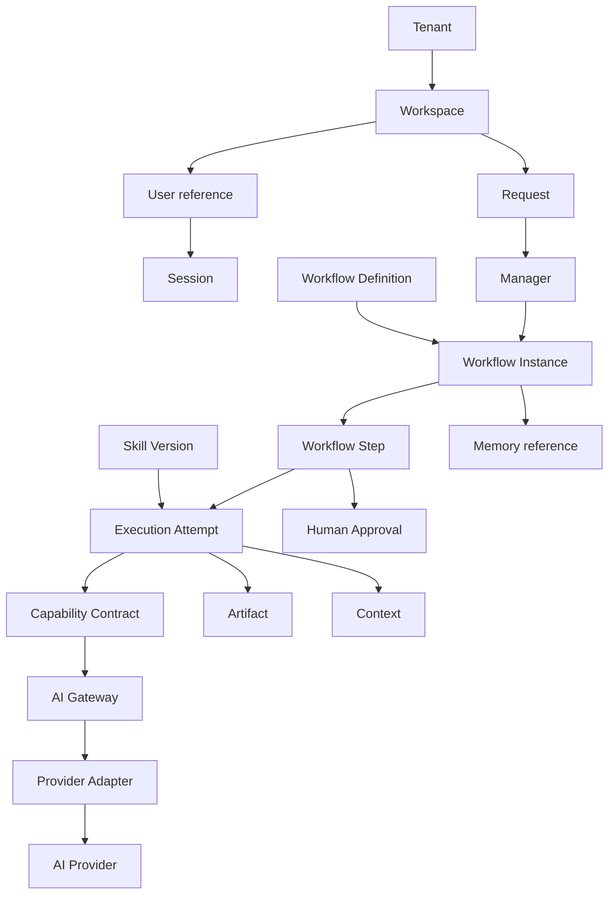

Arrows denote relationships or references, not mutation authority. Only owning Aggregate Roots authorize changes to their state.

## 7. Aggregate Catalog and Boundaries

| Aggregate | Root | Owner | Contains or governs | External references |
| --- | --- | --- | --- | --- |
| **Workflow** | Workflow Instance | Workflow Engine | Definition-version reference, Workflow Steps, Human Approvals, Workflow transition history, retry decisions | Request, Workspace, Skill Version, Execution Attempt, Artifact, Memory |
| **Execution** | Execution Attempt | Skill Runtime | Attempt number, input Context snapshot, Skill Version reference, lifecycle, normalized outcome, timing | Workflow Step, Capability, Artifact |
| **Skill** | Skill | Skill Registry | Skill Versions, contracts, declared Capabilities, permitted Tool metadata, compatibility | Capability |
| **Capability** | Capability | Capability Registry | Capability Contracts and eligible implementation references | AI Gateway or non-AI implementation boundary |
| **Memory** | Memory | Memory Service | Provenance, Workspace scope, content reference, classification, lifecycle | Workflow, Artifact, User |
| **Artifact** | Artifact | Workspace component | Provenance, validation state, content reference, publication state, external receipt reference | Execution Attempt, Workflow, Workspace |
| **Session** | Session | Authentication | Actor reference, issued/expiry/revocation state, authentication evidence | User, Tenant, Workspace |
| **Tenant** | Tenant | Workspace component | Tenant lifecycle and Workspace references | User references |
| **Workspace** | Workspace | Workspace component | Membership references, resource scope, Employee references, Policy references | Tenant, User, Workflow, Memory, Artifact |

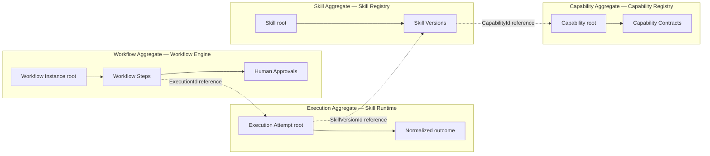

Consistency is enforced inside each Aggregate. Cross-Aggregate progress uses Commands, Events, and stable references; it does not assume a shared atomic transaction.

## 8. Identity Model

All identifiers are opaque, immutable values. An identifier is never reassigned to a replacement object. Tenant- or Workspace-scoped objects carry the corresponding `TenantId` and `WorkspaceId` as separate scope, never encoded inside another identifier.

| Identity | Identifies and owner | Scope | Creation and stability | Lifecycle and relationships |
| --- | --- | --- | --- | --- |
| `RequestId` | One Request; Manager owns acceptance state | Tenant and Workspace when applicable | Created when caller intent is recorded; stable and immutable | Persists through the Request lifecycle and references any authorized Workflow created from it. |
| `WorkflowId` | One Workflow Instance; Workflow Engine | Tenant and Workspace | Created with the instance; stable and immutable | Persists through the full Workflow lifecycle and every retry. |
| `WorkflowDefinitionId` | One logical Workflow Definition; Workflow Engine | Platform or Workspace according to registration policy | Created when the logical definition is registered; stable and immutable across versions | Persists while immutable definition versions are added or retired. |
| `WorkflowDefinitionVersionId` | One immutable Workflow Definition version; Workflow Engine | One `WorkflowDefinitionId` | Created for each approved definition revision; immutable | Every Workflow Instance references the exact version used for its full lifecycle. |
| `WorkflowStepId` | One Workflow Step; Workflow Engine | Unique within one Workflow Instance | Created with or derived from the versioned Workflow plan; stable and immutable | Persists for the step lifecycle and relates all of its Execution Attempts. |
| `ExecutionId` | One Execution Attempt; Skill Runtime | One Workflow Step in one Tenant and Workspace | Created by Workflow Engine for every requested attempt; never reused | Terminal attempt history remains immutable; retry creates a new `ExecutionId`. |
| `AttemptNumber` | Attempt ordinal; Workflow Engine assigns it | One Workflow Step | Created with an Execution Attempt and increases monotonically | Value Object; it never replaces `ExecutionId`. |
| `AIInvocationId` | One provider-independent AI Invocation; AI Gateway | One Execution Attempt in the same Tenant and Workspace | Created when AI Gateway accepts an invocation; stable and immutable | Bounded provider transport retries and failover remain under this ID. Child provider-attempt identity is deferred; a new logical invocation receives a new ID. |
| `CommandId` | One logical Command; its accountable target processes it | Dispatch scope | Created when the Command is recorded; stable and immutable | Redelivery retains the same ID; a new logical request receives a new ID. |
| `EventId` | One Event; authoritative producer | Event stream scope plus Tenant and Workspace when applicable | Created when the fact is recorded; immutable | Correction creates a new Event with a new ID and superseding relationship. |
| `SkillId` | One logical Skill; Skill Registry | Registry scope | Created at Skill registration; stable across versions | Persists while Skill Versions are added or retired. |
| `SkillVersionId` | One Skill Version; Skill Registry | One `SkillId` | Created for each immutable approved version; immutable | Executions reference the exact version used. |
| `CapabilityId` | One logical Capability; Capability Registry | Registry scope | Created at Capability registration; stable across implementations | Persists while contracts and eligible implementations evolve. |
| `CapabilityContractVersionId` | One Capability Contract version; Capability Registry | One `CapabilityId` | Created for each immutable contract revision; immutable | Skills and implementations reference the exact compatible version. |
| `MemoryId` | One Memory Aggregate Root; Memory Service | Explicit Tenant and Workspace where applicable | Created with the Memory object; stable and immutable | Persists for that Memory lifecycle and is never reused for replacement Memory. |
| `ArtifactId` | One Artifact; Workspace component | Exactly one Tenant and Workspace | Created when produced or acquired; stable and immutable | Persists across validation, publication, failure, and archival transitions. |
| `SessionId` | One Session; Authentication | Actor plus permitted Tenant and Workspace context | Created when the Session is issued; immutable | Stable until terminal expiry or revocation; a new Session receives a new ID. |
| `UserId` | One User; Authentication identity boundary | Platform identity; memberships separately reference Tenant and Workspace | Created when the User is recognized; stable and immutable across Sessions | Distinct from `SessionId` and service identities; membership is never encoded in it. |
| `HumanApprovalId` | One Human Approval lifecycle; Workflow Engine | One Workflow Step in one Tenant and Workspace | Created when approval is first requested; stable and immutable | Waiting and resume preserve it. After Granted, Rejected, Expired, or Cancelled, a reissued approval creates a new ID. |
| `PolicyId` | One logical Policy; Workspace component | Tenant and Workspace | Created when the logical Policy is registered; stable and immutable across versions | Persists while Policy Versions are revised. |
| `PolicyVersionId` | One Policy Version; Workspace component | One `PolicyId` | Created for every immutable revision; immutable | Commands, executions, approvals, and decisions reference the exact version applied. |
| `TenantId` | One Tenant; Workspace component | Platform | Created with the Tenant; stable and immutable | Required for Tenant-scoped ownership. |
| `WorkspaceId` | One Workspace; Workspace component | Exactly one Tenant | Created with the Workspace; stable and immutable | Required for Workspace-scoped resources. |
| `CorrelationId` | One related operation chain | One Workflow and its retries | Created at correlation ingress or Workflow start; immutable | Remains stable across the Workflow and its retries. |
| `CausationId` | Immediate cause of a record or transition | One causal edge | Assigned when the caused record is created; immutable | References the Command, Event, or recorded decision that directly caused it. |

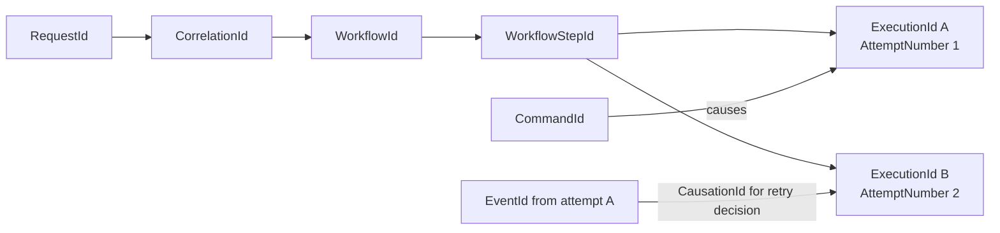

`CorrelationId` and `WorkflowId` remain stable across retries. Each attempt receives a new `ExecutionId`; `AttemptNumber` increases. `CausationId` records why that attempt or Event exists.

## 9. Canonical Commands

| Command | Accountable target | Meaning |
| --- | --- | --- |
| `AcceptRequest` | Manager | Validate and accept caller intent for goal interpretation. Manager may then issue a distinct `StartWorkflow` Command. |
| `StartWorkflow` | Workflow Engine | Create a Workflow Instance from an approved definition and context. |
| `DispatchExecutionAttempt` | Skill Runtime | Execute one specified Skill Version attempt under supplied Policy and Context. |
| `PauseWorkflow` | Workflow Engine | Request a valid pause transition. |
| `ResumeWorkflow` | Workflow Engine | Resume persisted Workflow state with correlated input or approval. |
| `CancelWorkflow` | Workflow Engine | Request cancellation and downstream propagation. |
| `RecordHumanApproval` | Workflow Engine | Apply a correlated human decision to its waiting step. |
| `PublishArtifact` | Approved publication Tool boundary | Request one controlled external publication effect. |

Command names use imperative verb + singular domain object. A Command has one accountable target, may be rejected, carries authorization and idempotency context, and MUST NOT pass through Event Bus.

## 10. Canonical Events

| Event | Authoritative producer | Meaning |
| --- | --- | --- |
| `RequestReceived` | Ingress contract owner | Caller intent was recorded. |
| `RequestRejected` | Manager | Request was rejected during Manager-owned interpretation or acceptance. Workflow-level outcomes use distinct Workflow Events. |
| `WorkflowStarted` | Workflow Engine | Workflow Instance entered Running. |
| `WorkflowPaused` | Workflow Engine | Persisted Workflow entered Paused. |
| `WorkflowResumed` | Workflow Engine | Persisted Workflow resumed valid execution. |
| `WorkflowCompleted` | Workflow Engine | Workflow reached successful terminal state. |
| `WorkflowFailed` | Workflow Engine | Workflow reached failed terminal state. |
| `ExecutionAttemptStarted` | Skill Runtime | One attempt entered Executing. |
| `ExecutionAttemptSucceeded` | Skill Runtime | One attempt reached successful terminal state. |
| `ExecutionAttemptFailed` | Skill Runtime | One attempt reached failed terminal state. |
| `ExecutionAttemptTimedOut` | Skill Runtime | One attempt reached timed-out terminal state. |
| `HumanApprovalRequested` | Workflow Engine | A step persisted a Human Approval requirement. |
| `HumanApprovalGranted` | Workflow Engine | An authenticated, correlated approval was accepted. |
| `HumanApprovalRejected` | Workflow Engine | An authenticated, correlated rejection was accepted. |
| `ArtifactValidated` | Workspace component | Workspace-owned Artifact passed required validation. |
| `ArtifactPublished` | Workspace component after confirmed effect | External publication was confirmed with evidence. |
| `ArtifactPublicationFailed` | Workspace component | Publication attempt ended without confirmed success. |

Event names use singular domain object + past-tense outcome. Events are immutable facts with one authoritative producer. They may have multiple consumers and MUST NOT instruct a named component.

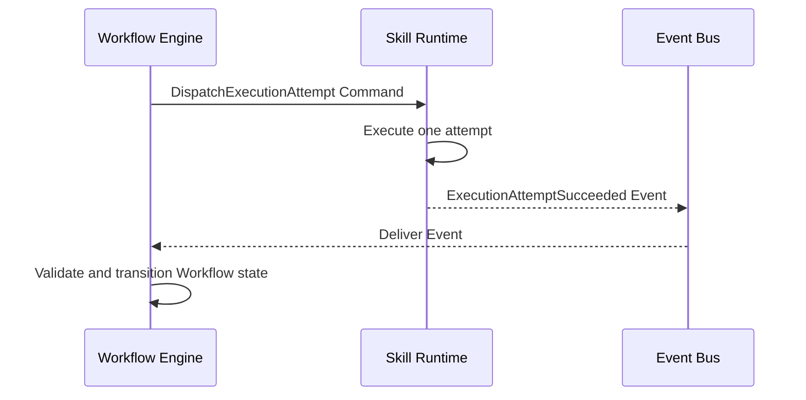

## 11. State Models

### Request

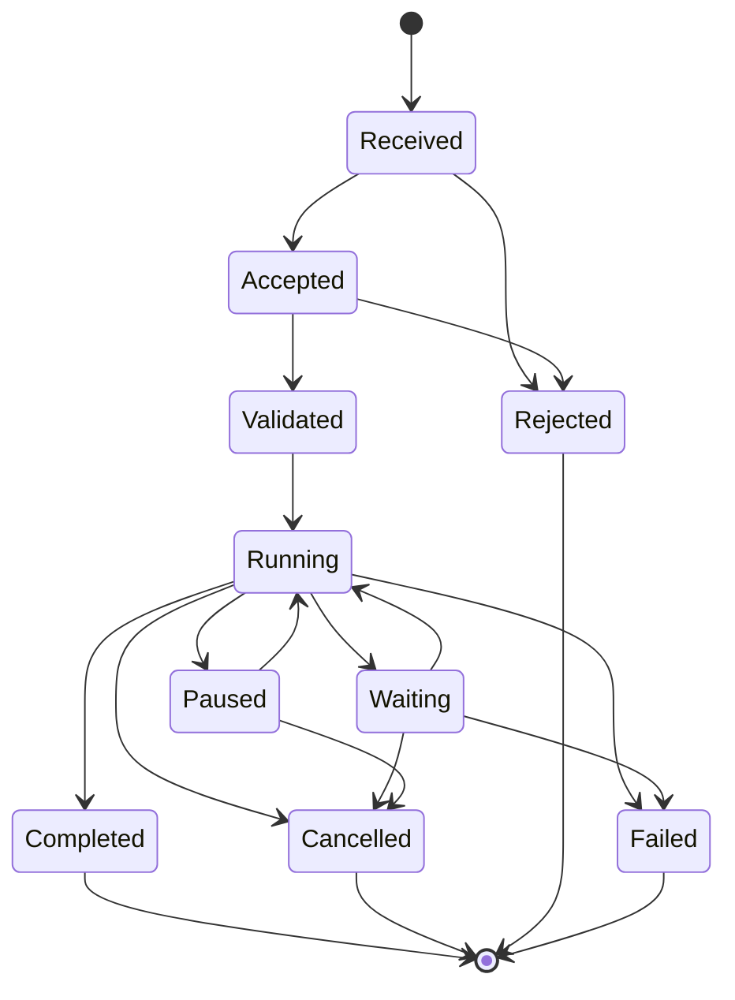

Completed, Cancelled, Rejected, and Failed are terminal. Request state is not Workflow state.

### Workflow Instance

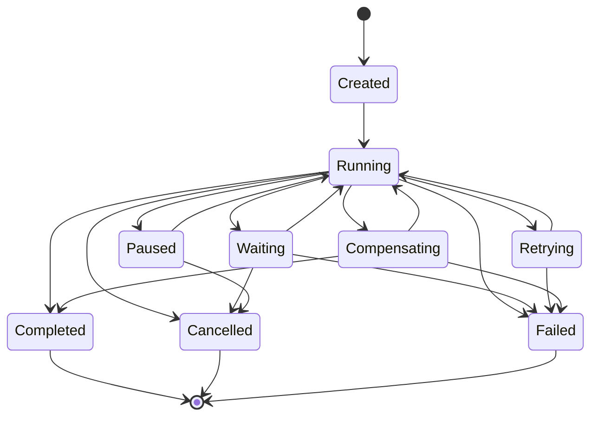

Workflow Engine alone owns these transitions. Human waiting preserves the persisted state.

### Workflow Step

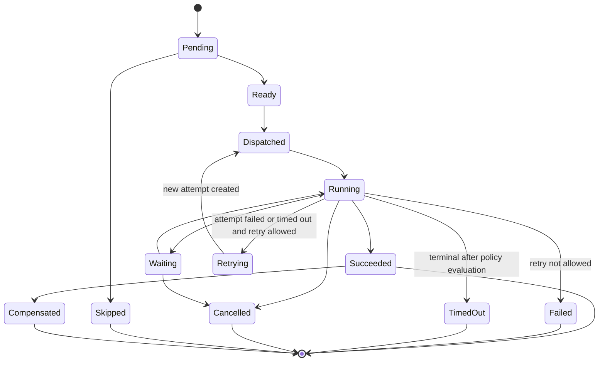

Workflow Engine owns retry decisions. Retrying creates a new Execution Attempt; it never revives the prior attempt.

### Execution Attempt

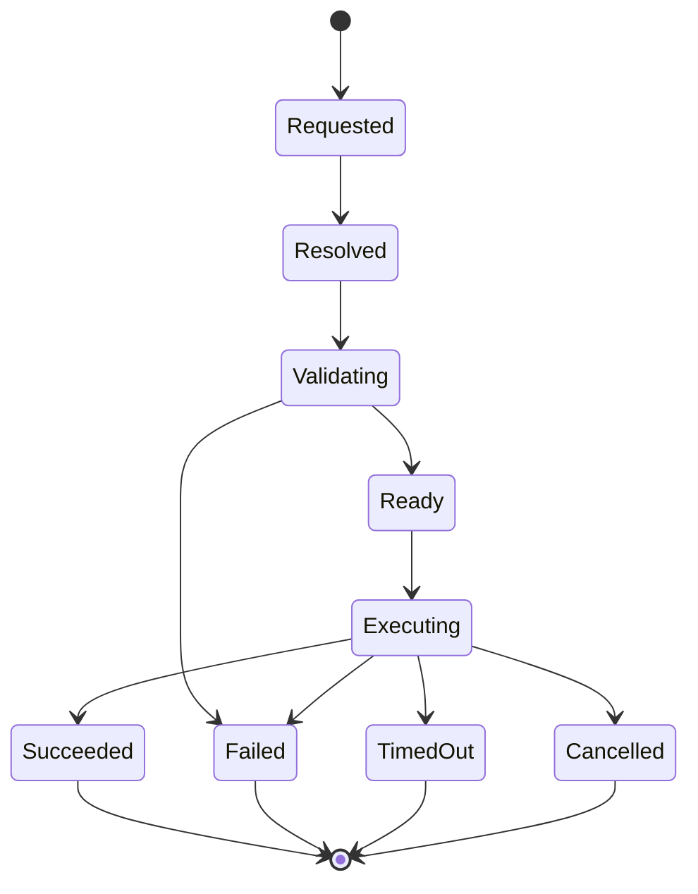

Skill Runtime owns attempt state. Succeeded, Failed, TimedOut, and Cancelled are terminal and immutable. There is no Retrying state for an Execution Attempt.

### AI Invocation

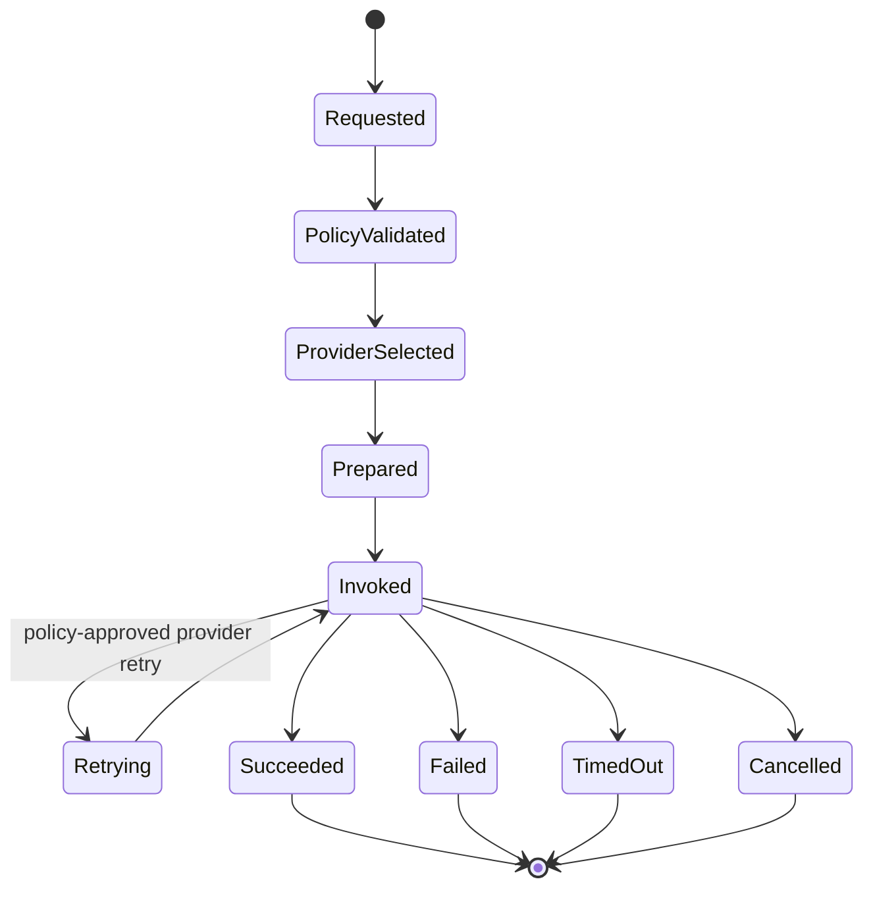

AI Gateway owns provider-level invocation state and bounded provider retry inside one Execution Attempt. It does not create a Workflow retry.

### Human Approval

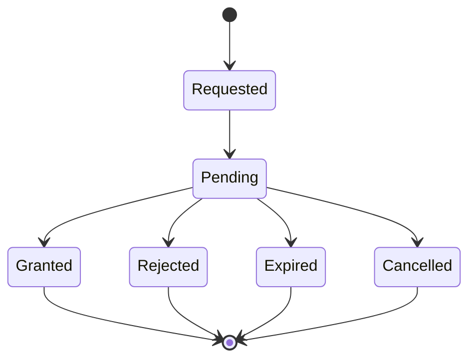

Workflow Engine owns the Human Approval record inside the Workflow Aggregate. A decision is accepted only when authenticated, authorized, correlated, and valid for the current waiting step. Notification delivery is not approval.

### Artifact

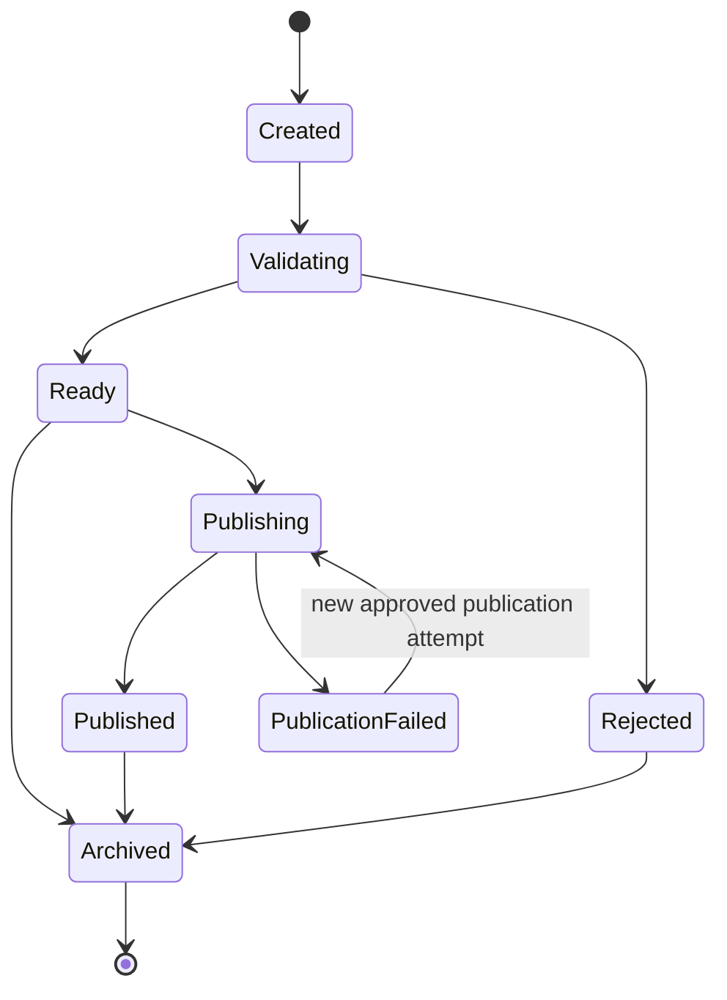

The Workspace component owns Artifact state and validates Artifact transitions; it does not execute publication. Workflow orchestration and an approved Skill or Tool produce the correlated result that requests an Artifact transition. Artifact identity remains stable. Publication attempts and external receipts remain distinct immutable evidence. `Published` requires confirmed external success; a request or notification alone is insufficient.

## 12. Tenant and Workspace Isolation

- Every Workspace-scoped Entity and reference MUST carry `WorkspaceId`.
- Every Workspace MUST belong to exactly one `TenantId`.
- Cross-Workspace access MUST be denied unless a future approved contract explicitly authorizes it.
- Tenant or Workspace context MUST propagate through Commands, execution Context, Memory access, Artifact ownership, and Human Approval.
- A Session does not erase Tenant or Workspace scope and does not itself grant authorization.
- Version 1's one-user, one-Workspace operation MUST NOT justify implicit or missing ownership fields.
- This model preserves isolation boundaries; it does not claim that exposed multi-tenant SaaS features exist in Version 1.

## 13. Domain Invariants

1. One Workflow Engine owns each Workflow Instance.
2. Workflow state changes only through valid Workflow Engine transitions.
3. One Execution Attempt belongs to exactly one Workflow Step.
4. Each retry creates a distinct `ExecutionId` and incremented `AttemptNumber`.
5. Failed and timed-out Execution Attempts remain immutable and auditable.
6. Workflow Engine owns retry decisions; Skill Runtime executes only the requested attempt.
7. Commands are directed requests with one accountable target.
8. Commands do not pass through Event Bus.
9. Events are immutable facts transported by Event Bus.
10. Event Bus does not make business decisions or own state.
11. Manager does not execute Skills or own Workflow state.
12. Skills do not orchestrate other Skills.
13. AI Providers are accessed only through AI Gateway.
14. Provider-specific credentials and formats do not cross AI Gateway.
15. Human waiting preserves Workflow state; notification delivery is not approval.
16. `CorrelationId` remains stable across one Workflow and its retries.
17. `CausationId` identifies the triggering Command, Event, or recorded decision.
18. Tenant and Workspace isolation is explicit at every scoped boundary.
19. References do not grant mutation authority over another Aggregate.
20. Product-specific behavior belongs in Workflows and Skills, not platform infrastructure.

## 14. Extension Rules

New Employees SHALL reuse this language. A new domain term MUST have one definition, classification, owner, identity and lifecycle where applicable, and relationships to existing terms. A synonym MUST NOT be introduced when an existing term expresses the same concept.

A new state, aggregate boundary, service owner, Command route, Event transport rule, or retry owner requires specification review. Any change to a frozen Architecture v1.0 boundary requires an ADR and architecture review before documentation or implementation proceeds.

## 15. Non-Goals and Deferred Decisions

This model does not select storage, serialization, transport, API, language, framework, provider, or deployment technology. It does not define database transaction boundaries, Event ordering guarantees, Command/Event envelopes, retention, tenant provisioning, billing, or product-specific Workflows.

Deferred specifications SHALL define:

- complete Command and Event envelopes;
- error and idempotency standards;
- persistence and consistency implementation;
- Artifact publication-attempt and receipt details;
- Memory categories and retention;
- late-result reconciliation;
- Policy representation and evaluation contracts; and
- authorization and Human Approval expiry/escalation rules.

## 16. Open Questions

- Which future contract coordinates an approved external-effect result with the Workspace-owned Artifact transition?
- Does a Request remain an ingress-owned Entity or become a dedicated Aggregate when one Request may create multiple Workflow Instances?
- Which Policy categories require independent version identities?

These questions do not change current boundaries. They MUST be resolved by later specifications or an ADR when a frozen boundary would change.

## 17. Related Documents

- [ES-003 — Domain Model and Ubiquitous Language](../engineering-specifications/ES-003-Domain-Model-and-Ubiquitous-Language.md)
- [Engineering Blueprint](../03-architecture/EngineeringBlueprint.md)
- [System Architecture](../03-architecture/SystemArchitecture.md)
- [Execution Flow](ExecutionFlow.md)
- [ES-001 — Execution Core](../engineering-specifications/ES-001-Execution-Core.md)
- [ES-002 — Execution Flow Architecture](../engineering-specifications/ES-002-Execution-Flow-Architecture.md)
- [Engineering Principles](../02-engineering-handbook/Principles.md)
- [Security](../02-engineering-handbook/Security.md)
