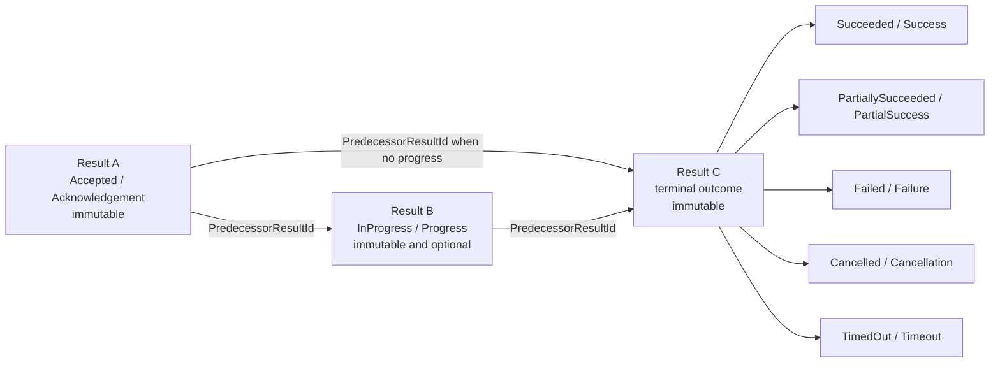
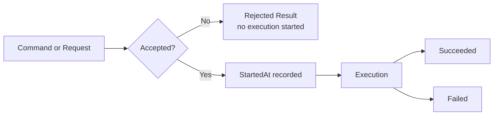
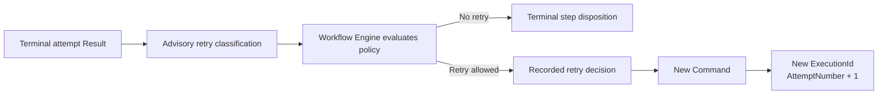
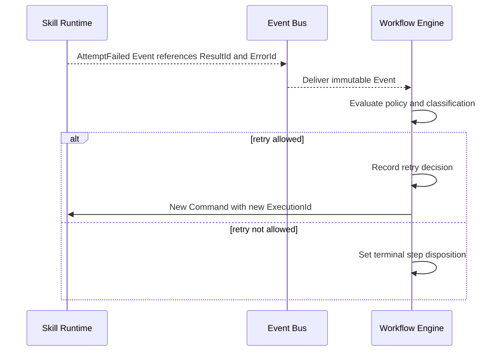
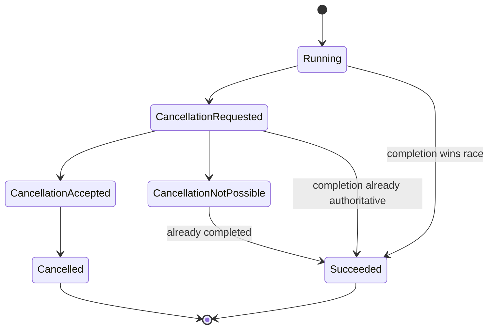
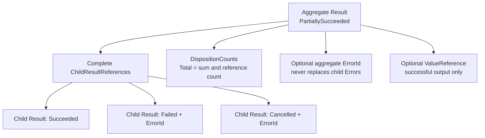
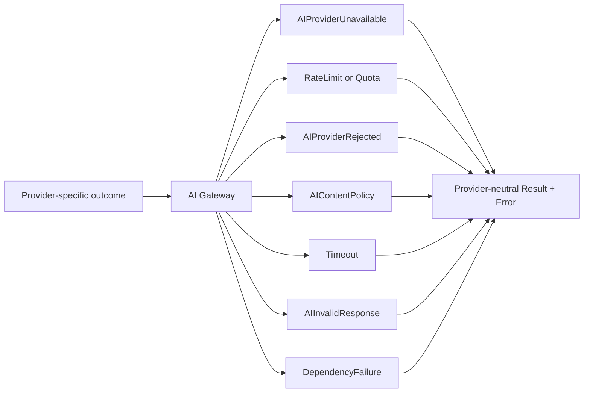
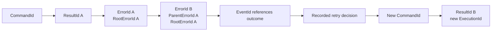
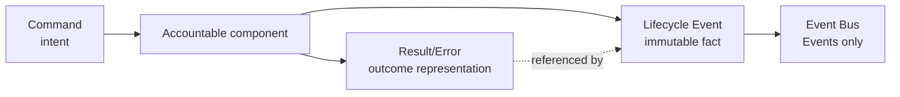

# Error and Result Model

## 1. Purpose

AIEOS uses one canonical outcome model so every component communicates acceptance, success, rejection, failure, cancellation, timeout, and partial completion without leaking local implementation or provider semantics.

This document defines representation and normalization, not authority. Workflow Engine owns Workflow state and retry decisions; Skill Runtime owns one Execution Attempt; AI Gateway owns provider isolation; Manager owns Request rejection; Memory Service owns Memory; and Capability Registry owns Capability contracts and resolution.

Results and Errors are typed service-contract representations. They are not Commands, Events, transports, or state stores. Commands express intent; Events record facts; Results describe outcomes; Errors describe unsuccessful outcomes and preserved causes.

Related sources are [ES-007](../engineering-specifications/ES-007-Error-and-Result-Model.md), [Service Interfaces](ServiceInterfaces.md), [Command Contract](CommandContract.md), [Event Contract](EventContract.md), [Execution Flow](ExecutionFlow.md), and [Domain Model](DomainModel.md).

## 2. Canonical Result Envelope

| Field | Requirement | Rule |
| --- | --- | --- |
| `ResultId` | Required | Immutable identity of exactly one acknowledgement, progress, or terminal outcome record. |
| `ResultStatus` | Required | One canonical status. |
| `OutcomeCategory` | Required | Acknowledgement, Progress, Success, PartialSuccess, Rejection, Failure, Cancellation, or Timeout. |
| `SubjectReference` | Required | Typed reference to the affected operation or subject. |
| `TenantId` | Required when scoped | Verified scope, never a payload claim. |
| `WorkspaceId` | Required when scoped | Verified scope consistent with Tenant. |
| `CorrelationId` | Required | Stable across the logical work. |
| `CausationId` | Required | Command, Event, or Recorded Decision only. |
| `CommandId` | Conditional | Originating Command when applicable. |
| `EventId` | Conditional | Originating Event when applicable. |
| `ProducerComponent` | Required | Canonical component producing the Result. |
| `StartedAt` | Conditional | Absent for rejection before execution. |
| `CompletedAt` | Required when terminal | Time terminal disposition became authoritative. |
| `ValueReference` | Conditional | Typed value or Artifact reference. |
| `ErrorId` | Required for `Rejected`, `Failed`, `Cancelled`, and `TimedOut`; conditional for `PartiallySucceeded` | Canonical Error reference; aggregate partial-success rules apply. |
| `Warnings` | Optional | Structured non-fatal warnings. |
| `Metadata` | Optional | Minimized, non-authoritative context. |
| `ContractVersion` | Required | Result contract interpretation version. |
| `PredecessorResultId` | Conditional | Previous immutable Result for the same subject. |
| `ParentResultId` | Conditional | Aggregate or parent Result for child lineage. |
| `ChildResultReferences` | Required for `PartiallySucceeded` | Complete immutable references to direct child Results. |
| `DispositionCounts` | Required for `PartiallySucceeded` | `Total`, `Succeeded`, `Failed`, `Cancelled`, `TimedOut`, `Rejected`, and `PartiallySucceeded` counts. |

Identity, subject, producer, scope, lineage, and contract version are immutable. A Result record never changes status. Acknowledgement, optional progress, and terminal completion are separate Results with separate `ResultId` values, joined by stable subject and correlation context plus `PredecessorResultId` where applicable. A terminal Result has one terminal status. `Rejected`, `Failed`, `Cancelled`, and `TimedOut` reference one Error; `PartiallySucceeded` follows its aggregate Error rule. `Succeeded` means all required effects completed and validated. `PartiallySucceeded` exposes every unsuccessful subset. `Accepted` and `InProgress` are non-terminal records, not mutable phases of a terminal Result.

## 3. Immutable Result Record Sequence



Each node is a distinct record with a distinct `ResultId`; the arrows express lineage and never mutation.

| `ResultStatus` | Required `OutcomeCategory` |
| --- | --- |
| `Accepted` | `Acknowledgement` |
| `InProgress` | `Progress` |
| `Succeeded` | `Success` |
| `PartiallySucceeded` | `PartialSuccess` |
| `Rejected` | `Rejection` |
| `Failed` | `Failure` |
| `Cancelled` | `Cancellation` |
| `TimedOut` | `Timeout` |

Every other pairing is invalid. Producers MUST reject invalid pairs. `InProgress` is permitted only for interfaces that explicitly support progress.

Rejection precedes execution:



An asynchronous AI invocation returns `Accepted` with `AIInvocationId`; terminal completion arrives separately. A synchronous invocation returns a terminal Result and MUST NOT call it an acknowledgement.

## 4. Canonical Error Envelope

| Field | Requirement | Rule |
| --- | --- | --- |
| `ErrorId` | Required | Immutable identity of one Error. |
| `ErrorCode` | Required | Stable machine-oriented code. |
| `ErrorCategory` | Required | Provider-neutral canonical category. |
| `ErrorSeverity` | Required | Impact classification, not retry authority. |
| `RetryClassification` | Required | Advisory evidence for Workflow Engine policy. |
| `Message` | Required | Safe human-facing summary. |
| `DiagnosticReference` | Optional | Restricted reference, not raw sensitive detail. |
| `OriginatingComponent` | Required | Canonical origin boundary. |
| `AffectedSubject` | Required | Typed subject reference. |
| `TenantId` / `WorkspaceId` | Required when scoped | Verified isolation context. |
| `CorrelationId` / `CausationId` | Required | Valid lineage; Request is not causation. |
| `OccurredAt` | Required | When the unsuccessful fact became known. |
| `ExternalErrorReference` | Optional | Opaque, minimized diagnostic reference. |
| `ParentErrorId` / `RootErrorId` | Optional | Preserved cause chain. |
| `ContractVersion` | Required | Error contract interpretation version. |

Errors are immutable. Wrapping adds context with a new `ErrorId`, preserves root-cause linkage, and never mutates or erases the upstream Error.

## 5. Error Taxonomy

| Family | Categories |
| --- | --- |
| Boundary | `Validation`, `Authentication`, `Authorization`, `NotFound`, `Conflict`, `Concurrency`, `PolicyViolation` |
| Capacity and dependency | `RateLimit`, `Quota`, `DependencyUnavailable`, `DependencyFailure`, `Timeout`, `Cancellation` |
| Capability | `UnsupportedCapability`, `CapabilityCompatibility` |
| Memory | `MemoryRead`, `MemoryWrite` |
| AI | `AIProviderUnavailable`, `AIProviderRejected`, `AIContentPolicy`, `AIInvalidResponse` |
| Execution and integrity | `WorkflowState`, `ExecutionFailure`, `InternalInvariant`, `Unknown` |

The most specific category applies. Names never include providers, SDK types, protocols, databases, or frameworks. `NotFound` applies only after authorized lookup. `Conflict` describes authoritative-state conflict; `Concurrency` describes a failed version/concurrency precondition. `DependencyUnavailable` means a dependency cannot currently serve; `DependencyFailure` means it returned an unsuccessful outcome.

## 6. Retry Classification and New Attempts

| Classification | Meaning |
| --- | --- |
| `NeverRetry` | Repetition under unchanged inputs and policy cannot produce an acceptable outcome. |
| `Retryable` | Workflow Engine may consider a new attempt immediately. |
| `RetryableAfterDelay` | Workflow Engine may consider a new attempt only after an approved delay or backoff. |
| `RetryableAfterCondition` | Workflow Engine may consider a new attempt only after a named observable prerequisite is satisfied. |
| `RequiresPolicyEvaluation` | The producer cannot safely decide retryability without Workflow Engine policy and context. |

| Severity | Meaning |
| --- | --- |
| `Informational` | Limited unsuccessful outcome with no broader integrity, security, or availability impact. |
| `Warning` | Scoped failure or degradation requiring attention while broader integrity and availability remain intact. |
| `Error` | Operation cannot complete and requires handling within its scope. |
| `Critical` | Security, isolation, data-integrity, or sustained-availability risk requiring immediate escalation. |

Severity describes impact; retry classification describes advisory retry evidence. Each Error has exactly one canonical value for each field. Neither field implies the other, and neither grants retry authority. Unknown producer values fail validation; compatible consumers preserve them only under conservative, non-retrying handling.





Workflow Engine alone creates the new attempt. Skill Runtime and Capability Registry never initiate retries. AI Gateway provider retry stays inside one `AIInvocationId` and one Execution Attempt. A terminal attempt is never resurrected.

## 7. Cancellation

Cancellation request, acceptance, and terminal completion are separate.



The lifecycle owner makes one atomic terminal transition. The losing observation remains auditable but cannot replace terminal state. Cancellation propagates only through approved interfaces.

## 8. Timeout and Late Completion

```mermaid
sequenceDiagram
    participant Owner as Timeout Boundary Owner
    participant Work as Downstream Work
    participant State as Authoritative Lifecycle
    Owner->>Work: Begin bounded operation
    alt completed before deadline
        Work-->>Owner: Terminal outcome
        Owner->>State: Commit terminal Result
    else deadline expires
        Owner->>State: Commit TimedOut Result
        Owner-->>Work: Request cancellation where supported
        Work-->>Owner: Late completion
        Owner->>State: Preserve TimedOut; record late observation
    end
```

Timeout detection belongs to the ES-006 boundary owner. `TimedOut` and `Cancelled` remain distinct. Late completion cannot resurrect an attempt or overwrite terminal Workflow state.

## 9. Partial Success



Partial success is valid only when the contract permits independent item outcomes. It requires at least one success and one unsuccessful child and never claims atomic success. `ChildResultReferences` lists every direct immutable child. `DispositionCounts` contains `Total`, `Succeeded`, `Failed`, `Cancelled`, `TimedOut`, `Rejected`, and `PartiallySucceeded`; `Total` equals both the child-reference count and the sum of dispositions. Nested partial Results count once and are not double-counted.

Every unsuccessful child exposes its own `ErrorId`. A top-level `ErrorId` is optional only when an aggregate-level Error exists; when present it summarizes aggregate impact and links to, but never replaces, child Errors. It is otherwise prohibited. `ValueReference`, metadata, and warnings cannot hide failure. Workflow Engine alone decides whether failed subsets produce new attempts.

## 10. AI Provider Error Normalization



AI Gateway preserves `AIInvocationId`, correlation, scope, and safe cause. Provider formats, SDK types, credentials, and raw payloads do not escape. An authorized diagnostic boundary may retain an opaque reference.

## 11. Memory and Capability Registry Outcomes

Memory Service normalizes `NotFound`, `Conflict` or `Concurrency`, `MemoryRead`, `MemoryWrite`, authentication, authorization, and validation failures without exposing persistence.

Capability Registry normalizes `UnsupportedCapability`, `CapabilityCompatibility`, `DependencyUnavailable` when no eligible implementation is available, and pre-handoff `Validation`. It does not execute Skills, invoke providers, or initiate retries.

## 12. Component Normalization

| Component | Own normalization | Must preserve |
| --- | --- | --- |
| **Manager** | Request validation, acceptance, rejection, and safe interaction outcomes | Request context and upstream Workflow outcome |
| **Workflow Engine** | Invalid transitions, Workflow/step disposition, retry-policy decision | Attempt lineage and prior Errors |
| **Skill Runtime** | Attempt validation, execution, timeout, cancellation, Capability outcome | Upstream cause and declared contract context |
| **AI Gateway** | Provider-neutral invocation and policy outcomes | `AIInvocationId`, usage context, safe cause |
| **Memory Service** | Memory authorization, scope, read, write, conflict | Memory identity and provenance |
| **Capability Registry** | Discovery, compatibility, availability, pre-handoff validation | Capability identity and contract version |

No component converts upstream failure to success or removes root-cause lineage.

## 13. Correlation, Causation, and Lineage



`CorrelationId` remains stable. `CausationId` references only Command, Event, or Recorded Decision. `RequestId` is context only. New retries use new Command, Result, and Execution identities; earlier outcomes remain immutable.

## 14. Security, Privacy, and Compatibility

Human messages are safe and minimal. Secrets, credentials, tokens, raw provider payloads, cross-Workspace data, and unrestricted diagnostics are prohibited. Tenant and Workspace scope are verified at each boundary. Error chains cannot cross Workspace scope.

Result and Error contracts are independently versioned. Additive optional information is compatible only when meaning, authority, validation, and security remain unchanged. Changed required fields, identity/status/taxonomy meaning, scope, or security require a new major version. Unknown categories normalize to `Unknown`, never success.

## 15. Command and Event Relationship



A Result is returned or retained through the service interface. An Event may reference it. Neither Result nor Error is an independent Event Bus message category or a path around directed Commands.

## 16. Observability Boundary

ES-007 propagates only outcome/error identity, subject, producer, scope, correlation, causation, lifecycle times, status/category, contract version, and minimized context. ES-008 defines logs, traces, spans, metrics, audit schemas, telemetry, health signals, storage, retention, alerts, and dashboards.

## 17. Architectural Invariants

1. Outcome representation does not transfer behavioral authority.
2. Workflow Engine alone decides Workflow retries.
3. Every Workflow retry creates a new `ExecutionId`.
4. Terminal Attempts and Results remain immutable.
5. Skill Runtime and Capability Registry never initiate retries.
6. AI Gateway never creates a Workflow retry.
7. Acknowledgement is not terminal completion.
8. Acknowledgement, progress, and terminal completion are distinct immutable Results with distinct identities.
9. Rejection precedes execution; failure follows acceptance.
10. Manager remains sole authoritative owner of `RequestRejected`.
11. `CausationId` references Command, Event, or Recorded Decision only; `RequestId` is context.
12. Event Bus transports Events only.
13. Results and Errors are not a new transport category.
14. Partial success never hides unsuccessful subsets and always supplies complete child references and consistent disposition counts.
15. Provider-specific formats do not escape AI Gateway.
16. Tenant and Workspace isolation applies to outcomes and cause chains.
17. Semantic deviations require applicable review and ADR governance.

## 18. Non-Goals and Review Checklist

This model does not define HTTP mappings, language exceptions, framework classes, serialization, persistence, brokers, vendor SDK errors, retry scheduling, telemetry implementation, UI copy, or deployment topology.

Reviewers verify field requiredness and immutability; non-overlapping statuses; Error references for unsuccessful terminal Results; advisory-only retry classification; safe cancellation/timeout races; explicit partial outcomes; provider-neutral normalization; preserved upstream cause and scope; intact Command/Event boundaries; ES-008 deferral; and diagram/prose consistency.
