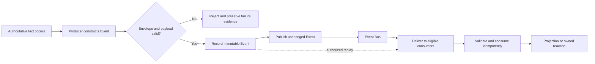
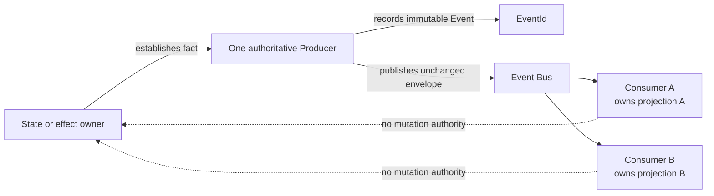
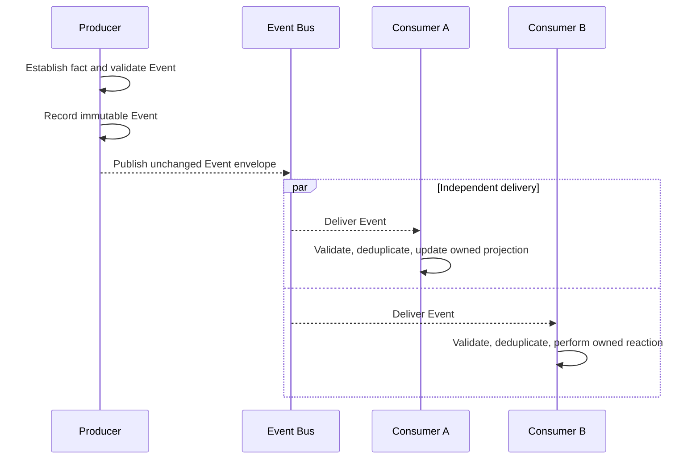
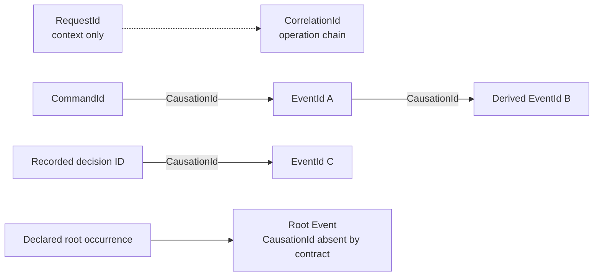
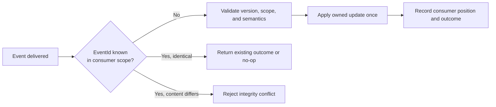
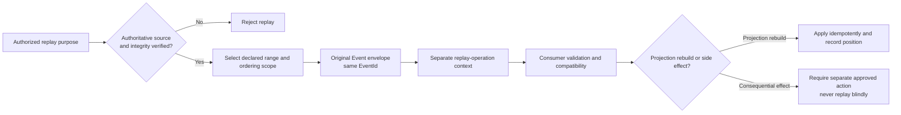
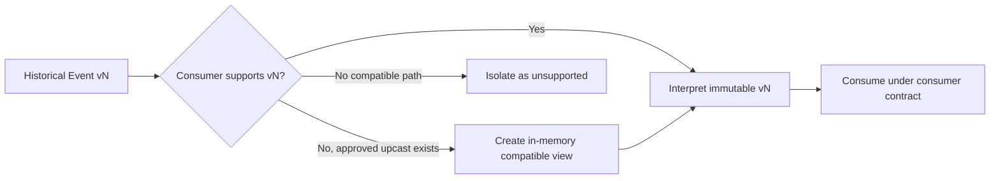

# Event Contract Model

## 1. Purpose

This document defines the canonical, transport-neutral contract for AIEOS Events. An Event is an immutable past-tense fact established by exactly one authoritative producer and published through the Event Bus. It may have multiple consumers. It is not a Command, does not direct a named consumer, and does not transfer mutation authority over the producer's domain state.

This contract refines the Event model deferred by Architecture v1.0, ES-001, ES-002, Domain v1.0, and ES-004. It introduces no component, aggregate, service, transport, persistence, serialization, or deployment boundary.

Normative terms such as MUST, MUST NOT, SHALL, SHOULD, and MAY are used as requirements.

## 2. Architectural Invariants

1. Every Event records one immutable fact established by exactly one authoritative `Producer`.
2. Commands express intent; Events record facts.
3. Events MUST NOT instruct a named consumer or disguise a Command.
4. Event Bus accepts, transports, and delivers validated Event envelopes only.
5. Event Bus does not make business decisions, own domain state, or transport Commands.
6. `EventId` identifies one immutable Event; correction creates a new Event and explicit relationship.
7. `CausationId` references only the immediate causal Command, Event, or recorded decision.
8. `RequestId` is context only and MUST NOT be used as `CausationId`.
9. Redelivery and replay preserve the original Event envelope and `EventId`.
10. Consumers tolerate duplicates and own correctness of their local projections and effects.
11. Tenant and Workspace scope remains explicit at every applicable boundary.
12. Historical interpretation, producer authority, and canonical domain meaning MUST NOT be weakened by compatibility handling.

## 3. Canonical Event Envelope

The envelope is immutable after authoritative recording. “Conditionally required” means a field MUST be present whenever its stated condition applies and otherwise MUST be absent unless the Event contract explicitly permits broader context.

| Field | Presence | Contract |
| --- | --- | --- |
| `EventId` | Required | Opaque identity of one immutable Event. Created when the authoritative fact is recorded. Redelivery and replay retain it; correction or a derived fact receives a new ID. |
| `EventType` | Required | Stable singular-domain-object plus past-tense outcome, such as `WorkflowCompleted` or `ExecutionAttemptFailed`. It describes a fact, not a requested action. |
| `EventVersion` | Required | Version of the complete Event interpretation: envelope requirements plus payload schema and semantics for this `EventType`. |
| `OccurredAt` | Required | UTC instant at which the authoritative domain or runtime fact occurred. It is not delivery or consumption time. |
| `RecordedAt` | Required | UTC instant at which the producer authoritatively recorded the Event. It MUST NOT precede `OccurredAt`; any material lag remains observable. |
| `Producer` | Required | Exactly one canonical logical component or approved boundary authorized to establish this Event type and subject. Runtime replicas do not create multiple authoritative producers. |
| `TenantId` | Conditionally required | Required whenever the fact, subject, producer action, or referenced resource is Tenant-scoped. |
| `WorkspaceId` | Conditionally required | Required whenever the fact, subject, producer action, or referenced resource is Workspace-scoped; it MUST belong to `TenantId`. |
| `CorrelationId` | Required | Stable identifier for the related operation chain. For Workflow work, it remains stable across the Workflow and retries. |
| `CausationId` | Conditionally required | Required unless this Event type explicitly permits a root occurrence with no prior in-platform cause. It references the immediate causal Command, Event, or recorded decision only. |
| `RequestId` | Conditionally required | Required when a platform Request provides context. It is not causation and does not replace `CorrelationId`. |
| `WorkflowId` | Conditionally required | Required when the fact concerns or results from an existing Workflow Instance. |
| `WorkflowStepId` | Conditionally required | Required when the fact concerns a Workflow Step. It MUST identify a step in `WorkflowId`. |
| `ExecutionId` | Conditionally required | Required when the fact concerns an Execution Attempt. It MUST identify an attempt for `WorkflowStepId`. |
| `AIInvocationId` | Conditionally required | Required when the fact concerns one provider-independent AI Invocation and MUST relate to its `ExecutionId`. |
| `Subject` | Required | Typed canonical identity of the primary Aggregate or domain object about which the fact is asserted. The subject identifies ownership and ordering scope but grants no mutation authority. |
| `Payload` | Required | Event-type-owned, versioned fact data. An empty structured value is allowed only when its schema explicitly permits it. |
| `Metadata` | Required | Structured, versioned context for provenance, integrity, delivery interpretation, observability, and audit. Unknown metadata does not acquire authority. |

### 3.1 Required metadata

`Metadata` SHALL contain logical values required by the Event contract when applicable:

| Metadata | Requirement |
| --- | --- |
| Provenance | Identifies the source evidence or state transition by which the producer established the fact when material. |
| Integrity context | References contract-level integrity or tamper-evidence observations without selecting a mechanism. |
| Policy context | References the exact `PolicyVersionId` used when policy materially governed the fact. |
| Trace context | Propagates operational trace information without replacing correlation or causation. |
| Supersession context | Required when this Event corrects or supersedes a prior Event; references the prior `EventId` without mutating it. |
| Classification | Declares the approved Event taxonomy category when the Event contract requires it. |

Metadata is trusted only when its producer, integrity, field meaning, and Event version are verified. Credentials, secret values, raw authorization headers, mutable delivery state, consumer checkpoints, replay flags, and unbounded sensitive content MUST NOT appear in the immutable envelope.

### 3.2 Field relationships

- `WorkflowStepId` MUST NOT appear without `WorkflowId`.
- `ExecutionId` MUST NOT appear without `WorkflowId` and `WorkflowStepId`.
- `AIInvocationId` MUST NOT appear without its applicable `ExecutionId`.
- `TenantId`, `WorkspaceId`, `Subject`, and referenced scoped identities MUST agree; mismatch is an isolation or invariant failure.
- `Producer` MUST match the one authoritative producer defined by the governing domain contract.
- `OccurredAt` and `RecordedAt` are immutable event-time facts. Delivery, consumption, and replay times are external observations.
- Redelivery and replay preserve every envelope field exactly.
- A correction, newly derived fact, changed producer assertion, or changed payload creates a new `EventId`.

## 4. Event Semantics and Classification

### 4.1 Commands and Events

A Command asks one accountable target to act and may be rejected. An Event records a fact that the authoritative producer has already established. A consumer may react to an Event only under its own approved contract and authority. An Event MUST NOT encode an imperative target, required handler action, or hidden Command in its payload.

### 4.2 Canonical taxonomy

| Classification | Meaning | Authority rule |
| --- | --- | --- |
| **Domain Event** | Fact about a canonical domain lifecycle, invariant, or outcome, such as `WorkflowCompleted` or `ArtifactPublished`. | Produced only by the component that owns the corresponding state or confirmed effect. |
| **Integration Event** | Compatibility-governed published representation of an authoritative fact for consumers outside the producer's local contract boundary. | Derived from an authoritative fact, names the deriving producer, and references its immediate cause. It MUST NOT create parallel domain truth. |
| **System or runtime Event** | Fact about an approved platform execution lifecycle, such as `ExecutionAttemptTimedOut`. | Produced only by the component owning that runtime lifecycle. It is still immutable and domain-scoped where applicable. |
| **Audit record** | Protected evidence of an actor, decision, authority, input reference, or outcome. | It is distinct from Event transport, diagnostic logs, and authoritative domain state. It is an Event only when a separately approved canonical Event contract explicitly says so. |

One fact MAY yield a deliberately derived Integration Event, but the derived Event receives its own `EventId`, `EventType`, `Producer`, contract, and causal relationship. Classification MUST NOT assign a second authoritative producer to the source fact.

## 5. Event Lifecycle

The Event envelope does not change state. The lifecycle below describes producer, transport, and consumer operations associated with one immutable `EventId`.

| Stage | Owner and requirement |
| --- | --- |
| **Fact occurrence** | The component owning the relevant state or confirmed external effect establishes that the fact occurred. A delivery receipt or model output alone is not an authoritative business fact. |
| **Construction** | The authoritative producer constructs the Event or delegates mechanical construction while retaining authority for Event type, subject, scope, payload, and meaning. |
| **Validation** | The producer validates schema, semantics, producer authority, isolation, identity relationships, version, and integrity before recording. |
| **Recording** | The producer records the immutable Event and its authoritative relationship to the established fact. Recording does not imply successful publication. |
| **Publication** | The producer, or infrastructure acting only on its behalf, presents the unchanged Event to Event Bus. |
| **Delivery** | Event Bus delivers the unchanged envelope to eligible subscribers and records delivery observations without interpreting the fact. |
| **Consumption** | Each consumer validates the Event at its trust boundary, detects duplicates, and applies only behavior it already owns and is authorized to perform. |
| **Projection or update** | The consumer updates its local projection or derives a new action/fact under its own contract. The source Event and producer-owned state remain unchanged. |
| **Replay** | An authorized purpose re-presents an authoritative historical Event with the same envelope and a separate replay-operation context. |
| **Archival or retention boundary** | The Event source owner applies an approved retention or archival policy while preserving required interpretation and audit obligations. Mechanism and duration remain deferred. |

The diagram is an operation flow, not a mutable Event state machine.

## 6. Ownership Model

| Role | Accountable party |
| --- | --- |
| Observes and establishes fact | The component that owns the state transition, lifecycle, or confirmed effect under Architecture v1.0 and Domain v1.0. |
| Constructs | The authoritative producer, or a mechanical helper acting within the producer boundary. Delegation MUST NOT change Event meaning or authority. |
| Authoritative producer | Exactly one logical component or approved boundary. Multiple runtime instances do not create multiple logical producers. |
| Validates before recording | The authoritative producer validates complete semantics, scope, identities, payload, and version. |
| Records and publishes | The producer owns the decision. Infrastructure MAY record or deliver on its behalf but MUST preserve the envelope and MUST NOT establish the domain fact. |
| Transports | Event Bus owns delivery of validated Event envelopes and delivery observations only. |
| Consumes | Each subscribed logical consumer owns its local validation, idempotency, projection, and authorized reaction. |
| Authorizes replay | The owner of the replay purpose authorizes it; the Event source owner determines source authority and replay eligibility. |
| Owns projection correctness | The component owning that projection, including checkpoint, duplicate, ordering, rebuild, and reconciliation behavior. |

### 6.1 Canonical producer examples

The frozen Domain v1.0 producer catalog remains authoritative:

- Manager alone produces `RequestRejected`;
- Workflow Engine produces Workflow and Human Approval Events;
- Skill Runtime produces Execution Attempt Events;
- Workspace component produces Artifact lifecycle Events; and
- the ingress contract owner produces `RequestReceived`.

ES-005 does not add, rename, or reassign canonical Events.

## 7. Producer-to-Consumer Flow

Consumer A's failure MUST NOT mutate the Event, reverse the producer's fact, or cause Consumer B to treat the Event as invalid. Consumer recovery is isolated within its own contract.

## 8. Correlation and Causation

`CorrelationId` groups the related operation chain. `CausationId` identifies the immediate causal edge. `RequestId` supplies Request context only.

Rules:

- `CausationId` MUST reference the immediate causal Command, Event, or recorded decision.
- `RequestId`, `CorrelationId`, a timestamp, free-form text, or the Event's own ID MUST NOT substitute for causation.
- A root Event MAY omit `CausationId` only when its versioned Event contract declares an external or origin fact with no prior in-platform cause. Root status MUST NOT be inferred merely because causal evidence is inconvenient.
- Recorded-decision causation MUST reference protected, stable, retrievable decision evidence; a prose description alone is insufficient.
- A derived Event receives a new `EventId` and references the source Event or recorded decision that directly caused it.
- Correlation and Request context do not grant producer authority or consumer mutation rights.

## 9. Delivery and Processing Semantics

### 9.1 At-least-once tolerance and duplicates

Consumers MUST expect the same immutable Event to be delivered more than once. Redelivery preserves `EventId` and every envelope field. Each consumer owns idempotency within its local projection or effect boundary.

A duplicate is not a new Event and MUST NOT produce uncontrolled duplicate publication, charge, notification, or another consequential effect. A consumer that needs a consequential action issues a separate authorized Command or uses another approved idempotent contract; the Event itself does not grant that authority.

### 9.2 Ordering

- Global ordering MUST NOT be assumed.
- Ordering across unrelated subjects, Tenants, Workspaces, producers, or Event types MUST NOT be assumed.
- An Event contract MAY declare an ordering scope based on stable `Subject` identity and version, but the precise guarantee remains an implementation contract.
- Consumers MUST enforce domain invariants from authoritative state and version evidence, not arrival order alone.
- Late or out-of-order Events MUST be held, ignored idempotently, reconciled, or marked unprocessable according to consumer-owned policy; they MUST NOT silently overwrite newer authoritative state.

### 9.3 Poison and unprocessable Events

An Event is unprocessable for a consumer when its immutable envelope is valid but that consumer cannot safely interpret or apply it, for example because of an unsupported version or violated local precondition. Malformed, unauthorized, integrity-conflicting, and semantically invalid Events are rejected earlier at their relevant boundary.

Event Bus or delivery infrastructure MAY isolate repeated delivery failure, but MUST NOT modify the Event, label the authoritative fact false, or select a business remedy. The affected consumer owns remediation or escalation for its projection. Detailed Error categories and dispositions are deferred to ES-007.

### 9.4 Consumer failure isolation

Consumers process independently. Failure, lag, replay, or retirement of one consumer MUST NOT:

- block unrelated consumers by contract;
- change the producer's fact;
- mutate the Event envelope;
- convert success into failure for other consumers; or
- grant Event Bus business authority.

## 10. Replay Semantics

Replay is an authorized operation that re-presents historical immutable Events from an authoritative source to a consumer or projection purpose.

Replay SHALL obey these rules:

- only authoritative, integrity-verified, version-interpretable Events are replayable;
- the original `EventId`, envelope, `OccurredAt`, and `RecordedAt` remain unchanged;
- replay has a separate operation or trace identity outside the Event envelope;
- replay context indicates replay versus live delivery without mutating the Event;
- consumers prevent duplicate effects and SHOULD support side-effect-disabled rebuild mode;
- projection rebuild declares its source boundary, ordering scope, starting position, completion position, and verification outcome;
- derived facts created during replay receive new `EventId` values and valid immediate causation;
- historical Events are never rewritten, re-timestamped, or republished as though newly occurred; and
- retention, source storage, authorization implementation, and operational scheduling remain deferred.

## 11. Versioning and Compatibility

`EventVersion` identifies the complete interpretation of one `EventType`, including required envelope relationships, payload schema, semantics, producer, subject, and authority expectations.

Rules:

- published versions and their historical meaning are immutable;
- a breaking change to meaning, required fields, producer, subject, scope, authority, or payload requires a new version and applicable governance review;
- an additive field is compatible only when existing consumers are explicitly permitted to ignore it, it is non-authoritative for that version, and meaning is unchanged;
- producers publish declared versions; consumers declare supported versions and fail deliberately on unsupported versions;
- upcasting MAY construct an in-memory compatible interpretation at the consumer boundary but MUST NOT rewrite the source Event;
- downcasting is prohibited unless a reviewed lossless mapping preserves all authoritative semantics; absence of consumer support is not permission to discard meaning;
- compatibility adapters MUST NOT weaken producer authorization, Tenant/Workspace isolation, causation, subject identity, or integrity; and
- compatibility and replay behavior require contract-test evidence before a version is retired.

### 11.1 Deprecation

A deprecated Event version SHALL identify its owner, replacement, affected producers and consumers, migration guidance, compatibility window, announcement point, and removal criteria. Historical Event interpretation and required replay remain possible for the documented retention obligation. Deprecation does not alter an already-recorded Event.

## 12. Validation Model

Validation is cumulative and occurs at every trust boundary.

| Layer | Required checks | Accountable owner |
| --- | --- | --- |
| **Schema** | Required fields, type, structure, nullability, timestamp form, supported `EventType` and `EventVersion`, payload schema, metadata structure. | Producer before recording; consumer rechecks supported interpretation. |
| **Semantic** | Field relationships, past-tense fact meaning, subject identity, lifecycle applicability, payload meaning, one authoritative producer. | Producer authoritatively; consumer validates safe local interpretation. |
| **Producer authorization** | Verified producer identity and current authority to assert this Event type for this subject and scope. | Producer boundary before recording; Event Bus and consumer verify evidence appropriate to their boundary. |
| **Isolation** | Tenant, Workspace, subject, Workflow, step, execution, invocation, and referenced identities share an authorized scope. | Producer and every consumer at their trust boundaries. |
| **Integrity** | Immutable envelope matches the recorded source and has not changed during publication, delivery, or replay. | Producer establishes; Event Bus preserves; consumer verifies available evidence. |

Unknown Event versions, producers, authoritative metadata, scopes, or required fields fail closed. A consumer MUST NOT weaken validation simply to make replay or delayed processing succeed.

## 13. Security and Audit

### 13.1 Producer authority

The producer MUST prove identity and authority independently of self-asserted envelope metadata. Event Bus acceptance confirms transport eligibility only; it does not confer producer authority or prove the fact.

### 13.2 Scope isolation

Tenant- and Workspace-scoped Events carry explicit `TenantId` and `WorkspaceId`. A consumer validates access before processing and MUST NOT infer cross-Workspace authority from correlation, shared infrastructure, or a User Session.

### 13.3 Sensitive-data minimization

Payload and metadata contain only information required to understand and process the fact. Credentials, secret values, raw private prompts, unrestricted model context, signed URLs, and unnecessary personal data are prohibited. Protected content SHOULD be referenced through authorized identities rather than copied into every Event.

### 13.4 Integrity and tamper evidence

Implementations SHALL provide evidence sufficient to detect unauthorized Event-envelope changes between authoritative recording and consumption. This contract does not select signing, hashing, storage, or transport technology. Integrity evidence MUST itself be protected and MUST NOT be accepted solely because it appears in unverified metadata.

### 13.5 Audit expectations

Consequential Event processing requires durable evidence of:

- Event identity, type, version, producer, subject, Tenant, and Workspace;
- occurrence, recording, publication, delivery, and consumption times as applicable;
- producer authorization and Policy Version references where material;
- correlation, causation, Request, Workflow, step, execution, and invocation context where applicable;
- validation, duplicate, compatibility, replay, and projection outcomes;
- derived Command, Event, or external-effect evidence references; and
- stable failure condition without exposing protected diagnostics.

Audit evidence is distinct from the Event, authoritative domain state, projection state, and diagnostic logs. It is protected from ordinary mutation.

## 14. Error Boundaries

This contract identifies these conceptual conditions without defining the final ES-007 Error envelope or code taxonomy:

| Condition | Detected by | Required boundary behavior |
| --- | --- | --- |
| **Malformed** | Producer, Event Bus eligibility boundary, or consumer | Reject or isolate; do not repair by guessing authoritative content. |
| **Invalid** | Producer or consumer semantic validation | Reject or isolate with protected evidence; do not mutate the Event. |
| **Unauthorized producer** | Producer boundary, Event Bus eligibility boundary, or consumer | Deny recording, publication, or processing as applicable; preserve security evidence. |
| **Scope mismatch** | Producer or consumer isolation validation | Deny and prevent cross-Tenant or cross-Workspace processing. |
| **Integrity conflict** | Event Bus or consumer | Isolate; the same `EventId` with different immutable content is not a duplicate. |
| **Unsupported version** | Consumer | Isolate or use an approved compatibility interpretation; never silently downcast. |
| **Duplicate** | Consumer | Return the existing local outcome or no-op safely. It is not an error in the authoritative fact. |
| **Late or out of order** | Consumer | Apply consumer-owned ordering and reconciliation policy; do not overwrite newer authority blindly. |
| **Unprocessable** | Consumer | Isolate from unrelated consumers and preserve evidence for remediation. |

Detailed categories, retryability, operator actions, result envelopes, and presentation remain deferred to ES-007. Telemetry field standards and alerting remain deferred to ES-008.

## 15. Non-Goals

This contract does not define or select:

- an Event broker, queue, stream, or messaging product;
- transport protocols, REST, or gRPC;
- databases, Event stores, or persistence schemas;
- queue, topic, partition, or consumer-group naming;
- serialization formats;
- implementation languages or frameworks;
- deployment topology;
- retention duration, archival medium, or deletion mechanism;
- complete Error, Result, Idempotency, Policy, authorization, or Observability standards;
- product-specific Event payload schemas beyond frozen examples; or
- changes to Architecture v1.0, Domain v1.0, or ES-004.

## 16. Review Checklist

- [ ] Every Event has one and only one authoritative producer.
- [ ] Required and conditionally required envelope fields are unambiguous.
- [ ] `OccurredAt` and `RecordedAt` are distinct from delivery, consumption, and replay time.
- [ ] Commands remain outside Event Bus and no Event disguises an instruction.
- [ ] `CausationId` references only a Command, Event, or recorded decision.
- [ ] `RequestId` remains context only.
- [ ] Root Events use a narrow, declared absent-causation rule.
- [ ] Classification does not create duplicate truth or conflate audit records with Events.
- [ ] Producer, Event Bus, consumer, replay, and projection ownership are distinct.
- [ ] Duplicate delivery preserves `EventId` and is handled idempotently by each consumer.
- [ ] No global ordering is assumed; late and out-of-order behavior is safe.
- [ ] Consumer failures and poison Events are isolated without Event mutation.
- [ ] Replay preserves historical Event identity and prevents blind consequential effects.
- [ ] Versioning and compatibility preserve immutable historical interpretation.
- [ ] Schema, semantic, producer-authorization, isolation, and integrity validation are distinct.
- [ ] Security and audit rules minimize protected data and do not trust self-asserted metadata.
- [ ] Error boundaries do not pre-empt ES-007 or allow silent loss.
- [ ] No transport, persistence, serialization, language, deployment, or vendor choice is introduced.
- [ ] Mermaid diagrams agree with the prose.
- [ ] Relative links resolve.
- [ ] Architecture v1.0, Domain v1.0, and ES-004 remain unchanged.

## 17. Traceability and Governance

| Source | Preserved contract |
| --- | --- |
| [Engineering Blueprint](../03-architecture/EngineeringBlueprint.md) | Event Bus delivers versioned Events, preserves correlation and causation, tolerates duplicates, and owns no business decision. |
| [System Architecture](../03-architecture/SystemArchitecture.md) | Events are durable completed facts with independent consumers, explicit trust boundaries, safe failure, and infrastructure neutrality. |
| [Execution Flow](ExecutionFlow.md) | Result Events progress Workflows only after Workflow Engine validation; Commands remain outside Event Bus. |
| [Domain Model](DomainModel.md) | Event meaning, `EventId`, producer ownership, scope, correlation, causation, immutability, and canonical Event examples remain unchanged. |
| [ES-001](../engineering-specifications/ES-001-Execution-Core.md) | Delivers the shared Event Envelope requirements without selecting technology. |
| [ES-002](../engineering-specifications/ES-002-Execution-Flow-Architecture.md) | Refines Event lifecycle, duplicate delivery, no-global-order, failure propagation, and traceability requirements. |
| [ES-003](../engineering-specifications/ES-003-Domain-Model-and-Ubiquitous-Language.md) | Preserves frozen Event names, identities, authoritative producers, aggregate boundaries, and invariants. |
| [ES-004](../engineering-specifications/ES-004-Command-Contract-Model.md) | Preserves Command/Event separation, correlation and causation semantics, and the events-only Event Bus. |
| [Command Contract](CommandContract.md) | Leaves Command fields, abstract dispatch, acknowledgement, redelivery, retry, and security semantics unchanged. |

Any semantic change to canonical Event identity, meaning, authoritative producer, lifecycle ownership, aggregate meaning, causation, Event Bus responsibility, or another frozen boundary requires the applicable architecture or domain review and ADR process. Editorial clarification that preserves meaning follows normal review.

## 18. Open Questions and Deferred Standards

- ES-007 will define normalized Error and Result envelopes, stable codes, retry classification, and remediation dispositions.
- ES-008 will define Event-related logs, traces, metrics, audit telemetry, cost attribution, and alerting contracts.
- A future Idempotency standard will define retention and durable duplicate-result representation.
- Future service-interface contracts may bind publication, consumption, replay, and projection operations to component interfaces without selecting a transport unless separately authorized.
- Retention duration, archival, deletion, and legal-hold behavior require later data-governance work.

These deferrals do not authorize changes to frozen architecture, domain, or Command semantics.
