# Execution Flow Architecture

## 1. Purpose

This document is the canonical architecture explanation for AIEOS execution. It describes how a request becomes governed, observable, resumable work without selecting implementation technology. [ES-002](../engineering-specifications/ES-002-Execution-Flow-Architecture.md) is the controlling engineering contract; this document explains that contract as a cohesive runtime model.

## 2. Architectural Context

AIEOS separates goal interpretation, orchestration, execution, capability resolution, provider access, and Event delivery:

- the **Manager** owns goal interpretation and interaction;
- the **Workflow Engine** owns orchestration, Workflow state, step transitions, and retry decisions;
- the **Skill Runtime** owns one restricted execution attempt;
- registries own approved metadata and resolution contracts;
- the **AI Gateway** owns provider interaction boundaries; and
- the **Event Bus** transports immutable Event envelopes only.

Commands are directed requests delivered through an abstract command-dispatch contract. They do not pass through the Event Bus. Events are completed facts published through the Event Bus.

## 3. Canonical Execution Model

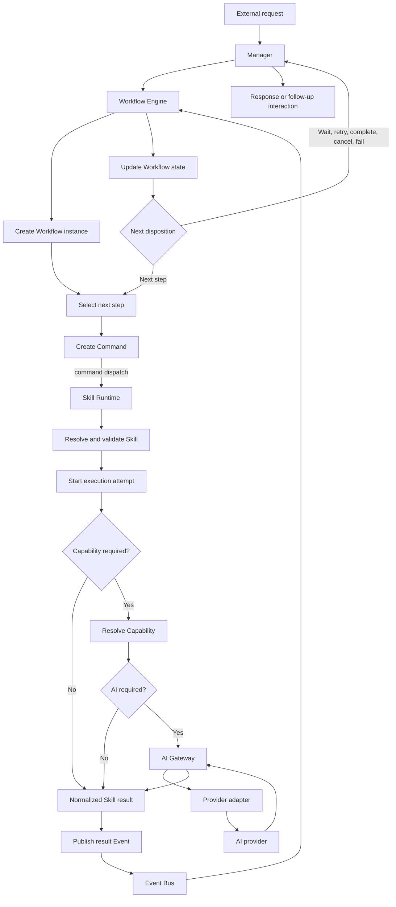

The Workflow Engine SHALL persist valid state before dispatch and after consuming a result Event. The Skill Runtime SHALL execute only the attempt requested by the Command. A result does not alter Workflow state until the Workflow Engine validates the corresponding transition.

## 4. End-to-End Execution Sequence

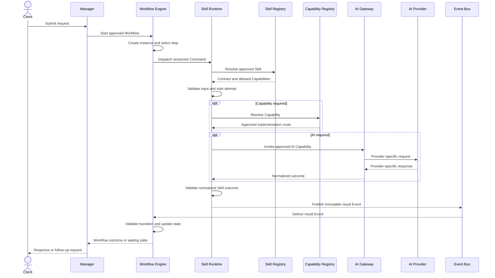

The sequence shows logical contracts, not transport or deployment choices.

## 5. Component Responsibilities

### Manager

The Manager SHALL interpret goals, initiate approved Workflows, manage interaction, receive outcomes, request clarification, and present final or follow-up responses. It MUST NOT execute Skills, own Workflow state, contact providers, or bypass the Workflow Engine.

### Workflow Engine

The Workflow Engine SHALL create Workflow instances, select steps, validate transitions, own durable Workflow and step state, create and dispatch Commands, consume result Events, own retry decisions, pause and resume, and determine completion or failure. It MUST NOT execute Skill logic, call providers, or act as the Event Bus.

### Skill Runtime

The Skill Runtime SHALL validate Commands, resolve approved Skills, restrict Capability and Tool access, execute one requested attempt, handle attempt timeout and cancellation, validate output, and produce a normalized outcome. It MUST NOT orchestrate Workflows, select steps, mutate Workflow state, define retry policy, or independently create another attempt.

### Skill Registry

The Skill Registry SHALL expose approved Skill identities, versions, contracts, metadata, required Capabilities, and allowed Tools. It MUST NOT execute Skills or contain Workflow logic.

### Capability Registry

The Capability Registry SHALL expose provider-neutral Capability contracts and eligible approved implementations. It MUST NOT orchestrate Workflows, execute product behavior, or act as the AI Gateway.

### AI Gateway

The AI Gateway SHALL isolate providers; enforce approved selection and invocation policy; transform requests; normalize responses and errors; account for usage; and own bounded provider-level retry and failover. It MUST NOT execute Skills, own Workflow state, or contain product-specific decisions.

### Event Bus

The Event Bus SHALL transport and deliver Event envelopes while preserving metadata and delivery observability. It MUST NOT transport Commands, make business decisions, determine state transitions, or become authoritative state.

## 6. Request Lifecycle

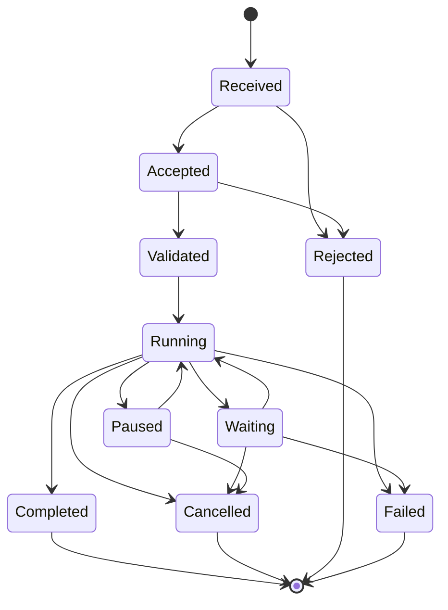

A request has exactly one current state. Completed, Cancelled, Rejected, and Failed are terminal. Request state summarizes caller-facing progress and is not Workflow state. Multiple Workflow instances per request require explicit future authorization.

## 7. Workflow Lifecycle

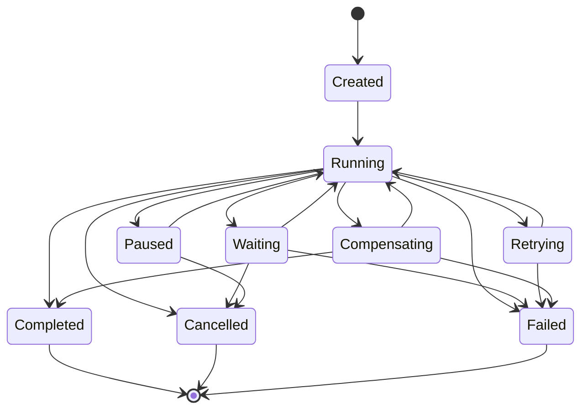

The Workflow Engine is the sole owner of these transitions. Completed, Cancelled, and Failed are terminal. Definitions and instances are separately versioned. Resume continues from persisted state and MUST NOT silently recreate completed work.

## 8. Workflow-Step Lifecycle

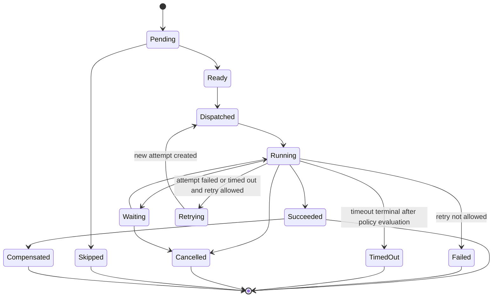

The Workflow Engine owns step state and evaluates each normalized attempt outcome. If an attempt fails or times out, the Workflow Engine applies the approved retry policy. When retry is allowed, the step transitions from Running to Retrying and then to Dispatched only after a distinct new attempt is created. When retry is not allowed, the step transitions to Failed or TimedOut. Succeeded, Failed, TimedOut, Cancelled, Skipped, and Compensated are terminal step dispositions only when the Workflow Engine determines that no further transition is allowed.

The Workflow step never reuses or revives the prior attempt. Every retry has a new Execution ID and a monotonically increasing attempt number within the Workflow-step execution context. Correlation ID and Workflow ID remain stable across retries. Causation ID identifies the Event or Workflow Engine decision that created the new attempt. Prior failed and timed-out attempts remain immutable and auditable.

## 9. Skill Execution Lifecycle

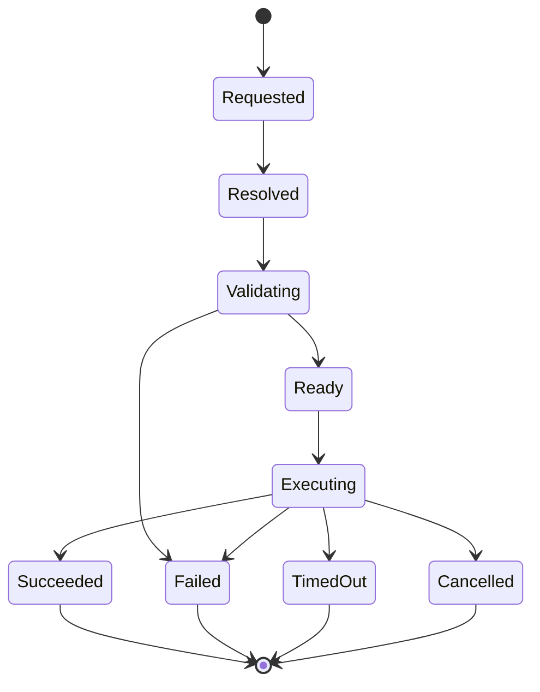

The Skill Runtime owns execution-attempt state. Succeeded, Failed, TimedOut, and Cancelled are terminal attempt states and have no outgoing transition to Retrying. The Skill Registry resolves identity and version but does not execute. Every terminal attempt produces one normalized outcome; partial failure cannot be reported as success. A retry is represented by a distinct new execution attempt created by the Workflow Engine, never by reviving a terminal attempt.

## 10. Capability Invocation

A Capability is a provider-neutral operation declared by a Skill. The Capability Registry resolves the approved contract and eligible implementation. A Capability MAY be non-AI. Resolution MUST NOT introduce product orchestration. Invocation remains within the Skill Runtime's restricted context and carries Request, Workflow, step, execution, correlation, and Capability identifiers.

## 11. AI Invocation Lifecycle

AI invocation states are Requested, PolicyValidated, ProviderSelected, Prepared, Invoked, Retrying, Succeeded, Failed, TimedOut, and Cancelled.

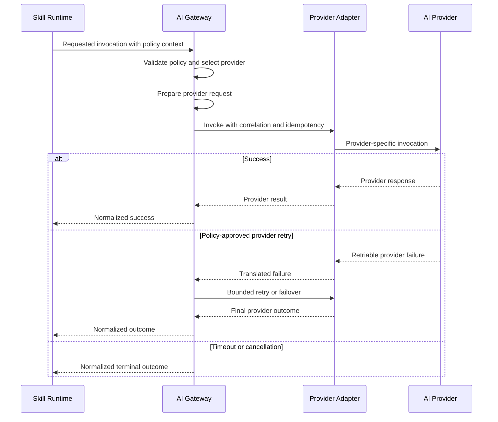

Provider-specific formats and credentials stay inside the AI Gateway boundary. Provider retries MUST remain inside one Workflow execution attempt and preserve context.

## 12. Commands and Events

Commands request an action from one accountable target and MAY be rejected. Events record immutable facts and MAY have multiple consumers.

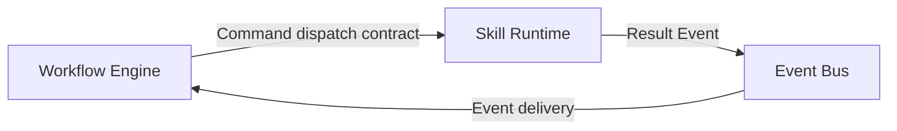

Commands SHALL carry identity, type and version, target, correlation, causation, idempotency, authorization context, and payload metadata. Their precise transport is future work. Events SHALL preserve identity, version, producer, subject, time, correlation, causation, request, Workflow, execution, payload, and metadata. Events MUST NOT direct named components to act, and Commands MUST NOT pass through the Event Bus.

## 13. Failure Propagation

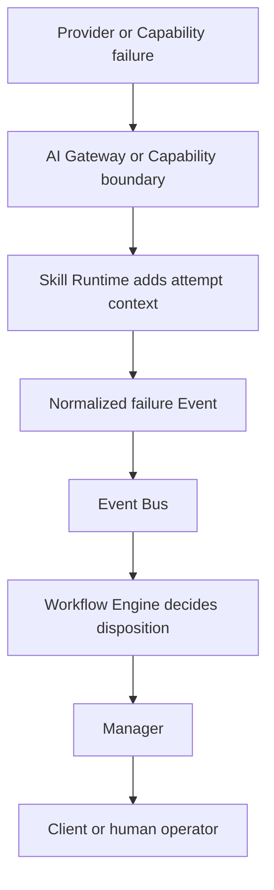

Each boundary adds context without destroying cause. Failures are normalized, never swallowed, and classified for Workflow disposition. User-facing detail MUST exclude secrets and sensitive internals.

## 14. Retry Ownership

Retry decision ownership is not the same as retry-safe execution ownership.

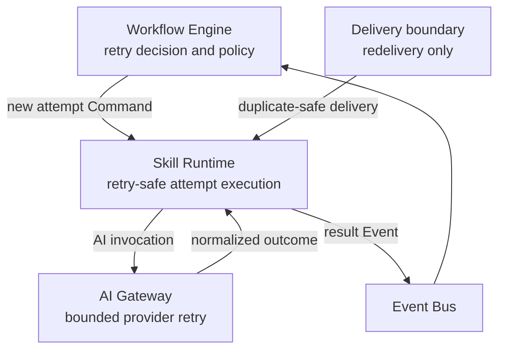

The Workflow Engine owns maximum attempts, Workflow-level backoff, retry, fail, compensate, pause, or escalation decisions, and creation of each new attempt. A failed or timed-out attempt remains terminal. If retry is allowed, the Workflow Engine transitions the Workflow step to Retrying and creates a new attempt with a new Execution ID and monotonically increasing attempt number. Correlation ID and Workflow ID remain stable, while Causation ID identifies the Event or decision that created the new attempt. The Skill Runtime executes only the instructed attempt. The AI Gateway MAY retry provider invocation within approved policy without creating a Workflow attempt. Delivery redelivery is not a Workflow retry.

## 15. Idempotency Expectations

Every Command and execution request requires a scoped idempotency strategy. Components distinguish redelivery from a new logical request. Duplicate Events are expected and consumers MUST be safe. A terminal result for a known idempotency scope MUST NOT cause an uncontrolled duplicate effect. Detailed retention and replay rules belong to the future shared Idempotency standard.

## 16. Timeout and Cancellation

Timeout means allowed duration expired; cancellation is an explicit stop request. They produce distinct outcomes. Cancellation SHOULD propagate to active downstream work where supported. Late results cannot overwrite terminal Workflow state without explicit reconciliation. The Skill Runtime handles the active attempt; the Workflow Engine validates resulting Workflow transitions.

## 17. Human-in-the-Loop Execution

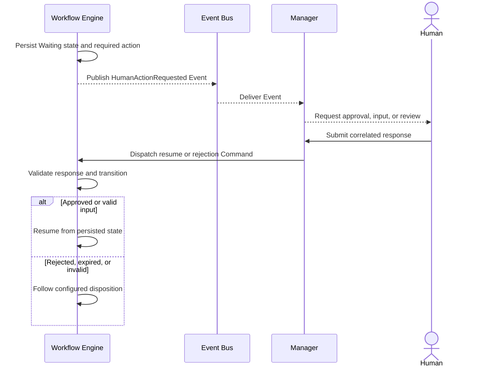

Human waiting MUST preserve Workflow state. Responses carry Workflow, step, request, and correlation context. Decisions are auditable. Expiration and escalation are governed by approved Workflow configuration or future specifications.

## 18. Observability and Traceability

Significant transitions carry Request ID, Correlation ID, Causation ID, Workflow ID and version, Step ID, Execution ID, Skill ID and version, Capability ID, provider invocation ID when applicable, timing, duration, status, and owner. Trace context crosses every contract boundary. Logs are evidence, not execution state. Telemetry MUST not expose secrets or unnecessary sensitive content.

## 19. Security Boundaries

Every boundary validates inputs, outputs, identity context, Workspace scope, authorization context, and declared Capability or Tool access as applicable. Provider credentials remain inside the AI Gateway boundary. Skills receive no authority beyond the current restricted attempt. Human decisions are authenticated, correlated, and audited. Event and telemetry payloads minimize sensitive data.

## 20. Architectural Invariants

1. Every Workflow instance has exactly one Workflow Engine owner.
2. Workflow state changes only through valid Workflow Engine transitions.
3. The Manager does not execute Skills directly.
4. Skills do not orchestrate other Skills.
5. Skills do not directly access AI providers.
6. AI-provider interactions pass through the AI Gateway.
7. Skill Runtime owns execution-attempt state.
8. Workflow Engine owns retry decisions.
9. Skill Runtime performs retry-safe attempts but does not define retry policy.
10. Event Bus transports Events only.
11. Commands do not pass through the Event Bus.
12. Events are immutable facts.
13. Commands request actions and may be rejected.
14. Duplicate Event delivery is expected and must be safe.
15. Human waiting does not discard Workflow state.
16. Provider-specific formats do not escape the AI Gateway.
17. Product-specific behavior belongs in Workflows and Skills.
18. Architectural deviations require an ADR and CTO approval.
19. Succeeded, Failed, TimedOut, and Cancelled are terminal execution-attempt states.
20. A retry creates a distinct attempt with a new Execution ID and monotonically increasing attempt number; it never revives a terminal attempt.
21. Correlation ID and Workflow ID remain stable across retries, while Causation ID identifies the Event or decision that created each new attempt.
22. Prior failed and timed-out attempts remain immutable and auditable.

## 21. Extension Rules

New Employees SHALL compose this execution model rather than replace it. New Skills and Capability implementations MUST preserve registry, runtime, and Gateway boundaries. New lifecycle states or cross-component contracts require specification review. Any change to ownership or invariant requires an ADR and CTO approval.

## 22. Open Questions

The following remain for future specifications and MUST NOT be inferred here:

- the precise command-dispatch transport contract;
- complete Command, Event, Error, and Idempotency envelope standards;
- reconciliation rules for late provider or Tool results;
- policy format for provider retry and failover;
- conditions under which one request may create multiple Workflow instances; and
- product-specific waiting, expiration, escalation, and compensation policy.

## 23. Related Documents

- [ES-002 — Execution Flow Architecture](../engineering-specifications/ES-002-Execution-Flow-Architecture.md)
- [ES-001 — Execution Core](../engineering-specifications/ES-001-Execution-Core.md)
- [Engineering Blueprint](../03-architecture/EngineeringBlueprint.md)
- [System Architecture](../03-architecture/SystemArchitecture.md)
- [Engineering Principles](../02-engineering-handbook/Principles.md)
- [Security](../02-engineering-handbook/Security.md)
- [Observability](../02-engineering-handbook/Observability.md)

### Component Responsibility Boundaries

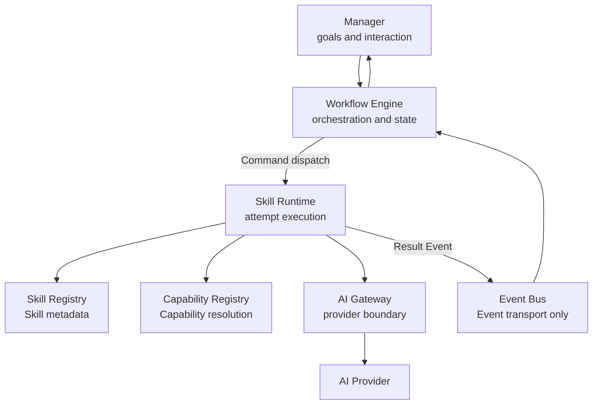

This diagram is a responsibility map, not a deployment design. Arrows represent permitted logical interactions. The only interaction entering the Event Bus is an Event.
