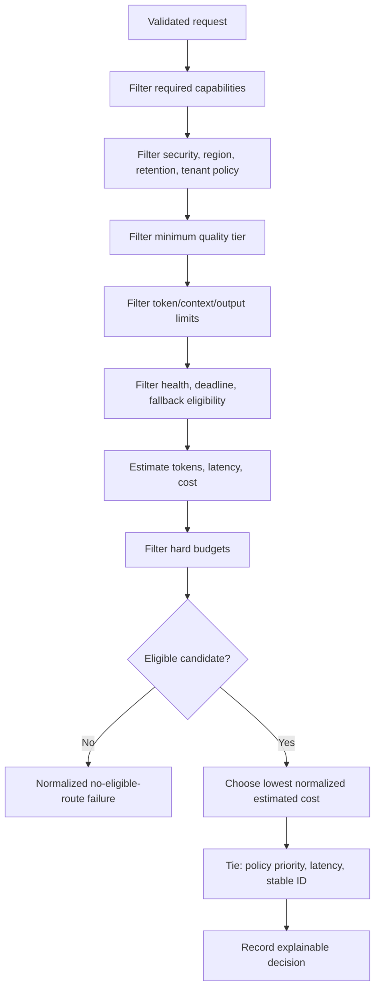
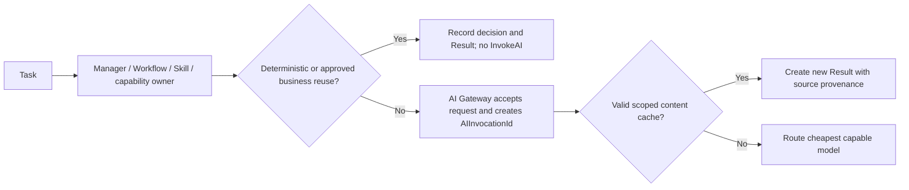
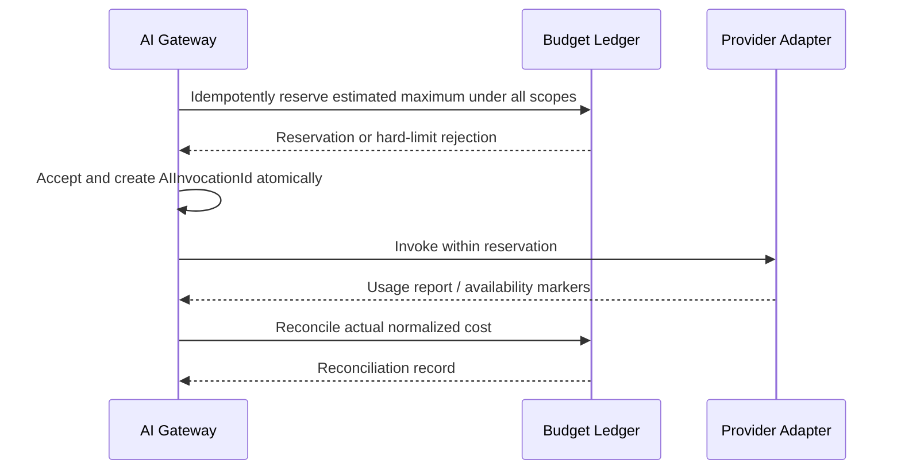
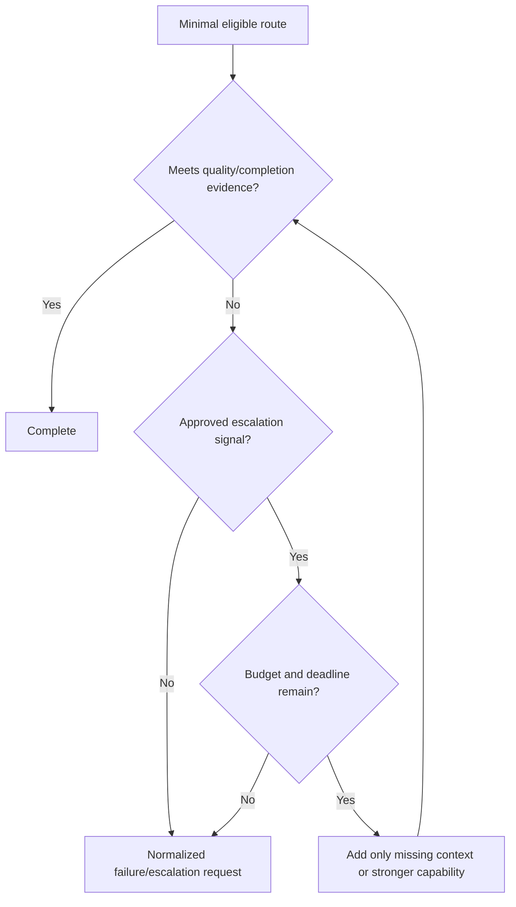

# Model Routing and Budgeting

## Objective

Select the cheapest model that satisfies every hard requirement and enforce concurrency-safe budgets without weakening quality or giving AI Gateway workflow-retry authority.

## AI Gateway model routing catalog

This catalog is internal to AI Gateway. It is not a new architectural component and is not the frozen Capability Registry. Gateway maintainers own reviewed catalog writes, freshness, and atomic activation; callers and the Capability Registry are read-independent of its storage.

Each immutable catalog version contains:

- logical model identifier/version and provider-adapter reference;
- capability contract version;
- input/output/context limits;
- text, vision, audio, tool, structured-output, and streaming support;
- reasoning, quality, latency, and availability/health classes;
- supported regions and provider data handling/retention properties;
- pricing reference/version, currency/unit, effective time, and freshness state;
- deprecation/availability status; and
- evidence timestamp and accountable catalog maintainer.

Stale or contradictory capability/pricing data makes the candidate ineligible by default. Catalog updates are reviewed data changes, not hidden code changes.

## Routing decision

The route record lists candidates considered, exclusion codes, estimates/confidence, selected capability/pricing versions, policy version, tie-break result, and hard/soft constraints. Sensitive provider details are access-controlled and never emitted as unbounded metrics.

## Pre-invocation avoidance and Gateway routing

## Budget scopes

| Scope | Owner/purpose |
| --- | --- |
| Invocation | AI Gateway enforces request ceiling and reservation. |
| Workflow step / workflow | Workflow Engine policy supplies remaining budget; Gateway cannot increase it. |
| Capability / AI Employee | Approved policy allocates and attributes usage. |
| Tenant/Workspace daily/monthly | Concurrency-safe ledger enforces organizational ceilings. |

Hard limits prevent reservation/invocation. Soft limits create a governed warning and allow continuation only when policy says so. The pre-acceptance estimate is reserved atomically across every applicable scope in the same acceptance boundary that creates `AIInvocationId`. Existing scoped `CommandId` and target-owned `IdempotencyKey` provide durable replay identity; no canonical reservation ID is introduced.

## Reservation and reconciliation

Concurrent reservations MUST not overspend a hard scope. Reservation transitions are `pending`, `committed`, `released`, or `expired` implementation-local states. Cancellation and abandonment release unused amounts; crash recovery resumes by the same scoped command/idempotency identity. Streaming usage accumulates monotonically. Missing/delayed provider usage uses conservative calculation with explicit confidence and idempotent later reconciliation. Replays never double-charge. Pricing changes never rewrite historical cost: records retain the pricing snapshot reference used.

## Progressive escalation

Escalation can add focused context, enlarge an output budget, or choose a stronger eligible model. It requires an explicit signal and remaining scope budget. It cannot relax security, residency, safety, output schema, evidence, or quality thresholds.

Maximum stages and attempts are finite. A failed invocation does not create a workflow retry.

## Fallback and circuits

Circuit state is operational provider health evidence, not business state. Fallback candidate selection reruns hard filters, preserves `AIInvocationId`, records only an implementation-local opaque provider-attempt reference, and obeys a maximum attempt/cost/deadline policy. There is no cyclic fallback graph. Circuit opening or stale health cannot cause a less safe route.

## Cache routing

Exact content/artifact caches are checked after Gateway acceptance and before routing. Semantic cache is disabled unless a separately approved policy proves equivalence and freshness. Every hit retains bounded source provenance but creates a new `ResultId` for the current `AIInvocationId`, subject, and lineage. It never reuses source `ResultId`, `ErrorId`, `AIInvocationId`, `CommandId`, `EventId`, correlation, or causation. Product/business result reuse is decided and recorded by the accountable pre-invocation owner before Gateway is called.

## Quality-cost governance

Each task class has protected quality, factuality, safety, schema, and evidence thresholds. Offline datasets and deterministic mock candidates test selection and escalation. A candidate with lower cost but failing a protected threshold is ineligible. Periodic reviews examine quality, cost, latency, failure, fallback, cache, and estimator error together.
