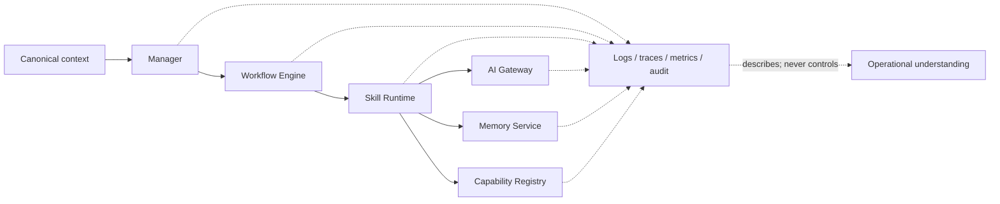
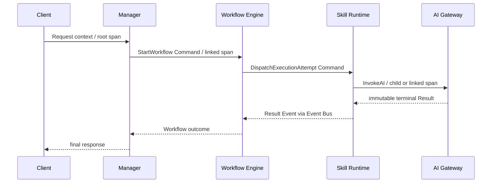
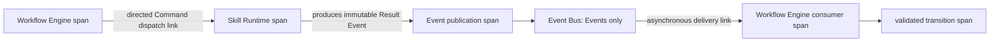
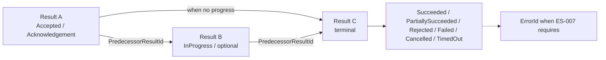
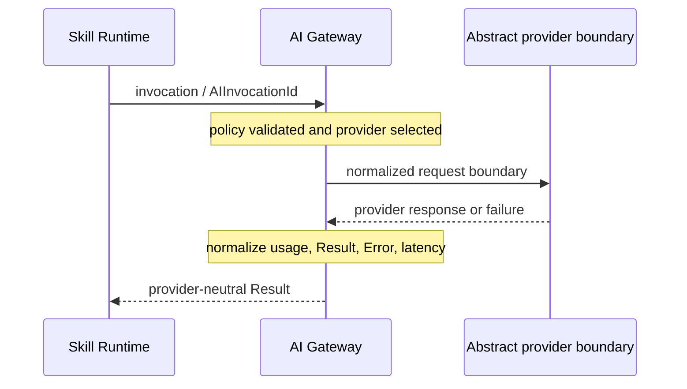
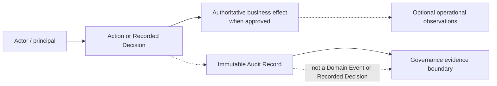
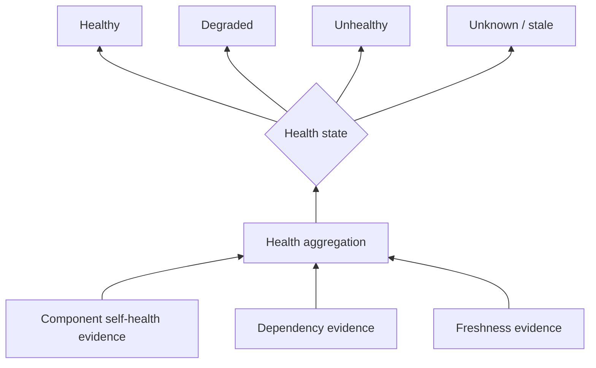
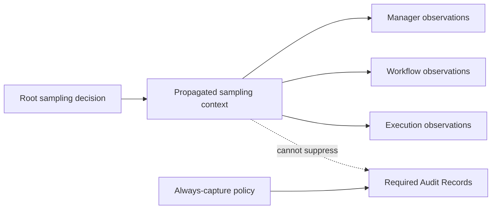
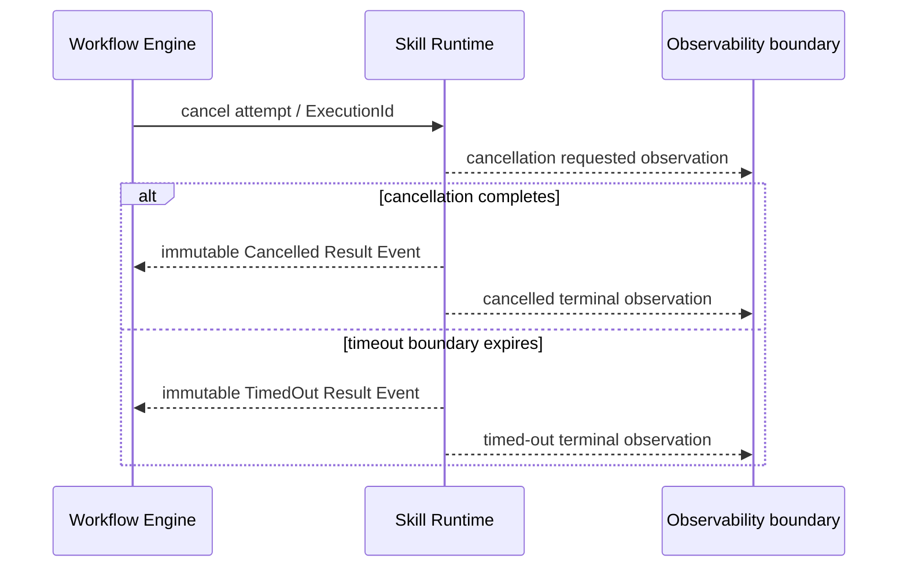

# Observability Model

## 1. Purpose

AIEOS observability provides correlated evidence about platform execution without becoming platform authority. Logs diagnose, traces relate operations, metrics aggregate conditions, Audit Records preserve governance evidence, operational signals describe operating conditions, and health signals describe time-bounded ability to participate.

Telemetry is not a Command, Domain Event, Result, Error, Workflow state, retry decision, or new Event Bus payload category. The authoritative specification is [ES-008](../engineering-specifications/ES-008-Observability-Model.md). Frozen sources include [Execution Flow](ExecutionFlow.md), [Domain Model](DomainModel.md), [Command Contract](CommandContract.md), [Event Contract](EventContract.md), [Service Interfaces](ServiceInterfaces.md), and [Error and Result Model](ErrorResultModel.md).

## 2. Pillars and Architectural Boundaries

| Record | Answers | Authority boundary |
| --- | --- | --- |
| Log | What did this component observe? | Diagnostic only. |
| Trace/span | How are timed operations causally related? | Relationship evidence only. |
| Metric | What aggregate condition exists? | Numerical observation only. |
| Audit Record | Who did what to which governed resource, under what decision? | Evidence, not the decision or domain fact. |
| Operational signal | What operational condition arose? | No business-state mutation. |
| Health signal | Can this subject presently participate? | No business semantics. |
| Diagnostic context | What restricted metadata helps investigation? | No raw sensitive-content store. |



## 3. Canonical Context

Every observation has `ComponentIdentity`, `OperationName`, `ContractVersion`, `ObservedAt`, abstract `EnvironmentIdentity` and `DeploymentIdentity`, plus classification/redaction status. Scoped work requires verified `TenantId` and `WorkspaceId`. `CorrelationId` follows the logical work. `CausationId` references only a Command, Event, or Recorded Decision. `RequestId` remains context only.

Subject identities are included when applicable: `CommandId`, `EventId`, `WorkflowId`, `WorkflowStepId`, `ExecutionId`, `AIInvocationId`, `ResultId`, and `ErrorId`. Absence is explicit; telemetry never invents identity. Context propagation communicates lineage, never authorization or mutation authority.

## 4. Logging

Logs are immutable structured observations with safe human message and bounded machine-readable attributes. `ObservedAt` records observation time; optional `OccurredAt` records source occurrence time. Canonical severities are:

| Severity | Precise meaning |
| --- | --- |
| `Trace` | Sampleable fine-grained execution detail. |
| `Debug` | Troubleshooting detail unnecessary for normal operation. |
| `Info` | Expected operation or lifecycle observation. |
| `Warn` | Degradation or anomaly without established operation failure. |
| `Error` | One operation has an unsuccessful terminal outcome. |
| `Critical` | Immediate platform-integrity, security, or broad-continuity risk. |

Severity is not retry authority. `ErrorSeverity` from ES-007 and log severity are separate types; mapping requires an explicit rule. Logs prohibit secrets, credentials, raw prompts, unrestricted personal data, Memory content, raw provider payloads, and implementation-specific exception objects.

## 5. Distributed Tracing

A trace has immutable `TraceId`; each span has immutable `SpanId`, optional `ParentSpanId`, operation, component, start, optional end, disposition, context, links, and sampling decision. Synchronous nested work uses parent-child relationships. Asynchronous Command dispatch and Event consumption use causal links when one call stack is not preserved.



The trace records the route but does not imply that Commands use Event Bus. AI provider details remain behind AI Gateway.

## 6. Command and Event Relationships



Telemetry observes Command creation, validation, dispatch, receipt, acknowledgement/rejection, and completion. It observes Event production, recording, publication, delivery, consumption, replay, and duplicate detection. It does not merge their contracts or make telemetry an Event.

## 7. Workflow, Attempts, and Retry

Workflow Engine emits observations of Workflow and step transitions and is sole retry-decision owner. Skill Runtime observes only its instructed attempt. A retry creates a new immutable `ExecutionId`; stable correlation and Workflow identity link attempts.

```mermaid
sequenceDiagram
    participant RT as Skill Runtime
    participant WE as Workflow Engine
    RT-->>WE: terminal Failed Result Event / ExecutionId A
    Note over WE: Retry policy evaluation and Recorded Decision
    WE->>RT: new DispatchExecutionAttempt Command / ExecutionId B
    Note over RT: B is distinct; A remains terminal
    RT-->>WE: terminal Result Event / ExecutionId B
```

Telemetry MAY record retry classification, approved policy reference, decision identity, attempt number, and backoff as metadata. It MUST NOT represent Skill Runtime or telemetry infrastructure as choosing retry.

## 8. Result and Error Observability

ES-007 remains authoritative. Acknowledgement, optional progress, and terminal completion are distinct immutable Results.



Observations reference `ResultId` and `ErrorId`; they never mutate them. Partial success records aggregate and child Result references plus bounded disposition counts. Root-cause chains use Error references, not copied sensitive payloads. `RetryClassification` is observed evidence only.

## 9. AI Gateway Observability



Allowed observations include acceptance/completion, latency, normalized outcome, allowed usage, abstract provider-selection reference, approved fallback occurrence, quota/rate-limit indicator, content-policy rejection, timeout, and cancellation. Vendor metric names, SDK objects, prompts, credentials, and sensitive payloads are prohibited.

## 10. Memory and Capability Registry

Memory Service observations cover operation kind, read/write/search timing, version conflicts, and normalized outcome without Memory contents. Capability Registry observations cover discovery, immutable contract-version lookup, compatibility, and validation. They MUST NOT imply that Capability Registry executes Skills or that Memory Service owns Workflow behavior.

## 11. Metrics

Metric kinds are counters, gauges, histograms/distributions, durations, and saturation indicators. Stable metric names identify platform concept, operation, and unit. Dimensions are bounded and documented. Unbounded identifiers—including Request, Command, Event, Workflow, Execution, AI Invocation, Result, Error, user text, and arbitrary provider values—are prohibited as dimensions.

Metric families SHOULD cover:

- Command/Event throughput and disposition;
- Workflow, step, and Execution Attempt outcomes and duration;
- AI invocation usage, latency, fallback, and normalized outcome;
- Memory operation latency and failure;
- Capability Registry discovery, compatibility, and validation;
- Result/Error outcome rates; and
- bounded capacity and saturation.

Counters are monotonic inside their declared reset boundary. Metric type, unit, dimensions, and semantic version are part of the contract.

## 12. Audit Boundary



An Audit Record contains immutable `AuditRecordId`, actor, action, target, verified scope, decision/outcome, policy or authorization reference, correlation and causation, timestamp, required justification, minimized metadata, and optional before/after references. It is tamper-evident at the contract level. Required Audit Records are never removed by telemetry sampling.

## 13. Operational Signals and Health

Operational signals describe component lifecycle, dependency degradation, elevated backlog, provider degradation, Memory latency, or Capability incompatibility. They do not alter business state and do not travel as Domain Events by implication.



Readiness is ability to accept assigned work; liveness is ability to continue participation. Health evidence has subject, state, timestamp, and freshness boundary. Stale evidence becomes `Unknown`. Health has no direct business meaning.

## 14. Sampling and Retention



Sampling is explicit, versioned, propagated, and observable. Deterministic sampling is preferred for correlated work. Required security evidence is always captured. Retention follows data classification, legal/security constraints, minimization, and deletion requirements; durations and storage tiers remain undecided.

## 15. Cancellation and Timeout



Cancellation and timeout remain different outcomes. Telemetry records the owning boundary and reason but cannot decide either state or overwrite a terminal Result.

## 16. Cross-Component Contract

| Component | Required observability responsibility |
| --- | --- |
| Manager | Preserve Request/scope context; add interaction and acceptance/rejection observations. |
| Workflow Engine | Preserve lineage; add Workflow/step transitions, retry-decision evidence, and new Execution identity. |
| Skill Runtime | Preserve directed-Command context; add one attempt's observations and Result/Error links. |
| AI Gateway | Preserve invocation context; add provider-neutral usage, latency, policy, fallback, and outcome observations. |
| Memory Service | Add safe operation timing/outcomes without Memory contents. |
| Capability Registry | Add discovery/version/compatibility observations without execution authority. |

## 17. Security, Privacy, and Diagnostics

Telemetry follows least data, explicit classification, masking, scope isolation, least-privilege access, and auditable diagnostic access. Diagnostic context may contain safe execution/configuration references, normalized Result/Error linkage, duplicate/replay indication, retry lineage, cancellation/timeout reason, sampling decision, and redaction status.

It prohibits secrets, credentials, raw prompts, Memory contents, provider payloads, and unrestricted personal data unless a separately approved classification rule permits one minimized field. Cross-Tenant access is prohibited. Human-readable messages are safe for their declared audience.

## 18. Versioning, Compatibility, and Failure

Observability schemas have stable identity and explicit version. Additive optional fields are compatible when unknown fields are tolerated. Removal, rename, meaning/requiredness changes, severity or health semantic changes, and metric type/unit changes are breaking. Deprecated fields remain interpretable during their declared compatibility window.

Telemetry failure cannot silently change business outcomes or create retry authority. Critical Audit Record failure is surfaced according to approved policy. Backpressure/drop handling prioritizes required evidence, bounds resource use, declares degraded observability, and prevents recursive failure storms.

## 19. Architectural Invariants

1. Observability describes behavior; it does not own behavior.
2. Capability Registry is the canonical component name.
3. Commands remain directed intent outside Event Bus.
4. Events remain immutable facts and Event Bus transports Events only.
5. Logs, traces, metrics, Audit Records, and health signals are not new Domain Event categories.
6. `CausationId` references only a Command, Event, or Recorded Decision; `RequestId` is context only.
7. Workflow Engine remains sole retry-decision owner; every retry creates a new `ExecutionId`.
8. Skill Runtime observes one retry-safe attempt and never implies retry authority.
9. ES-007 Result/Error identities and semantics are referenced, never redefined.
10. Provider-specific formats do not escape AI Gateway.
11. Tenant/Workspace isolation applies to every observation and access path.
12. Required Audit Records cannot be dropped by telemetry sampling.

## 20. Extension and Non-Goals

Extensions MUST be additive, versioned, bounded, provider-neutral, and non-authoritative. Changes to frozen ownership, Command targets, Event producers, retry authority, Result/Error meaning, provider abstraction, or lifecycle require the applicable review and ADR process.

This model does not select OpenTelemetry or another telemetry standard; a logging library; Prometheus, Grafana, Datadog, CloudWatch, Azure Monitor, ELK, OpenSearch, or another named monitoring/APM product; an exporter, collector, agent, storage backend, dashboard, query language, alert implementation, HTTP health endpoint, deployment topology, infrastructure product, or code instrumentation API.
