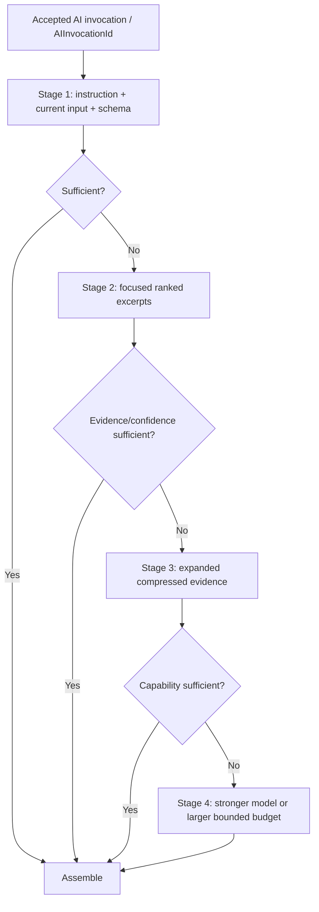

# Prompt and Context Pipeline

## Purpose

After Gateway acceptance creates `AIInvocationId`, the pipeline produces the smallest sufficient, versioned, injection-resistant prompt assembly for [AI Gateway v1](AIGatewayArchitecture.md). It does not run during pre-acceptance admission and does not own Memory, authorization, Skill execution, provider routing, or product truth.

## Instruction and data hierarchy

1. platform safety and authorization constraints;
2. approved system instruction/template version;
3. capability and output contract;
4. normalized current task input;
5. authorized retrieved context, explicitly marked untrusted evidence;
6. tool results or prior outputs, also marked by trust and provenance.

Lower levels cannot override higher levels. Retrieved context never grants tools or expands scope.

## Assembly stages

## Context item contract

Each item carries a stable reference, version/freshness marker, Tenant/Workspace scope, provenance, trust level, data classification, relevance score, necessity reason, estimated tokens, and retention/caching permission. Full records are replaced by excerpts when sufficient. Duplicate or semantically redundant items are removed before compression.

## Pipeline

```mermaid
flowchart LR
    T["Template resolution"] --> B["Typed variable binding"]
    B --> N["Input normalization"]
    N --> R["Authorized retrieval request"]
    R --> K["Rank and filter"]
    K --> D["Deduplicate"]
    D --> C["Bounded compression"]
    C --> E["Token estimate"]
    E --> A["Trust-boundary assembly"]
    A --> V["Preflight validation"]
    V --> P["Provider adaptation"]
```

### Retrieval boundary

Memory Service returns authorized, bounded, provenance-bearing content. The pipeline never queries persistence directly and never treats Memory as instruction. Skill Runtime supplies the permitted purpose and scope.

### Relevance and minimization

Ranking uses task-class policy and deterministic signals before any optional model-assisted compression. Every selected item needs a reason. Maximum item/section counts and token allocations are policy fields. Mandatory policy/evidence context cannot be removed merely to hit a soft budget.

### Compression

Prefer excerpt selection, field projection, normalization, and deterministic summarization. Model-assisted summarization is a separate metered invocation, requires provenance links, and is used only when expected downstream savings exceed its cost and quality risk. Compression artifacts have identities/versions and cannot replace the source of truth.

### Token estimation

Post-acceptance estimation is adapter-aware but provider-neutral at the contract boundary. It reserves output tokens within context budgeting before context allocation, applies a safety margin, and records estimated versus actual usage. Only coarse budget feasibility may occur before acceptance; it is not full context-dependent estimation or a durable reservation. Estimator error outside the adopted tolerance opens review of the estimator/catalog; it does not silently truncate mandatory context.

## Prompt template governance

Templates use implementation-local stable references and immutable version references, with owner, purpose/capability, typed inputs, output schema, trust rules, evaluation set, quality threshold, token/cost expectation, rollback target, and change history. These references are non-canonical value references, not new Domain identities or causation targets. Business branching, deterministic/no-model resolution, and permissions remain with the accountable Manager/Workflow/Skill/capability software before `InvokeAI`, never prompt-only rules or Gateway-owned product logic.

The first governed execution integration is limited to Stage 1: approved instructions, typed current
input, and exact output schema. Package lookup, variable binding, validation, and rollback are
deterministic. Retrieval, compression, tools, and product-specific prompt behavior need separate
approved scope.

## Injection resistance

Untrusted content is delimited and labeled with origin. Provider adapters cannot reorder instruction hierarchy. Tool schemas describe operations but do not authorize them. Model-produced tool arguments are validated by Skill Runtime. Suspicious instructions are retained only when necessary as quoted evidence and are never executed.

## Output validation

Text output is bounded by requested purpose and verbosity. Structured output is validated against the exact schema. Factual workflows require source/evidence references and downstream fact verification; Gateway validation does not declare business truth.

## Escalation audit

Every stage transition records signal, missing requirement, context delta, estimated token/cost delta, quality tier change, policy version, and outcome. No escalation loop is unbounded.

## Prohibited behavior

- full conversation/history or Memory by default;
- duplicate instructions or context;
- asking a model to reproduce deterministic data;
- embedding secrets, credentials, hidden authorization, or raw audit records;
- caching sensitive assemblies contrary to policy; or
- modifying frozen authority through prompt content.
