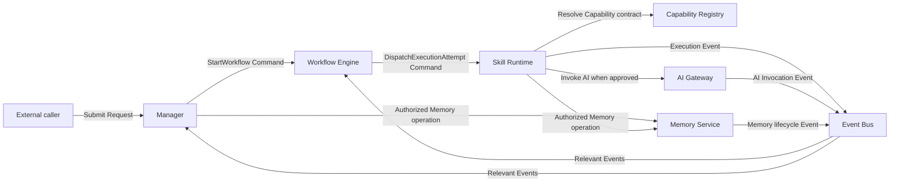
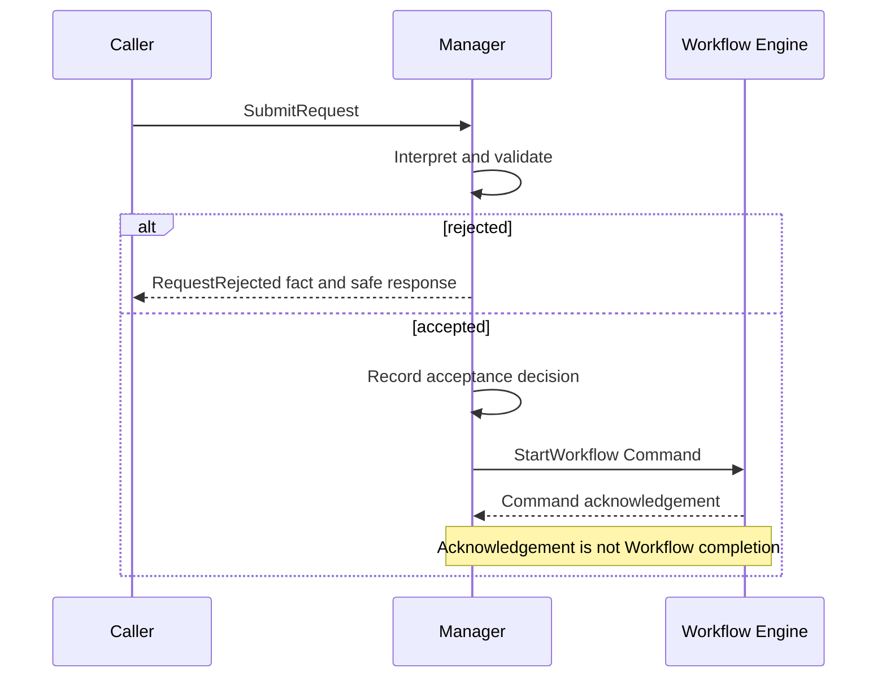
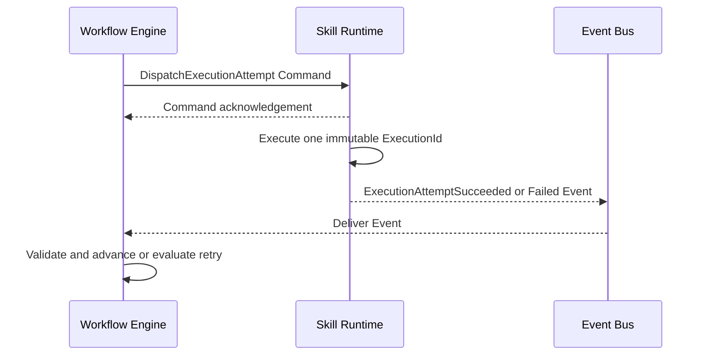
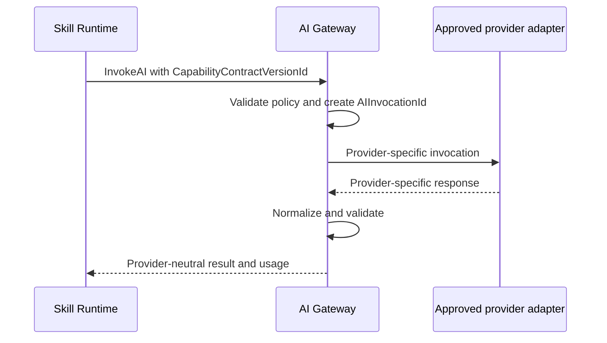
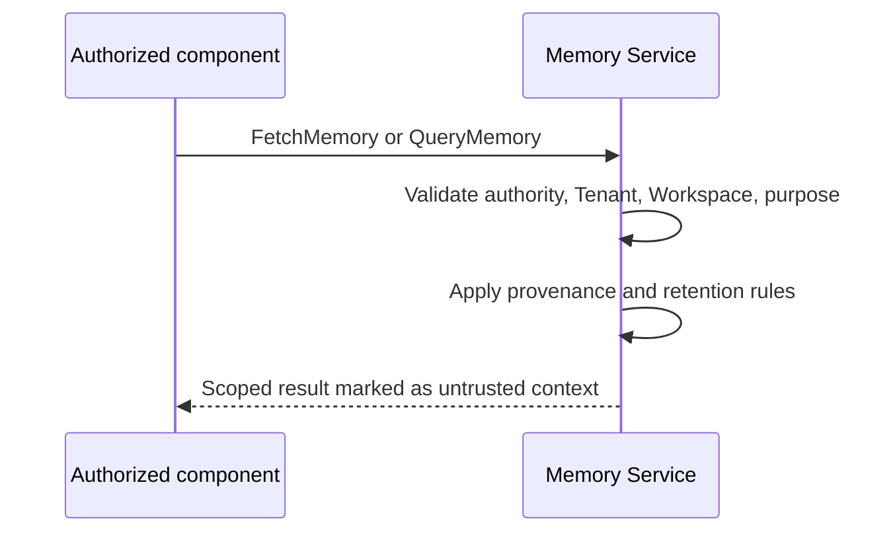
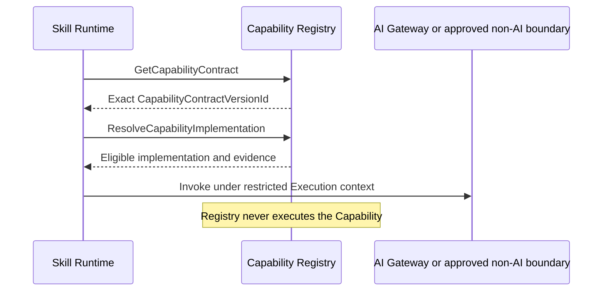
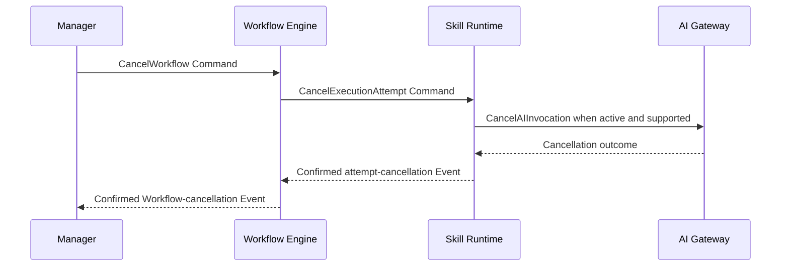
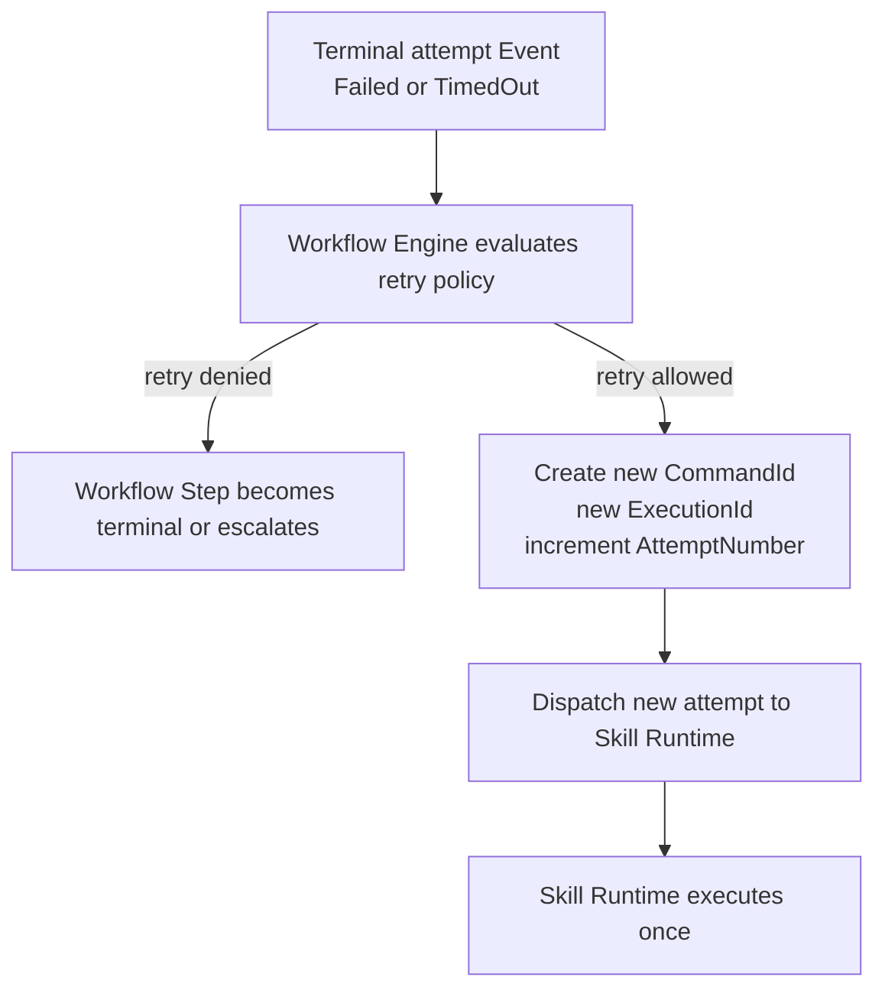
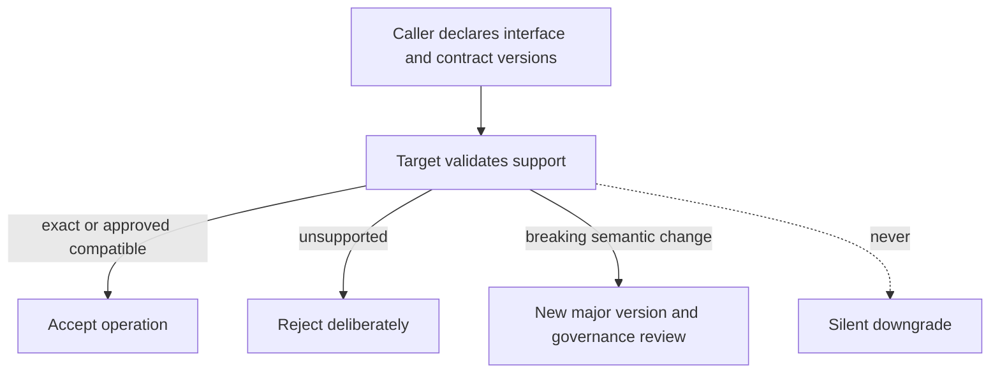

# Service Interface Contracts

## 1. Purpose

This document defines the canonical, implementation-neutral interfaces for Manager, Workflow Engine, Skill Runtime, AI Gateway, Memory Service, and Capability Registry. It refines how approved components collaborate without defining routes, protocols, code signatures, serialization, infrastructure, persistence, or deployment.

Normative terms such as MUST, MUST NOT, SHALL, SHOULD, and MAY are requirements. Architecture v1.0, Domain v1.0, the [Command Contract](CommandContract.md), and the [Event Contract](EventContract.md) remain authoritative.

## 2. Shared Interface Rules

### 2.1 Architectural invariants

1. Each operation has exactly one accountable target.
2. Commands request action and travel through the abstract command-dispatch contract, never Event Bus.
3. Events record immutable facts, have one authoritative producer, and are the only messages transported by Event Bus.
4. Acknowledgement means an operation was accepted for processing; it is not completion.
5. Authoritative state changes only inside the component that owns that state.
6. Workflow Engine alone owns Workflow and Workflow Step transitions and retry decisions.
7. Skill Runtime owns one Execution Attempt at a time and does not create retries.
8. Every Workflow retry creates a new `CommandId`, `ExecutionId`, and monotonically increasing `AttemptNumber`.
9. AI providers are accessible only through AI Gateway, and provider-specific formats never escape it.
10. Capability Registry resolves contracts and eligible implementations but does not execute them.
11. Memory Service alone owns Memory state and cross-Workspace access is prohibited.
12. Every boundary validates identity, authorization, scope, contract version, and input before authoritative work.

### 2.2 Common operation contract

Every operation below inherits these requirements unless it defines a stricter rule:

- **Input:** A versioned operation payload plus verified caller, `TenantId`, `WorkspaceId`, authorization decision or reference, `RequestId` when applicable, `CorrelationId`, immediate `CausationId`, and relevant canonical identities.
- **Outcome:** Accepted, rejected, completed, failed, cancelled, or timed out. ES-007 will define the canonical Result and Error envelope.
- **Scope:** Tenant and Workspace identifiers MUST match the target resource and caller authority. Their presence alone never grants access.
- **Trace:** Correlation remains stable across the operation chain. Causation identifies the immediate Command, Event, or recorded decision. `RequestId` is context only.
- **Idempotency:** Redelivery of one logical Command preserves its envelope and effect. A new logical action has a new `CommandId`.
- **Cancellation:** Cancellation is an explicit, separately authorized action and is distinct from timeout.
- **Version:** The caller declares the operation version and referenced immutable contract versions. Unsupported versions fail deliberately.
- **Security:** Credentials and provider secrets MUST NOT enter operation payloads, Events, failures, or propagated telemetry context.

### 2.3 Overall interaction map

The arrows labelled as Commands are directed dispatch contracts. Only Event arrows connect to Event Bus.

## 3. Manager Interface

### 3.1 Boundary

Manager owns external Request recording, interpretation, deterministic boundary validation, acceptance or rejection, clarification, selection of an approved Workflow, orchestration handoff, and presentation of outcomes. Manager alone authoritatively produces `RequestRejected`.

Manager MUST NOT execute a Workflow or Skill, own Workflow state, choose Workflow retries, call AI providers, mutate Memory directly, or bypass an owning component.

Allowed dependencies are Workflow Engine, Capability Registry, Skill Registry, Memory Service, Analytics, and Configuration through their approved contracts. Manager MUST NOT depend on provider adapters, infrastructure persistence, Skill implementation internals, or Event Bus as a Command path.

### 3.2 Public operations

| Operation | Caller → target | Input and outcome | Messages | Preconditions and postconditions | Idempotency, scope, trace, cancellation, timeout, version |
| --- | --- | --- | --- | --- | --- |
| `SubmitRequest` | Authorized external caller → Manager | Intent, caller context, `RequestId` or request-creation input; returns recorded Request context or rejection. | May lead to `AcceptRequest`; may produce `RequestRejected`. | Caller authenticated; input structurally safe. On success, one Request is recorded in `Received`. | Duplicate submission uses ingress idempotency context. Tenant/Workspace and correlation required where applicable. Ingress timeout ends the call, not an accepted Request. Interface version required. |
| `InterpretRequest` | Manager internal decision boundary → Manager | Recorded Request and approved context; returns a recorded interpretation or clarification requirement. | May produce a recorded decision used as later causation. | Request exists and is non-terminal. Success does not start a Workflow. | Re-evaluation MUST NOT duplicate acceptance. Same Request and policy version are auditable. Cancellation may leave Request waiting; bounded decision timeout applies. |
| `AcceptRequest` | Authorized Manager decision path → Manager | `RequestId`, interpretation evidence, exact `PolicyVersionId`, selected `WorkflowDefinitionVersionId`; returns accepted decision. | Accepts `AcceptRequest`; after acceptance Manager creates distinct `StartWorkflow` Command to Workflow Engine. | Request is eligible and policy permits acceptance. Success records one authoritative acceptance decision. | Same Command is duplicate-safe. Request and correlation retained; decision is immediate causation for `StartWorkflow`. Cannot be cancelled after acceptance is authoritative. |
| `RejectRequest` | Authorized Manager decision path → Manager | `RequestId`, safe rejection reason, policy evidence; returns recorded rejection. | Authoritatively produces `RequestRejected`. | Request is non-terminal and rejection is permitted. Success places Request in `Rejected`. | Redelivery MUST NOT duplicate the fact. Request scope and correlation retained. Terminal rejection cannot be cancelled or timed out retroactively. |
| `HandoffWorkflow` | Manager → Workflow Engine | Accepted Request reference, `WorkflowDefinitionVersionId`, policy and scope context; returns Command acknowledgement only. | Emits directed `StartWorkflow`; later consumes Workflow outcome Events. | Acceptance decision exists; definition version is approved. Success means dispatch accepted, not Workflow completion. | Redelivery preserves `CommandId`. Cancellation is a separate Workflow Command after `WorkflowId` exists. Dispatch timeout has no right to infer failure without reconciliation. |
| `PresentOutcome` | Workflow outcome Event or authorized caller → Manager | Terminal or waiting Workflow Event plus evidence; returns user-facing response or follow-up requirement. | Consumes relevant Workflow Events; may create clarification or approval Commands under approved contracts. | Event version, producer, scope, and state are valid. Success records presentation or follow-up decision, not Workflow mutation. | Duplicate Event consumption is safe. Correlation retained. Presentation timeout does not change Workflow outcome. |

### 3.3 Request-to-Workflow handoff

## 4. Workflow Engine Interface

### 4.1 Boundary

Workflow Engine owns Workflow Definition interpretation, Workflow Instance and Workflow Step state, transition validation, checkpoints, retry policy and decisions, pause, resume, cancellation, compensation decisions, and terminal outcome. It consumes validated result Events and authoritatively produces Workflow lifecycle Events.

Workflow Engine MUST NOT execute Skills, call AI Gateway or Tools, transport Commands through Event Bus, or mutate an Execution Attempt after dispatch.

### 4.2 Public operations

| Operation | Caller → target | Input and outcome | Messages | Preconditions and postconditions | Idempotency, scope, trace, cancellation, timeout, version |
| --- | --- | --- | --- | --- | --- |
| `StartWorkflow` | Manager or approved Scheduler path → Workflow Engine | `WorkflowDefinitionVersionId`, accepted decision causation, scope, policy; returns `WorkflowId` acknowledgement or rejection. | Accepts `StartWorkflow`; produces Workflow lifecycle Events. | Definition and policy versions compatible; caller authorized. Success creates exactly one Workflow Instance in `Created` or `Running`. | Redelivery preserves logical instance. Scope and correlation fixed. Cancellation uses `CancelWorkflow`. Definition/interface versions immutable for instance. |
| `AdvanceWorkflow` | Workflow Engine decision path → Workflow Engine | `WorkflowId`, current state/version, triggering Event or decision; returns transition outcome. | May emit `DispatchExecutionAttempt`, waiting, completion, or failure Events. | Current state and trigger valid. Success records one valid transition and next action. | Optimistic duplicate transition is rejected or treated as already applied. Workflow timeout policies are explicit. |
| `PauseWorkflow` | Authorized Manager, human-control, or policy path → Workflow Engine | `WorkflowId`, reason, authority; returns paused or rejected. | Accepts directed pause Command; produces `WorkflowPaused`. | Workflow is pausable and no terminal state exists. Success persists pause checkpoint. | Duplicate pause is safe. Correlation retained. It does not cancel an active attempt unless policy separately commands cancellation. |
| `ResumeWorkflow` | Authorized human or Manager path → Workflow Engine | `WorkflowId`, approval/input evidence, expected checkpoint; returns resumed or rejected. | Accepts resume Command; produces `WorkflowResumed`; may dispatch next attempt. | Workflow is waiting or paused and evidence is correlated and valid. Success resumes from persisted state. | Duplicate response cannot advance twice. Waiting expiry is separate from caller timeout. |
| `CancelWorkflow` | Authorized Manager, caller, or policy path → Workflow Engine | `WorkflowId`, authority, reason; returns cancellation decision. | Produces cancellation Commands to active owners as needed and an approved Workflow cancellation fact when the Event catalog defines it. | Workflow non-terminal; cancellation permitted. Success prevents new steps and coordinates active work. | Duplicate cancellation safe. Late Events cannot overwrite terminal Workflow state. |
| `ProcessResultEvent` | Event Bus delivery → Workflow Engine | Valid Execution, approval, or dependency Event envelope; returns consumer acknowledgement or isolation outcome. | Consumes Event only; may create next directed Command or Workflow Event. | Producer, version, scope, causation, identity, and current state valid. Success applies fact once. | Duplicate Event safe by `EventId`. Consumer timeout/redelivery does not create a Workflow retry by itself. |
| `EvaluateRetry` | Workflow Engine decision path → Workflow Engine | Failed/timed-out attempt Event, retry policy, attempt history; returns retry, fail, compensate, pause, or escalate decision. | If retry allowed, creates new `DispatchExecutionAttempt` Command. | Prior attempt is terminal and immutable. Success records the retry decision. | New attempt receives new `CommandId`, new `ExecutionId`, incremented `AttemptNumber`; correlation and `WorkflowId` remain stable. |

### 4.3 Workflow-to-Skill execution

## 5. Skill Runtime Interface

### 5.1 Boundary

Skill Runtime owns validation, preparation, restricted execution, timeout and cancellation, normalized outcome, and lifecycle of one `ExecutionId`. It resolves the exact `SkillVersionId`, enforces declared Capability and Tool permissions, and authoritatively produces Execution Attempt Events.

Skill Runtime MUST NOT choose a new attempt, alter `AttemptNumber`, decide Workflow retry policy, orchestrate another Skill, mutate Workflow state, or call an undeclared Capability, Tool, or AI provider.

### 5.2 Public operations

| Operation | Caller → target | Input and outcome | Messages | Preconditions and postconditions | Idempotency, scope, trace, cancellation, timeout, version |
| --- | --- | --- | --- | --- | --- |
| `DispatchExecutionAttempt` | Workflow Engine → Skill Runtime | `ExecutionId`, `AttemptNumber`, `SkillVersionId`, input Context, allowed Capabilities/Tools, policy, deadline; returns acknowledgement or rejection. | Accepts directed Command; produces attempt lifecycle Events. | New immutable Execution identity, compatible Skill version, authorized scope. Success registers exactly one attempt. | Redelivery of same Command/Execution is safe; different Command cannot reuse `ExecutionId`. Cancellation and deadline bind this attempt only. |
| `ExecuteSkill` | Skill Runtime execution controller → Skill Runtime | Registered attempt and resolved Skill contract; returns normalized attempt outcome. | May call Capability Registry, AI Gateway, Memory Service, or Tools under declared permissions; produces terminal attempt Event. | Inputs validated and execution context restricted. Success means output contract validated. | Never reruns terminal attempt. Timeout yields `TimedOut`; cancellation yields `Cancelled`. Contract versions remain fixed. |
| `CancelExecutionAttempt` | Workflow Engine cancellation path → Skill Runtime | Active `ExecutionId`, authority, cause; returns accepted, already terminal, or unsupported stage. | Accepts directed cancellation Command; produces an approved attempt-cancellation fact when the Event catalog defines it. | Attempt exists and scope matches. Success prevents further accepted effects where supported. | Duplicate cancellation safe. Late result cannot replace terminal outcome; reconciliation remains explicit. |
| `GetExecutionStatus` | Authorized Workflow Engine or operator path → Skill Runtime | `ExecutionId` and scope; returns current attempt state and safe evidence. | Query only; emits no domain Event merely for reading. | Caller authorized; attempt exists. No state change. | Repeated reads safe. Query timeout has no lifecycle effect. Interface version required. |
| `InvokeApprovedCapability` | Active Skill execution → Skill Runtime | `CapabilityId`, `CapabilityContractVersionId`, approved implementation reference, validated input; returns normalized Capability result. | Uses Capability Registry metadata; invokes approved non-AI boundary or AI Gateway where applicable. | Capability declared by Skill and policy permits it. Success does not alter Workflow state. | Bound to `ExecutionId`; duplicate external effects require capability-specific idempotency. Cancellation/deadline propagate. |

## 6. AI Gateway Interface

### 6.1 Boundary

AI Gateway owns provider-neutral request validation, `AIInvocationId`, provider/model selection within approved policy, provider adaptation, bounded transport retry and failover, response normalization, usage metadata, and AI Invocation lifecycle Events.

AI Gateway MUST NOT execute Skills, own Workflow retry decisions, choose product behavior, weaken safety or contract requirements during fallback, or expose provider credentials or formats.

### 6.2 Public operations

| Operation | Caller → target | Input and outcome | Messages | Preconditions and postconditions | Idempotency, scope, trace, cancellation, timeout, version |
| --- | --- | --- | --- | --- | --- |
| `InvokeAI` | Skill Runtime → AI Gateway | `ExecutionId`, Capability contract/version, prompt/config version, validated Context, output schema, policy and budget; returns `AIInvocationId` acknowledgement and normalized result/failure. | Direct interface call or directed Command as future binding decides; produces AI Invocation Events. | Caller and Capability authorized; inputs safe; provider policy available. Success validates normalized output. | One logical invocation has one immutable `AIInvocationId`; bounded provider retries remain beneath it. Deadline and cancellation propagate where supported. |
| `CancelAIInvocation` | Skill Runtime cancellation path → AI Gateway | Active `AIInvocationId`, authority, cause; returns accepted, unsupported, or terminal. | Produces cancellation Event only when fact confirmed. | Invocation exists and scope matches. Success stops further provider work where supported. | Duplicate safe; late provider result cannot replace terminal outcome without reconciliation. |
| `GetAIInvocationOutcome` | Authorized Skill Runtime or operator path → AI Gateway | `AIInvocationId`; returns safe normalized state, usage, and outcome metadata. | Query only. | Caller authorized; identity and scope valid. No state mutation. | Repeated reads safe; query timeout does not alter invocation. |

### 6.3 Skill-to-AI flow

## 7. Memory Service Interface

### 7.1 Boundary

Memory Service owns `MemoryId`, Memory content reference, provenance, classification, scope, lifecycle, retention-policy reference, retrieval, and supersession semantics. Retrieved content remains untrusted context.

Memory Service MUST NOT make business decisions, treat content as instructions, expose another Workspace, become an unbounded transcript store, or reveal persistence details.

### 7.2 Public operations

| Operation | Caller → target | Input and outcome | Messages | Preconditions and postconditions | Idempotency, scope, trace, cancellation, timeout, version |
| --- | --- | --- | --- | --- | --- |
| `StoreMemory` | Authorized Manager, Skill Runtime, or owning service → Memory Service | Provenance, classification, content/reference, policy, scope; returns immutable `MemoryId` and stored version/reference. | Accepts directed store request; authoritatively produces Memory lifecycle Event if defined by contract. | Caller permitted to write classification in exact scope. Success creates one Memory Aggregate. | Idempotency prevents duplicate Memory for same logical write. Cancellation before commit leaves no authoritative success. |
| `FetchMemory` | Authorized scoped caller → Memory Service | `MemoryId`, purpose, scope, requested representation/version; returns authorized record or absence/failure. | Query only. | Caller authorized; Memory belongs to scope and retention permits access. No state change. | Repeated reads safe. Result labeled with provenance/classification and treated as untrusted. |
| `QueryMemory` | Authorized scoped caller → Memory Service | Structured query purpose, filters, bounds, scope; returns bounded result set with provenance. | Query only. | Purpose and bounds authorized. No cross-scope search. | Repeated query may reflect later state unless snapshot identity is requested; no ranking technology promised. |
| `SupersedeMemory` | Authorized owner → Memory Service | Existing `MemoryId`, replacement content/reference, reason, policy; returns new `MemoryId` or version relationship as governed by Memory lifecycle. | Produces one authoritative lifecycle Event when recorded. | Source exists, caller authorized, semantics preserve immutable history. Success never reuses an ID for a replacement object. | Redelivery safe; concurrent conflict fails deliberately. Detailed storage/version mechanics deferred. |
| `RequestMemoryLifecycleAction` | Authorized policy or owner → Memory Service | `MemoryId`, archive/delete/retention intent when policy permits; returns accepted or rejected. | May produce lifecycle Event after authoritative completion. | Action exists in approved policy and legal/retention constraints permit it. | Consequential action idempotent and auditable. Physical deletion mechanics and durations remain deferred. |

### 7.3 Memory access flow

## 8. Capability Registry Interface

### 8.1 Boundary

Capability Registry owns logical `CapabilityId`, immutable `CapabilityContractVersionId`, Capability metadata, eligible implementation references, resolution evidence, lifecycle, and compatibility status. It does not own execution.

Capability Registry MUST NOT orchestrate Workflows, execute Skills, invoke AI providers, become a new Capability Runtime, or silently weaken modality, quality, policy, availability, or cost requirements.

### 8.2 Public operations

| Operation | Caller → target | Input and outcome | Messages | Preconditions and postconditions | Idempotency, scope, trace, cancellation, timeout, version |
| --- | --- | --- | --- | --- | --- |
| `DiscoverCapabilities` | Authorized Manager, Skill Registry, or Skill Runtime → Capability Registry | Required ability and bounded filters; returns matching logical Capabilities and supported contract versions. | Query only. | Caller authorized; query valid. No implementation selected or executed. | Repeated query safe; results may change with catalog state and carry version/snapshot evidence. |
| `GetCapabilityContract` | Authorized caller → Capability Registry | `CapabilityId`, exact or compatible `CapabilityContractVersionId`; returns immutable contract metadata. | Query only. | Contract exists and is visible in scope. No state change. | Exact lookup stable. Unsupported version fails deliberately. |
| `ValidateCapabilityRequirement` | Skill Registry or Skill Runtime → Capability Registry | Skill requirement, input/output constraints, policy and exact contract version; returns compatible or rejected evidence. | Query/validation only. | Skill and Capability references valid. Success proves contract compatibility, not execution success. | Same versions and constraints yield stable interpretation. Timeout cannot authorize fallback. |
| `ResolveCapabilityImplementation` | Skill Runtime → Capability Registry | `CapabilityId`, exact contract version, constraints, policy, health/eligibility context; returns one eligible implementation reference or unavailable. | May produce resolution evidence/Event if canonical contract defines one; does not execute. | Caller authorized; requirements complete. Selected reference satisfies all mandatory constraints. | Resolution decision correlated to Execution. Retry is controlled by caller/Workflow policy; registry cannot silently downgrade. |
| `PrepareInvocationHandoff` | Skill Runtime → Capability Registry | Resolved implementation reference and execution context; returns bounded handoff metadata for approved non-AI boundary or AI Gateway. | No execution Event; downstream owner produces its own facts. | Resolution remains valid and contract version exact. Success transfers no Workflow authority. | Bound to `ExecutionId` and contract version; expiration requires fresh resolution, not implicit downgrade. |

### 8.3 Discovery and invocation handoff

## 9. Cancellation and Timeout Ownership

Cancellation propagates only through explicit, authorized operations. Timeout is a boundary's observation that allowed time expired; it is not a cancellation request and does not by itself grant retry authority.

| Boundary | Timeout owner | Required behavior |
| --- | --- | --- |
| Request ingress | Manager | Return safe timeout or accepted acknowledgement; never infer rejection after acceptance. |
| Workflow waiting or deadline | Workflow Engine | Apply approved transition/policy; may cancel, fail, pause, or escalate. |
| Execution Attempt | Skill Runtime | End that attempt as `TimedOut`; emit normalized Event; do not retry. |
| AI Invocation | AI Gateway | End the provider-neutral invocation according to policy and report normalized outcome. |
| Memory or Capability query | Owning component | Return timeout without changing authoritative lifecycle state or weakening constraints. |

## 10. Retry Ownership and New Execution

Skill Runtime and AI Gateway may perform only their approved bounded attempt or provider-level behavior. Neither may create a new Workflow Execution Attempt. Message redelivery preserves the same logical identity and is not a retry decision.

## 11. Cross-Component Authority and Messaging

| Interaction | Authority before | Authority after | Contract rule |
| --- | --- | --- | --- |
| Request acceptance | Manager | Manager retains Request authority; Workflow Engine receives distinct Workflow Command | Acceptance does not create shared state ownership. |
| Workflow dispatch | Workflow Engine | Skill Runtime gains authority over one `ExecutionId` only | Workflow Engine retains Workflow and retry authority. |
| Capability resolution | Capability Registry | Skill Runtime receives eligible implementation evidence | Registry retains contract/catalog authority; no execution authority transferred. |
| AI invocation | Skill Runtime | AI Gateway gains authority over one `AIInvocationId` | Gateway cannot change product or Workflow decisions. |
| Memory access | Memory Service | Caller receives authorized data/reference only | Caller gains no Memory mutation authority beyond a separate authorized operation. |
| Event delivery | Authoritative producer | Consumer gains authority only under its own contract | Event never transfers producer state ownership. |

Synchronous completion MAY be used where a bounded result is required immediately; asynchronous completion MAY use acknowledgement followed by authoritative Events. The binding is deferred. In either case, ownership, identity, idempotency, and completion meaning MUST remain identical.

## 12. Result and Error Boundary

An interface may report only:

- **accepted:** authoritative target accepted responsibility for processing;
- **rejected:** work did not begin because validation, authorization, compatibility, state, or policy failed;
- **completed:** the target completed its owned operation and validated its outcome;
- **failed:** processing ended without success and retains normalized boundary context;
- **cancelled:** an authorized cancellation reached a terminal owned state; or
- **timed out:** the owned operation exceeded its allowed boundary.

Partial internal failure MUST NOT be reported as completed. Translation MUST preserve original cause and owning boundary, while user-facing information excludes secrets. ES-007 will define the canonical Result envelope, Error taxonomy, stable codes, retry classification, and remediation semantics; this document does not compete with it.

## 13. Observability Boundary

Every operation propagates applicable:

- `RequestId`, `CorrelationId`, and immediate `CausationId`;
- `TenantId` and `WorkspaceId`;
- `WorkflowId`, `WorkflowDefinitionVersionId`, and `WorkflowStepId`;
- `ExecutionId` and `AttemptNumber`;
- `SkillId` and `SkillVersionId`;
- `CapabilityId` and `CapabilityContractVersionId`;
- `AIInvocationId`;
- `PolicyId` and `PolicyVersionId`;
- caller identity, authorization-decision reference, operation/interface version, start/end timing, and outcome.

These fields support traceability but are not the authoritative state by themselves. Logs, traces, metrics, audit-record structures, telemetry retention, alerts, and dashboards are deferred to ES-008.

## 14. Versioning and Compatibility

### 14.1 Rules

- Every public operation has an explicit interface version whose published meaning is immutable.
- Adding optional, non-authoritative information is compatible only when old consumers are allowed to ignore it and behavior is unchanged.
- Changing required inputs, outcomes, authority, target, security, scope, state semantics, or identity meaning is breaking and requires a new major interface version plus applicable governance.
- Callers declare versions they produce or request; targets declare versions they accept.
- Unsupported versions fail deliberately. Silent downgrade is prohibited.
- Deprecation identifies owner, replacement, consumers, migration guidance, compatibility window, and removal criteria.
- Immutable domain versions such as `SkillVersionId`, `CapabilityContractVersionId`, `WorkflowDefinitionVersionId`, and `PolicyVersionId` are negotiated or validated separately from the service-interface version.

### 14.2 Compatibility flow

## 15. Security and Isolation

1. Caller identity MUST be verified by the approved identity boundary before authoritative processing.
2. Authorization MUST be operation-specific, least-privilege, and evaluated for the target resource and action.
3. `TenantId` and `WorkspaceId` MUST match caller authority, target state, referenced identities, and payload scope.
4. Identity and authorization metadata from an untrusted payload MUST NOT be treated as verified context.
5. Credentials, provider secrets, unrestricted prompts, private model context, and unnecessary personal data MUST NOT cross interfaces.
6. Model, Tool, external, Memory, and caller-provided content remains untrusted and is validated at every use boundary.
7. Consequential actions, approvals, denials, side effects, compatibility decisions, and cross-boundary access require protected audit evidence.
8. A component MUST NOT expand its authority, contract version, Capability eligibility, or scope based on AI output.

## 16. Non-Goals

This contract does not define REST, HTTP, gRPC, RPC, status codes, programming languages, frameworks, code interfaces, classes, broker or queue products, databases, serialization, service discovery, deployment topology, cloud providers, vendor SDKs, persistence schemas, product-specific payloads, a Capability Runtime, the canonical Error/Result model, or detailed observability.

## 17. Traceability and Governance

| Baseline | Preserved requirement |
| --- | --- |
| [Engineering Blueprint](../03-architecture/EngineeringBlueprint.md) | Approved components, responsibilities, dependencies, and prohibited behavior. |
| [System Architecture](../03-architecture/SystemArchitecture.md) | Trust boundaries, communication model, and implementation-neutral operating qualities. |
| [ES-001](../engineering-specifications/ES-001-Execution-Core.md) | Execution-core ownership and component documentation requirements. |
| [ES-002](../engineering-specifications/ES-002-Execution-Flow-Architecture.md) | Canonical execution, lifecycle, retry, cancellation, and Event Bus behavior. |
| [ES-003](../engineering-specifications/ES-003-Domain-Model-and-Ubiquitous-Language.md) | Canonical terms, Aggregate ownership, identities, Commands, Events, and invariants. |
| [ES-004](../engineering-specifications/ES-004-Command-Contract-Model.md) | Directed Command envelope, dispatch, target, acknowledgement, redelivery, and idempotency. |
| [ES-005](../engineering-specifications/ES-005-Event-Contract-Model.md) | Immutable Event envelope, producer, transport, delivery, duplicate, replay, and compatibility semantics. |

Changes to component ownership, authoritative decisions, canonical identities, Command targets, Event producers, retry ownership, scope, or cross-boundary responsibilities require the applicable architecture or domain review and ADR process. Editorial clarification that preserves frozen meaning follows normal review.

## 18. Review Checklist

- [ ] Only Manager, Workflow Engine, Skill Runtime, AI Gateway, Memory Service, and Capability Registry have interfaces.
- [ ] Every operation has one accountable target and complete contract semantics.
- [ ] Manager alone accepts/rejects Requests and produces `RequestRejected`.
- [ ] Workflow Engine alone mutates Workflow state and decides retries.
- [ ] Skill Runtime owns one attempt and never invents a retry.
- [ ] Every retry creates a new `CommandId`, `ExecutionId`, and `AttemptNumber`.
- [ ] AI Gateway remains provider-neutral and isolates provider identity and credentials.
- [ ] Memory access is authorized, scoped, bounded, and treated as untrusted context.
- [ ] Capability Registry resolves contracts and implementations but never executes them.
- [ ] Commands do not pass through Event Bus; Events have one producer.
- [ ] Acknowledgement, completion, cancellation, and timeout are distinct.
- [ ] Interface and domain-contract version compatibility is explicit and no silent downgrade exists.
- [ ] ES-007 and ES-008 are not pre-empted.
- [ ] All nine diagrams agree with prose and contain no implementation technology.
- [ ] Relative links resolve and frozen baselines are unchanged.

## 19. Open Questions and Deferred Standards

- The binding of each operation to synchronous or asynchronous transport remains deferred.
- ES-007 will define canonical Result and Error envelopes, codes, retry classification, and remediation.
- ES-008 will define logs, traces, metrics, audit records, telemetry propagation, retention, and alerting.
- API surface, schemas, persistence, and implementation technology remain future work.

Return to the [Architecture overview](../03-architecture/README.md) or [ES-006](../engineering-specifications/ES-006-Service-Interface-Contracts.md).
