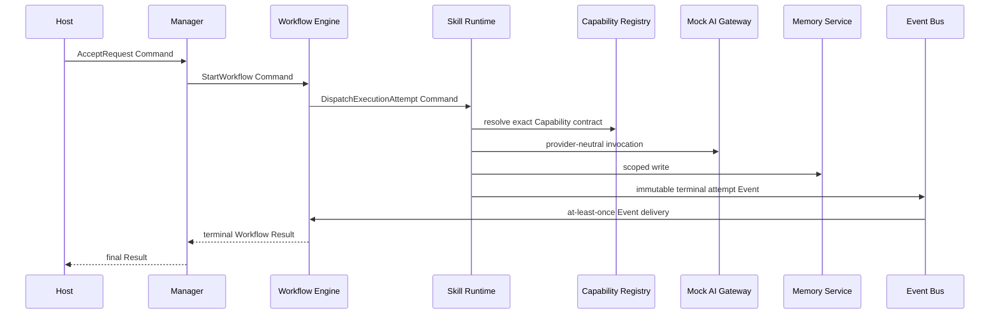

# Executable Reference Workflow

`HelloAIEOSWorkflow` is the first executable proof of AIEOS. It validates runtime boundaries; it is
not product functionality.

## Run locally

```text
./scripts/bootstrap
./scripts/run-host
```

Then submit:

```text
POST /reference/hello
{"message":"reference execution"}
```

The response is a frozen ES-007 Result projection. The host uses only local adapters.

## Execution path



Commands use the directed dispatcher and never Event Bus. A producer records an Event in the outbox
before publication. A reconstructed relay can resume pending delivery. Consumers treat duplicate
delivery as expected.

## Failure and retry

The mock AI adapter can be configured to fail before succeeding. Skill Runtime normalizes that
attempt as terminal. Workflow Engine evaluates the retry evidence and, when policy allows, creates a
new `CommandId`, `ExecutionId`, and incremented attempt number. The prior attempt remains immutable.

Timeout belongs to Skill Runtime's active attempt. A timeout emits a terminal timed-out attempt
Event; it does not grant retry authority.

## Local-only adapters

- in-process directed Command Dispatcher;
- events-only in-process Event Bus;
- recoverable shared in-memory outbox store;
- deterministic mock AI Gateway;
- Tenant/Workspace-scoped in-memory Memory repository; and
- in-memory ES-008 log recorder.

No adapter in this milestone is a production persistence or delivery guarantee.

## Validation

Run the canonical gate:

```text
./scripts/check
```

Focused tests cover success, retry identity, duplicate Command handling, scope isolation, outbox
recovery, timeout normalization, observability context, and host execution.
