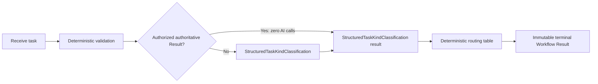

# ES-017 — Governed AI Workflow Execution

## Objective

Milestone 6 Phase 6 proves governed AI capabilities can safely participate in durable,
multi-step AIEOS Workflows while preserving deterministic orchestration, provider-neutral
execution, end-to-end security, idempotent recovery, cumulative cost governance, and complete
audit lineage.

The governing rule is: **Phase 6 adds AI to Workflows; it does not give AI control of
Workflows.** This is one reference-workflow integration proof, not product behavior.

## Authority and status

The frozen Phase 5 baseline is `4d016773768c3e8f9640c17324e920a3c1b73ca7`, tagged
`governed-structured-capability-v1.0`. [ES-016](ES-016-Governed-Structured-AI-Capability-Execution.md),
[ADR-001](../architecture/decisions/ADR-001-Authoritative-Result-Reuse.md),
[TDR-022](../runtime-architecture/decisions/TDR-022-AI-Usage-and-Cost-Accounting.md), and the
frozen Command, Result, Service Interface, Gateway, and accounting documents remain
authoritative. Nothing here approves implementation, changes a frozen contract, or reopens Phase 5.

This ES and [TDR-025](../runtime-architecture/decisions/TDR-025-Workflow-AI-Budget-and-Recovery.md)
require focused governance review before any implementation PR. They remain Draft/Proposed until
that review records a later status change.

## Related documents

| Relationship | Document |
| --- | --- |
| Frozen capability | [ES-016](ES-016-Governed-Structured-AI-Capability-Execution.md) |
| Reuse authority | [ADR-001](../architecture/decisions/ADR-001-Authoritative-Result-Reuse.md) |
| Workflow/Skill boundaries | [Service Interfaces](../architecture/ServiceInterfaces.md) |
| Commands and Results | [Command Contract](../architecture/CommandContract.md), [Error and Result Model](../architecture/ErrorResultModel.md) |
| Gateway/accounting | [AI Gateway Architecture](../architecture/AIGatewayArchitecture.md), [AI Usage and Cost Accounting](../architecture/AIUsageAndCostAccounting.md) |
| Budget/recovery decision | [TDR-025](../runtime-architecture/decisions/TDR-025-Workflow-AI-Budget-and-Recovery.md) |

## Version history

| Version | Date | Author | Notes |
| --- | --- | --- | --- |
| 0.2 | 2026-08-21 | CTO / Architect | Approved governance direction after review of `8e7f09bd7a036dd8935781dba6c960b196afcfef` with Blocking 0 / Major 0 / Minor 0; implementation remains prohibited until the separate contract-governance amendment is approved and merged. |
| 0.1 | 2026-08-20 | CTO / Architect | Initial Phase 6 governance Draft; implementation is not authorized. |

## Scope and reference workflow

The only Phase 6 reference Workflow is `ClassifyAndRouteTask`, at one immutable approved
definition version. It accepts one normalized statement and produces a deterministic queue route.
It creates no product task, sends no message, and performs no external effect.



`StructuredTaskKindClassification` is exactly the existing ES-016 capability contract version
`1`. The model may return only `Question`, `Instruction`, or `Statement`. It MUST NOT select a
step, queue, workflow definition, retry, budget action, cancellation action, or arbitrary
transition. Workflow Engine code interprets the contract-valid value with the fixed table below.

### Input contract

| Element | Requirement |
| --- | --- |
| `statement` | Required UTF-8 input; existing normalization is applied, then trimmed length is `1..512` Unicode scalar values. It is passed unchanged as ES-016 `{statement}` capability payload. |
| `AuthoritativeResultId` | Optional only through existing `DispatchExecutionAttempt` v2 metadata. It is never an input-payload member, policy member, or substitute for a task kind. |
| Scope/authority | Verified `TenantId`, `WorkspaceId`, authorization context, relevant policy references, deadline/cancellation context, `WorkflowId`, `WorkflowStepId`, `ExecutionId`, `CommandId`, and capability contract/version propagate at their existing applicable boundaries. |
| Workflow budget | An immutable workflow-level envelope is a required approved-policy input before an AI-capable step may be scheduled. Its additive contract review gate is below. |

### Output and routing contract

The terminal Workflow success Result contains only the provider-neutral reference-workflow
projection: `task_kind`, `route`, immutable Workflow/step/execution Result references, and safe
governance evidence references. It MUST NOT contain provider/model identity, provider attempt
identity, raw prompt/output, credential, or provider payload.

| Contract-valid `task_kind` | Deterministic route | Terminal success projection |
| --- | --- | --- |
| `Question` | `question_queue` | `{task_kind: "Question", route: "question_queue"}` |
| `Instruction` | `instruction_queue` | `{task_kind: "Instruction", route: "instruction_queue"}` |
| `Statement` | `information_queue` | `{task_kind: "Statement", route: "information_queue"}` |

The route is a terminal reference-workflow value, not an external queue dispatch. An absent,
additional, malformed, or incompatible classification is a terminal failed attempt and is never
mapped by heuristic, default, or model-assisted recovery.

## Lifecycle, Results, and Errors

Command acknowledgement/acceptance and business completion are distinct immutable facts.

| Stage | Owner | Required semantics |
| --- | --- | --- |
| Receive/validate | Workflow Engine | Validate definition/version, exact input, Workflow state, scope, authorization, policy, cancellation/deadline, idempotency, and budget evidence before a step dispatch. Invalid input, authority, reference, or budget evidence fails closed with no AI call. |
| Accepted | Skill Runtime / AI Gateway | `DispatchExecutionAttempt` acknowledgement accepts one `ExecutionId`; Gateway acceptance creates one `AIInvocationId`. Neither means classification or Workflow completion. |
| Terminal attempt | Skill Runtime | Emit one immutable success, rejection, failure, timeout, or cancellation outcome for the `ExecutionId`, preserving normalized Gateway Result/Error and lineage. A terminal attempt is never rerun. |
| Transition | Workflow Engine | Consume valid terminal evidence once; apply only the fixed table to a successful contract-valid classification; persist one resulting transition. It alone evaluates approved retry policy. |
| Terminal Workflow | Workflow Engine | Produce exactly one immutable terminal Workflow Result: success only after deterministic route; otherwise existing normalized failure, cancellation, timeout, or rejection with preserved cause. Late/duplicate facts cannot overwrite it. |

Gateway timeout, provider-effect ambiguity, capability rejection, repair exhaustion, cancellation,
and policy/budget rejection retain their existing provider-neutral terminal Result/Error semantics.
Ambiguous post-dispatch provider effect is not success, does not fail over, and does not cause a
Gateway Workflow retry. Workflow Engine acts only through approved retry policy after recording a
terminal attempt fact.

## Ownership and provider-neutrality

| Concern | Sole accountable owner | Boundary |
| --- | --- | --- |
| Definition interpretation, validation/routing, state/checkpoints, cancellation, terminalization, retry decision, Workflow budget envelope | Workflow Engine | Never executes a Skill or calls Gateway/provider. |
| One `ExecutionId`, reuse validation, capability execution, attempt lifecycle, timeout/cancellation propagation | Skill Runtime | Never creates a Workflow retry or transition. |
| Capability contract/catalog metadata | Capability Registry | Resolves only approved ES-016 capability/version; never orchestrates. |
| `AIInvocationId`, routing, provider retry/failover, schema validation/repair, provider usage/cost/reservation/reconciliation | AI Gateway | Never owns Workflow state, Workflow retry, or a Workflow-budget decision. |
| Provider protocol, credentials, model identity, provider attempt detail | Provider adapter inside Gateway | Never reaches Workflow contract/route/product behavior. |

The mandatory optimization order is: **(1) deterministic logic; (2) authoritative durable result
reuse; (3) governed AI invocation only if needed.** Deterministic validation and valid reuse occur
before `InvokeAI`. Valid reuse creates a new execution and terminal Result with source lineage, but
no `AIInvocationId`, Gateway call, provider call, or model token use. It records bounded avoided-call
evidence and zero actual provider cost. Gateway exact-cache remains an accepted invocation under
frozen semantics and is not this bypass.

## Workflow AI budget and accounting

Workflow Engine owns admission to the workflow-level AI budget envelope and makes a durable,
serialized remaining-budget decision before each AI-capable step. AI Gateway remains authoritative
for actual provider usage/cost and its existing `AIInvocationId` reservation/reconciliation
lifecycle. Workflow must not copy, re-price, or operate a second cost ledger.

For each candidate AI step, Workflow Engine reads the canonical durable accounting evidence
allocated to exact `TenantId`, `WorkspaceId`, and `WorkflowId`, including settled actual cost plus
conservative committed/reserved exposure as TDR-025 specifies. It checks remaining envelope before
dispatch. A bypass/reuse has zero provider cost; avoided savings are evidence, not spend. Gateway
provider attempts, fallback, and permitted repair stay cumulative inside one `AIInvocationId` and
never reset Workflow remaining budget.

Required privacy-safe Workflow evidence: AI calls made; AI calls avoided; input/output/total token
categories with measured/estimated/unavailable status; cumulative Workflow AI cost; remaining
Workflow AI budget; and provider-attempt/fallback counts only where existing Gateway evidence
exposes them. It is allocation/audit evidence, never duplicate accounting authority. Missing,
stale, cross-scope, non-monotonic, or inconsistent accounting evidence fails closed before another
provider dispatch.

## Recovery, idempotency, concurrency, cancellation, and timeout

- Same-command redelivery returns its existing acceptance or terminal disposition; it never creates
  a second execution, result, budget commitment, `AIInvocationId`, or provider dispatch.
- A Workflow retry is a Workflow Engine decision after a terminal attempt; it creates new
  `CommandId`/`ExecutionId` and increments attempt number, retaining `WorkflowId` and correlation.
  Gateway has no Workflow retry loop.
- Cross-worker duplicate advance, admission, terminalization, and event consumption require durable
  Workflow concurrency control. One worker owns the next step; competitors observe outcome/conflict
  and cannot spend twice.
- Before provider dispatch, recovery uses durable step/admission evidence and does not create an
  invocation just because a worker restarted. After provider completion, recovery resolves existing
  Gateway `AIInvocationId`, effect, usage, and terminal-intent evidence and does not call again.
- Unknown/ambiguous dispatch, including read timeout after dispatch may begin, is
  `AI_PROVIDER_EFFECT_AMBIGUOUS`, blocks Gateway failover, and becomes terminal attempt evidence.
- Cancellation prevents new steps and propagates to active owners. Cancellation/timeout races and
  late provider/attempt events cannot change a terminal Workflow Result; unconfirmed cancellation
  is represented honestly, never as success.

## Security, isolation, and audit lineage

Every owner revalidates exact `TenantId`, `WorkspaceId`, authorization context, relevant policy
references, capability contract/version, and time/cancellation constraints at its trust boundary.
For reuse, Skill Runtime also verifies read authorization, immutable terminal success, exact
scope/capability/version/input compatibility, and current invocation authority. Cross-tenant,
cross-workspace, unauthorized, malformed, stale, nonterminal, or incompatible references fail
closed before AI invocation.

Normal invocation lineage is durable and resolvable:

```text
WorkflowId -> WorkflowStepId -> CommandId -> ExecutionId -> capability execution -> AIInvocationId -> ResultId
```

Bypass/reuse lineage is:

```text
WorkflowId -> WorkflowStepId -> ExecutionId -> AuthoritativeResultId -> new ResultId
```

Reuse MUST NOT fabricate `AIInvocationId`. Raw statements/prompts/outputs, credentials, and raw
provider payloads stay outside default audit/telemetry; protected evidence may retain the canonical
digest required by ES-016 compatibility checks.

## Mandatory durability matrix and acceptance thresholds

Implementation evidence requires deterministic unit/integration and mandatory real PostgreSQL
coverage for every row. No required PostgreSQL case may be skipped. Each asserts exact scope,
identity, lineage, terminal uniqueness, call counts, and accounting effects.

| Scenario | Required proof |
| --- | --- |
| Normal completion | One deterministic route and one immutable terminal Workflow Result. |
| Deterministic bypass | Zero model/Gateway/provider calls and zero actual provider cost. |
| `AuthoritativeResultId` reuse | Valid source lineage, new Result, zero model/Gateway/provider calls. |
| Duplicate Workflow command | Existing disposition reused; no duplicate step, spend, or terminal Result. |
| Concurrent duplicate workers | Durable contention admits one effective transition/charge only. |
| Crash before AI dispatch | Restart reconciles without a provider effect. |
| Crash after provider completion | Existing effect, `AIInvocationId`, usage, and terminalization reused; no second effect. |
| Unknown/ambiguous provider dispatch | Fail closed, no Gateway failover or duplicate provider call. |
| Gateway timeout | Provider-neutral terminal timeout/ambiguity; Workflow does not invent success. |
| Capability rejection | Terminal rejection with no route/default classification. |
| Workflow cancellation | No new step after cancellation; late outcome cannot replace terminal cancellation. |
| Process/worker restart | Durable checkpoint, budget evidence, exactly-once terminalization survive. |
| Cross-tenant result reuse | Rejected before AI invocation with zero calls. |
| Cross-workspace result reuse | Rejected before AI invocation with zero calls. |
| Unauthorized capability invocation | Rejected before capability/Gateway execution with zero calls. |
| Budget exhaustion before another AI call | Fail closed; no new provider dispatch. |
| Provider failover | Existing bounded Gateway semantics, one `AIInvocationId`, cumulative cost. |
| Structured repair | Existing bounded Gateway semantics, one `AIInvocationId`, cumulative cost. |
| Repair exhaustion | Terminal failure; no capability/model retry. |
| One immutable Workflow terminal result | Duplicate/late/restarted processing cannot overwrite/create another. |

Release eligibility requires 100% pass of required deterministic/PostgreSQL matrix cases, zero
required skips, 100% exact route mapping, 100% zero-call proof for bypass/reuse/rejection, zero
duplicate provider dispatches/charges in recovery/concurrency, and `git diff --check`, documentation
link/Mermaid, formatting, type, canonical regression, security, and frozen-scope checks green. Any
security, identity, lineage, terminal-uniqueness, accounting, or durability assertion failure blocks
release.

## Frozen-contract compatibility and mandatory review gate

Inspection found frozen contracts already define `WorkflowId`, `WorkflowStepId`, `CommandId`,
`ExecutionId`, `AIInvocationId`, `ResultId`, `AuthoritativeResultId`, scope/authorization
propagation, per-invocation reservation/recovery, allocation references, and retry ownership. None
may be overloaded for a Workflow budget.

They do not define a typed, immutable, durable per-Workflow AI budget envelope or its versioned
source in Workflow definition/policy contract. That is a genuine additive gap for cumulative
enforcement across restart/workers. The smallest proposed amendment, for focused review only, is a
versioned, authority-bearing Workflow policy/definition member identifying immutable maximum
governed cost, currency/reference unit, and policy/version, persisted with the Workflow instance
and propagated as existing policy context. It is not a new canonical identity, free-form metadata,
Gateway-owned Workflow state, or second ledger. Exact shape needs separate additive contract
governance approval before implementation. This PR changes no frozen contract, runtime, provider,
or schema.

## Explicit exclusions and next step

Phase 6 excludes RAG; embeddings/vector databases; semantic cache; browser automation;
tools/function calling/MCP; autonomous planning; dynamic workflow generation; model-driven
transition selection beyond governed classification; provider #3; long-term Memory ownership
changes; multi-agent collaboration; YouTube/product Workflows; UI; deployment infrastructure; and
any merge/tag/release/freeze mutation of Phase 5.

No implementation may begin from this Draft. The exact next step is focused GPT-5.6 Sol governance
review of ES-017 and TDR-025, including the additive budget-envelope contract gate. Only explicit
approval followed by a separate implementation Draft PR may authorize code. Later Phase 6 release
requires the thresholds above, recorded PostgreSQL evidence, rollback to frozen Phase 5 if
governance/validation fails, immutable SHA alignment, and final recorded freeze decision.
