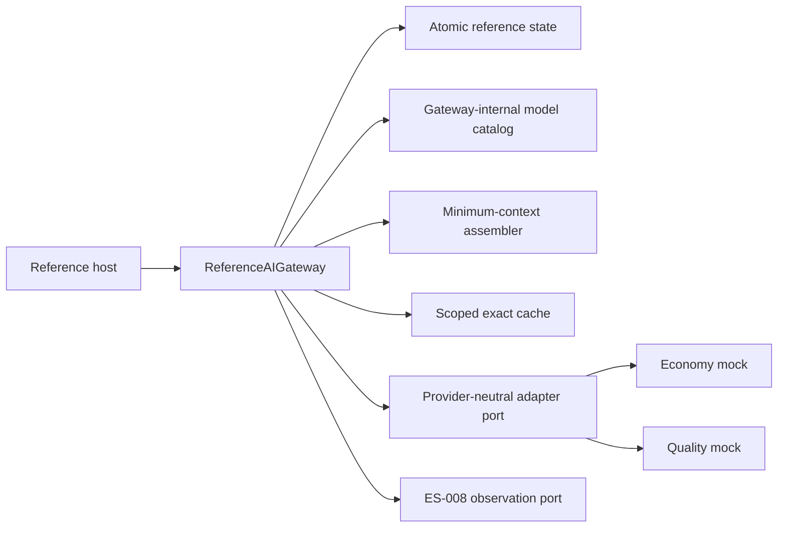
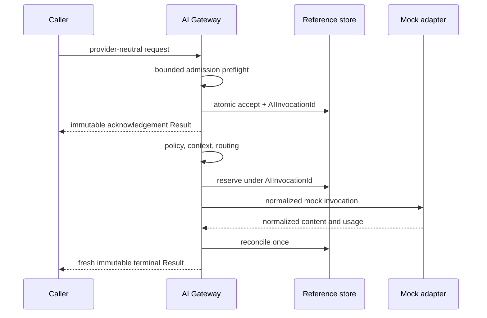

# AI Gateway Reference Implementation

## Purpose

This document describes the offline implementation of
[ES-013](../engineering-specifications/ES-013-AI-Gateway-Reference-Implementation.md). It proves the
frozen [AI Gateway architecture](../architecture/AIGatewayArchitecture.md) without a real provider.

## Runtime structure

`ReferenceAIGateway` implements the established `invoke` port and adds explicit `accept`, `execute`,
and `stream` operations for conformance tests and the reference host. `ReferenceGatewayStore`
atomically owns admission replay, invocation records, budget reservations, exact content cache, and
usage reconciliation for the offline runtime. It is an adapter seam, not a new platform component.

## Invocation flow

Admission replay is keyed by Tenant/Workspace and scoped `IdempotencyKey`; payload mismatch fails.
Every post-acceptance budget transition is keyed by `AIInvocationId`. Workflow retry remains outside
the Gateway.

## Routing and token minimization

Candidates are removed when unhealthy, deprecated, incapable, below quality, outside context/output
limits, disallowed by adapter/residency policy, or above the hard cost ceiling. Remaining candidates
sort by estimated cost, latency tier, then stable internal key. Context is sorted by mandatory status,
relevance, and stable reference; duplicate reference/version pairs are removed. Optional content is
truncated before mandatory policy/evidence content.

## Cache and lineage

The exact cache key includes scope, template version, normalized task content, capability set,
selected context-version digest, schema, safety policy, locale, and output limit. Values contain only
validated content, usage, expiry, and bounded provenance. A hit follows acceptance and creates a new
`AIInvocationId` and `ResultId`; prior authoritative identity or causation is never reused.

## Structured and streaming paths

Structured JSON is validated outside the mock model. A malformed value receives at most the configured
repair attempts and repair cannot weaken policy/schema. Streaming produces acknowledgement, stream
start, ordered deltas, usage, and one terminal Result. Deltas are never authoritative.

## Mock provider matrix

Two adapters model economy and quality tiers. Configurable behavior covers success, structured output,
streaming, transient/permanent failure, timeout, cancellation, malformed output, low confidence,
missing usage, and policy rejection. Both run entirely in process and have no SDK, credential, DNS, or
HTTP dependency.

## Local use

Run canonical validation with `./scripts/check`. Start the host with `./scripts/run-host`, then submit
`POST /reference/ai` with a prompt and idempotency key. The response exposes only safe invocation,
Result, route, usage, and cache metadata; it does not expose provider objects or credentials.

## Deferred work

Production provider adapters, durable Gateway storage, semantic cache, embeddings/vector retrieval,
provider tokenizer calibration, tool execution, product prompts, and AI Employee logic require later
reviewed milestones.

