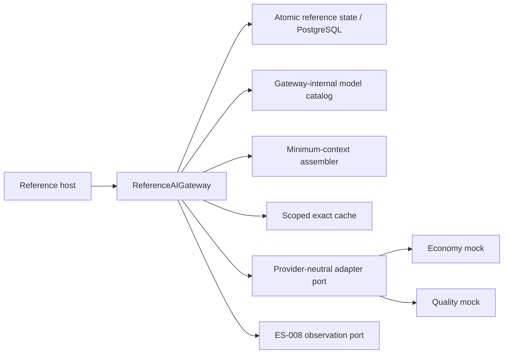
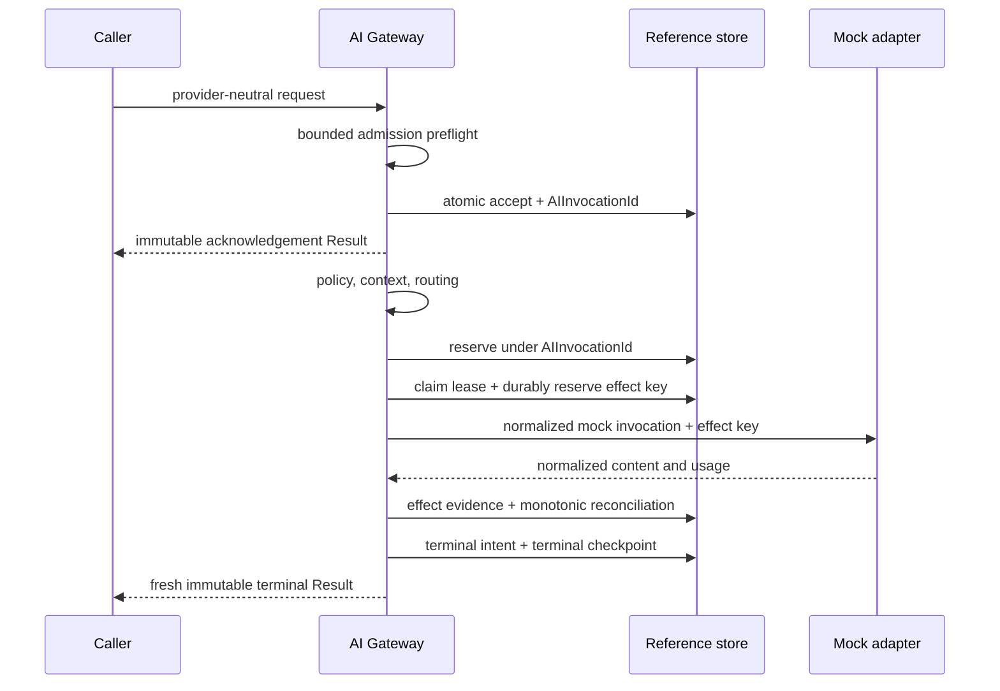

# AI Gateway Reference Implementation

## Purpose

This document describes the offline implementation of
[ES-013](../engineering-specifications/ES-013-AI-Gateway-Reference-Implementation.md). It proves the
frozen [AI Gateway architecture](../architecture/AIGatewayArchitecture.md) without a real provider.

## Runtime structure

`ReferenceAIGateway` implements the established `invoke` port and adds explicit `accept`, `execute`,
and `stream` operations for conformance tests and the reference host. `ReferenceGatewayStore`
atomically owns admission replay, invocation records, budget reservations, exact content cache, and
usage reconciliation for the offline runtime. It is an adapter seam, not a new platform component.
`PostgresAIGatewayStore` implements the same port with durable compare-and-set execution claims,
expiring leases, claim generations, provider-effect evidence, monotonic usage events, recoverable
terminal intents, and exactly-once authoritative terminal checkpoints.
An active executor renews its lease on a bounded heartbeat. Renewal, checkpoints, provider-effect
writes, accounting, terminal-intent installation, and terminalization are fenced by the current
owner and claim generation. A valid intent records the authorizing owner/generation and is immutable;
a reclaimer receives the next generation and stale workers cannot install or alter recovery state.

## Invocation flow

Admission replay is keyed by Tenant/Workspace and scoped `IdempotencyKey`; payload mismatch fails.
Every post-acceptance budget transition is keyed by `AIInvocationId`. A stale execution lease can be
reclaimed, but recovery continues the same invocation and never becomes a Workflow retry decision.
Concurrent workers either own the active claim or wait for its immutable terminal outcome.
Heartbeat loss is treated as ownership loss, not as a Workflow retry.

## Routing and token minimization

Candidates are removed when unhealthy, deprecated, incapable, below quality, outside context/output
limits, disallowed by adapter/residency policy, or above the hard cost ceiling. Remaining candidates
sort by estimated cost, latency tier, then stable internal key. Context is sorted by mandatory status,
relevance, and stable reference; duplicate reference/version pairs are removed. Optional content is
truncated before mandatory policy/evidence content.

## Cache and lineage

The exact cache key is finalized only for a successful effect and includes scope, template version,
the exact final canonical assembled system/task and
selected/truncated context content, context provenance and stage, input/output bounds, capability and
the actual successful model/adapter route, schema, safety/data/cache policy, locale, and deterministic
parameters. Lookup queries only the current assembled stage and selected route. Expanded-stage
identities become eligible after the corresponding escalation signal and assembly step; fallback
identities become eligible only after that route is selected. A cache hit cannot bypass bounded
context growth or fallback semantics, and a write is never placed under the initial stage/route. Values
contain only validated content, usage, expiry, and bounded provenance. A hit follows acceptance and
creates a new `AIInvocationId` and `ResultId`; prior authoritative identity or causation is never
reused.

## Structured and streaming paths

Structured JSON is validated and measured outside the mock model before success. A malformed value
receives at most the configured repair attempts; every repair is admitted against the remaining token
and invocation cost envelope and its actual usage is reconciled. Before a repair call, the store
persists a fenced, opaque provider idempotency/effect key. A fresh process can safely reissue a pending
effect with that same key or consume durable result evidence, then reconcile usage exactly once.
Streaming checks the cumulative
output bound before exposing each delta and durably records monotonic provider usage as it arrives.
Provider-reported partial usage outranks later estimates. Streaming produces acknowledgement, stream
start, ordered deltas, usage, and one terminal Result; deltas are never authoritative.
Stream-start, visible chunk sequence/content, monotonic usage, and terminal intent are checkpointed
before caller visibility. Because exact provider cursor resume is outside the frozen contract, a
restart after a nonterminal partial stream deterministically terminalizes ES-007, preserves durable
usage, does not restart the provider stream, and never reports false success.

## Explicit live PostgreSQL Gateway durability matrix

The CI PostgreSQL gate runs 20 AI Gateway-specific tests with zero skips, separately from the
repository-wide PostgreSQL count. They cover:

- acceptance/terminal restart replay and concurrent scoped admission;
- concurrent execution claim, stale reclaim, active-call heartbeat beyond the original TTL,
  generation advancement, stale-effect fencing, a concurrent reclaim race, and a cross-generation
  terminal-intent race in which only the valid generation authorizes recovery;
- persistence failure during terminal normalization and post-provider-effect/pre-accounting replay;
- stream crash after a durable chunk/usage boundary, failed chunk-checkpoint persistence, and
  terminal-checkpoint failure with the same replayed Result and preserved partial usage;
- structured-repair crash before durable effect recording with a fresh adapter and empty
  process-local effect cache, crash after repair effect before reconciliation, reservation
  expiry/release, and cumulative repair/fallback cap after restart;
- restart isolation proving an expanded-stage cache entry is not queried at the minimal stage;
- partial/delayed usage, reservation expiry, idempotent replay, and no double charge.

CI additionally runs migration parity/downgrade/upgrade, durable-runtime/outbox tests, cache durability,
and the zero-skip guard. The dedicated Gateway count is reported independently so aggregate coverage
cannot mask a missing Gateway crash boundary.

## Mock provider matrix

Two adapters model economy and quality tiers. Configurable behavior covers success, structured output,
streaming, transient/permanent failure, timeout, cancellation, malformed output, low confidence,
missing usage, and policy rejection. Both run entirely in process and have no SDK, credential, DNS, or
HTTP dependency.

## Local use

Run canonical validation with `./scripts/check`. Start the host with `./scripts/run-host`, then submit
`POST /reference/ai` with a prompt and idempotency key. The response exposes only safe invocation,
Result, route, usage, and cache metadata; it does not expose provider objects or credentials.

## Deferred work

Production provider adapters, semantic cache, embeddings/vector retrieval, provider tokenizer
calibration, tool execution, product prompts, and AI Employee logic require later reviewed milestones.
