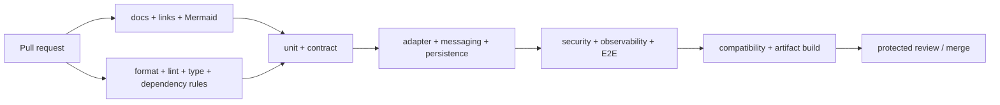

# Build, Test, and Release Strategy

## 1. Reproducible build

Python 3.13 and `uv` versions are pinned. `uv.lock` is committed. One repository command bootstraps, formats, lints, type-checks, validates boundaries/docs/contracts, and runs each test tier. Builds run offline after dependency resolution and produce source/wheel artifacts with commit provenance where packages require artifacts.

## 2. Test layers

| Layer | Subject | Real dependencies | Required evidence |
| --- | --- | --- | --- |
| Domain unit | values, identities, states, policies | none | branch/invariant coverage and property cases |
| Contract validation | envelopes, versions, schemas | real models/validator | valid, invalid, unknown-version, compatibility fixtures |
| Component unit | Manager and frozen components | in-memory ports, deterministic time/IDs | ownership, state, cancellation, timeout, Result/Error |
| Adapter contract | each port implementation | adapter and its sandbox/local dependency | common conformance suite |
| Messaging | directed Commands, Event delivery | local implementations | one target, events-only, redelivery, ordering boundary |
| Persistence | repositories and transactions | real PostgreSQL test instance | isolation, migration, optimistic concurrency, idempotency |
| Integration | multiple components | real local adapters | state plus emitted evidence |
| Concurrency/security | races and scoped access | real persistence/message adapter | no duplicate effects; no cross-scope access |
| Observability | ES-008 ports/adapters | test collector/store | propagation, redaction, immutable IDs, audit gate |
| E2E | Hello World Request-to-Result | full host, mock external providers | success/failure/retry/resume/cancel/timeout |

Do not mock frozen contracts, domain transitions, serialization, authorization checks, or repository conformance. External AI/tools, wall clock, random IDs, sleep/backoff, and network faults use deterministic fakes.

## 3. CI flow

Fast checks run first and may run in parallel. Integration tiers use isolated services and deterministic seeds. Main repeats required gates and produces provenance. Scheduled jobs MAY add dependency audit, mutation/property expansion, recovery, and performance baselines; they do not replace PR gates.

## 4. Quality tooling

- Ruff is the formatter/linter baseline.
- Pyright strict mode is the primary static type gate; mypy-compatible annotations are preferred.
- pytest and AnyIO run tests; Hypothesis is used for state/invariant/idempotency properties.
- Dependency-boundary tooling enforces [Dependency Rules](Dependency-Rules.md).
- Schema snapshots detect breaking contract changes.
- Markdown links, front matter, terminology, and Mermaid blocks are validated.

Material tool changes require a TDR. Tool configuration is centralized and packages may tighten but not weaken it.

## 5. Compatibility and releases

Runtime distribution versions and frozen contract versions are distinct. Compatibility gates compare public API and generated schema snapshots. Breaking contract changes require the applicable governance review and new contract version before runtime adoption.

Initial internal packages release together from one commit. Tags use `runtime-v<major>.<minor>.<patch>` after executable releases begin; documentation freeze tags remain separate. Release notes identify frozen-baseline versions, migrations, configuration changes, rollback target, and known limits.

## 6. Branch and protection expectations

`main` is releasable. Pull requests require review, passing required checks, resolved threads, and current base. Direct pushes and force pushes are disabled. CODEOWNERS should cover frozen contracts, runtime architecture, security, and component packages once owners exist. Changes to dependency rules, public contracts, migrations, or security require designated review.

## 7. Rollback and migrations

Artifacts are immutable and traceable to a commit and lockfile. Rollback selects a known-good artifact and compatible configuration. Data changes use expand/migrate/contract; the rollback plan accounts for data written by the new version. Model/prompt/policy changes are versioned release inputs even without code changes.

## 8. Definition of green

A change is green only when formatting, lint, strict types, dependency rules, unit/contract tests, relevant adapter/integration tests, security and observability conformance, docs validation, and compatibility checks pass. Exceptions are time-bounded, owned, documented, and cannot bypass frozen governance.
