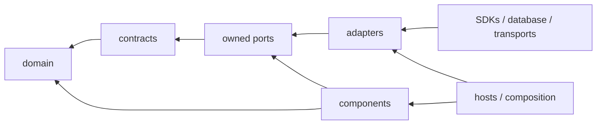

# Runtime Dependency Rules

## 1. Direction

Dependencies point inward: hosts and adapters depend on component ports; components depend on domain and contracts; domain depends on no AIEOS package. Ports are owned by the component whose need they express.



## 2. Dependency matrix

`A` means allowed; `C` means allowed only from composition; `—` means forbidden.

| From / To | Domain | Contracts | Support | Component ports | Other component implementation | Adapters | Hosts |
| --- | ---: | ---: | ---: | ---: | ---: | ---: | ---: |
| Domain | A | — | — | — | — | — | — |
| Contracts | A | A | — | — | — | — | — |
| Support | A | A | A | — | — | — | — |
| Component | A | A | A | A | — | — | — |
| Adapter | A | A | A | A | — | A | — |
| Host/composition | A | A | A | C | C | C | A |
| Tests | A | A | A | A | A | A | A |

Components may invoke another component only through its public service port. They may not import its `_internal` package, repository model, adapter, or handler implementation.

## 3. Frozen behavioral rules

- Manager may request Workflow operations; it never executes or advances workflows.
- Workflow Engine dispatches `DispatchExecutionAttempt` through Command Dispatcher; it never calls Skill implementation code.
- Skill Runtime runs one attempt and cannot choose retry, create a retry attempt, or mutate Workflow state.
- AI provider SDKs exist only inside AI Gateway adapters.
- Memory storage SDKs exist only in Memory Service persistence adapters.
- Capability Registry resolves contracts/implementations; it never executes Skills or owns retry.
- Event Bus imports Event contracts only and rejects Command envelopes.
- Command Dispatcher routes directed Commands to one accountable handler and never publishes them to Event Bus.
- Observability observes; it does not decide state, authorization, or retry.

## 4. Forbidden import examples

```python
# forbidden: domain depending on infrastructure
from sqlalchemy import select

# forbidden: Workflow Engine bypassing Skill Runtime
from aieos.skill_runtime._internal.executor import execute_skill

# forbidden: Skill Runtime acquiring retry authority
from aieos.workflow_engine._internal.retry_policy import RetryPlanner

# forbidden: direct provider use outside an AI Gateway adapter
from openai import AsyncOpenAI

# forbidden: command transported by Event Bus
from aieos.event_bus import publish_command

# forbidden: cross-owner persistence access
from aieos.memory_service._internal.tables import MemoryRow
```

Approved equivalents import domain values, frozen contracts, or the owning component's port.

## 5. Enforcement

CI SHALL combine:

1. package metadata validation;
2. static import graph rules;
3. forbidden dependency pattern checks;
4. public API snapshot checks;
5. adapter contract suites;
6. architecture tests that instantiate the composition graph.

Waivers require an owner, reason, expiry, and decision record. A waiver cannot override a frozen baseline.

## 6. Runtime cycles

Cross-component collaboration that would create an import cycle uses Commands, Events, or narrow public ports. Event consumers are registered from the composition root. Domain objects never hold live service references. Callbacks must implement an owned port and cannot become a hidden service locator.

## 7. Provider and persistence isolation

Provider-specific request/response/error types are translated inside adapters before crossing inward. Repository adapters map rows/documents to domain models before returning. Migration code may import persistence models but never domain component internals. Contract/domain packages cannot depend on generated database or provider types.
