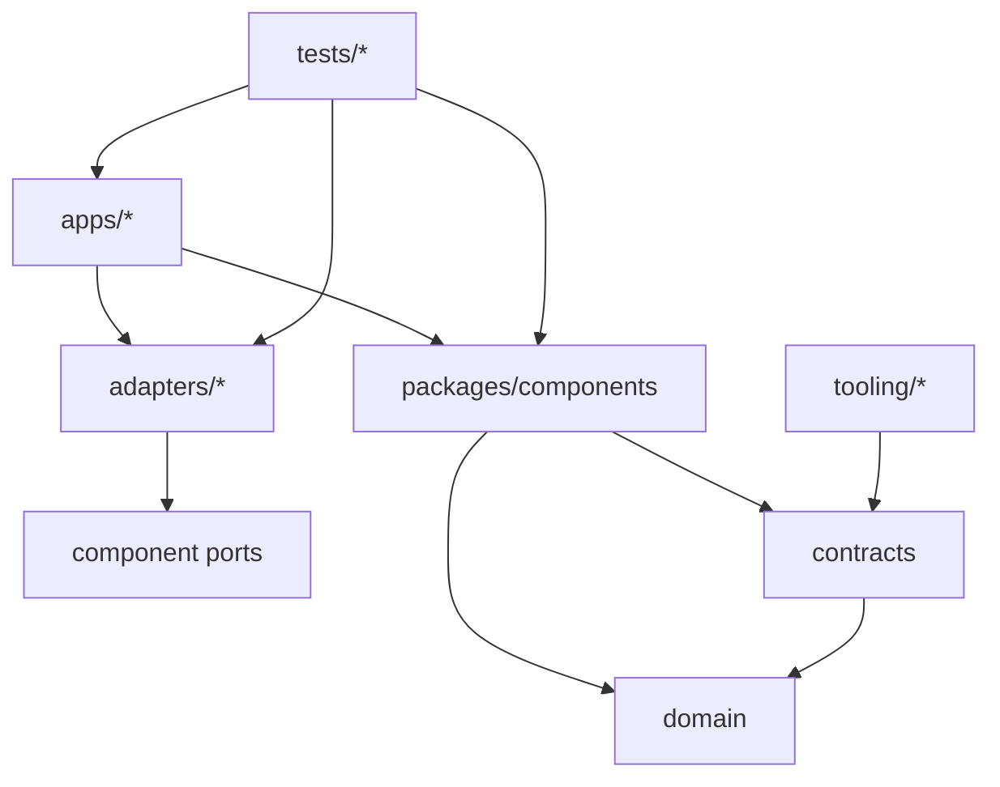

# Repository Layout

## 1. Principles

The repository is a Python monorepo managed as a `uv` workspace. Packages reflect frozen ownership, not deployment units. Public packages expose ports and contracts; implementation and adapter modules are internal. Generated artifacts are reproducible and never edited manually.

## 2. Proposed tree

```text
AIEOS/
├── apps/
│   └── api/
│       ├── src/aieos_api/
│       │   ├── composition.py
│       │   ├── ingress/
│       │   ├── lifecycle.py
│       │   └── main.py
│       └── tests/
├── packages/
│   ├── domain/
│   │   ├── src/aieos/domain/
│   │   └── tests/
│   ├── contracts/
│   │   ├── src/aieos/contracts/
│   │   │   ├── commands/
│   │   │   ├── events/
│   │   │   ├── results/
│   │   │   ├── errors/
│   │   │   ├── observability/
│   │   │   └── services/
│   │   ├── schemas/                 # generated, reproducible
│   │   └── tests/
│   ├── manager/
│   ├── authentication/
│   ├── workspace/
│   ├── workflow_engine/
│   ├── skill_registry/
│   ├── skill_runtime/
│   ├── ai_gateway/
│   ├── memory_service/
│   ├── capability_registry/
│   ├── scheduler/
│   ├── analytics/
│   ├── notification/
│   ├── logging/
│   ├── configuration/
│   ├── command_dispatcher/
│   ├── event_bus/
│   ├── result_error_support/
│   ├── observability/
│   ├── security_support/
│   └── testing/
├── adapters/
│   ├── persistence_postgres/
│   ├── ai_mock/
│   ├── ai_provider_<name>/          # only after approval
│   ├── event_bus_in_process/
│   ├── command_dispatch_in_process/
│   ├── memory_persistence/
│   ├── observability_default/
│   └── secrets_environment/
├── examples/
│   └── hello_world_employee/
├── tests/
│   ├── integration/
│   ├── e2e/
│   ├── architecture/
│   ├── compatibility/
│   ├── concurrency/
│   └── security/
├── tooling/
│   ├── contract_codegen/
│   ├── dependency_rules/
│   └── docs_validation/
├── scripts/
├── docs/
├── .github/workflows/
├── pyproject.toml
├── uv.lock
├── .python-version
└── README.md
```

Every component package follows:

```text
packages/<component>/
├── pyproject.toml
├── src/aieos/<component>/
│   ├── __init__.py          # explicit public exports only
│   ├── ports.py             # owned abstractions
│   ├── service.py           # component behavior
│   └── _internal/           # private implementation
└── tests/
```

## 3. Package classifications

| Classification | Examples | Stability rule |
| --- | --- | --- |
| **Stable public** | `aieos.domain`, `aieos.contracts`, component `ports` | Versioned; compatibility checks required. |
| **Component public** | service operations frozen by ES-006 | Importable only through package exports. |
| **Internal** | `_internal`, handlers, repository implementations | No cross-package import. |
| **Adapters** | PostgreSQL, provider, telemetry, local messaging | Depend inward; independently contract-tested. |
| **Generated** | JSON Schemas and compatibility fixtures | Rebuilt in CI; source model is authoritative. |
| **Test-only** | fakes, deterministic clock/IDs, harnesses | Never imported by production packages. |

## 4. Ownership and interactions



The composition root is the only place permitted to import all components and adapters. An adapter belongs to the port it implements, not the external vendor. Examples use public packages only. CI configuration invokes repository scripts; business behavior never lives in scripts or workflows.

## 5. Build order

1. domain;
2. contracts and schemas;
3. Result/Error, observability, and configuration/security support;
4. component packages and message abstractions;
5. adapters;
6. hosts;
7. examples, integration, and E2E tests.

Cycles are prohibited. The boundary checker SHALL evaluate import graphs independently of whether Python can import the cycle.

## 6. Versioning

The monorepo has one source commit and lockfile. Public contract packages carry explicit contract versions separate from distribution versions. Initial internal packages release together until independent consumers require separate semantic versions. Generated schemas include source contract identity/version and commit provenance.

## 7. Adding a package

A new package requires an owner, classification, public boundary, dependency declaration, tests, documentation, and an identified frozen responsibility or approved decision. A package is not a new architectural component. New business boundaries require architecture review.
