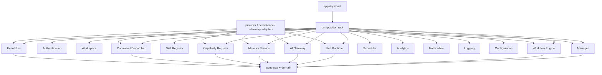
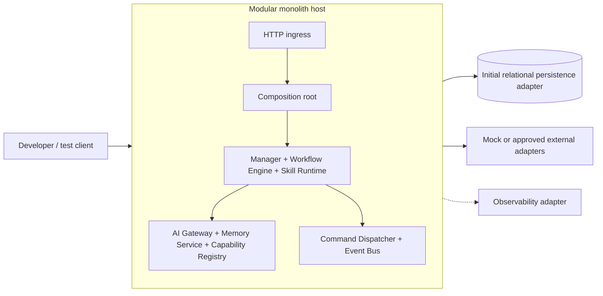
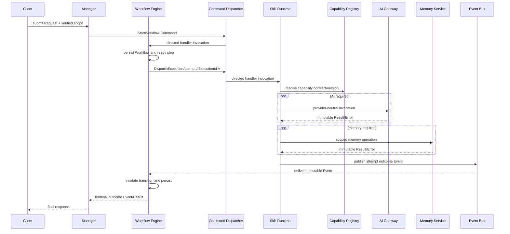
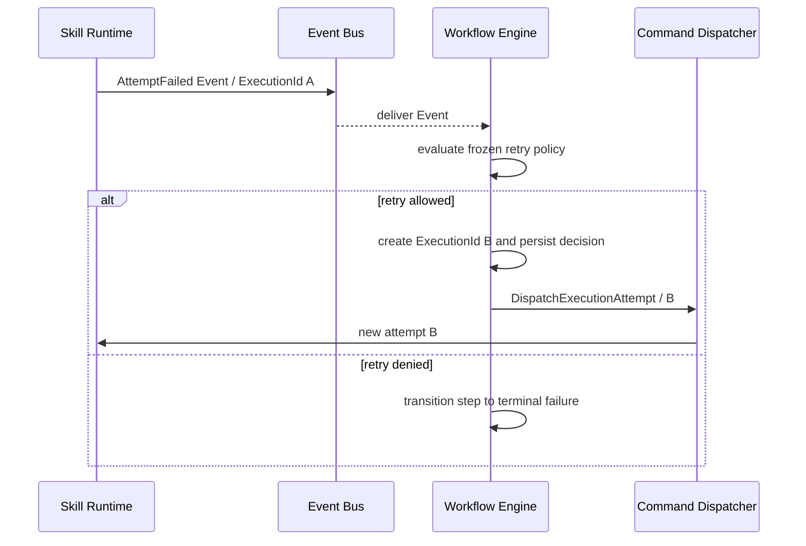
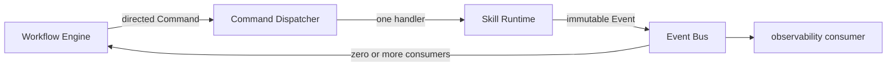
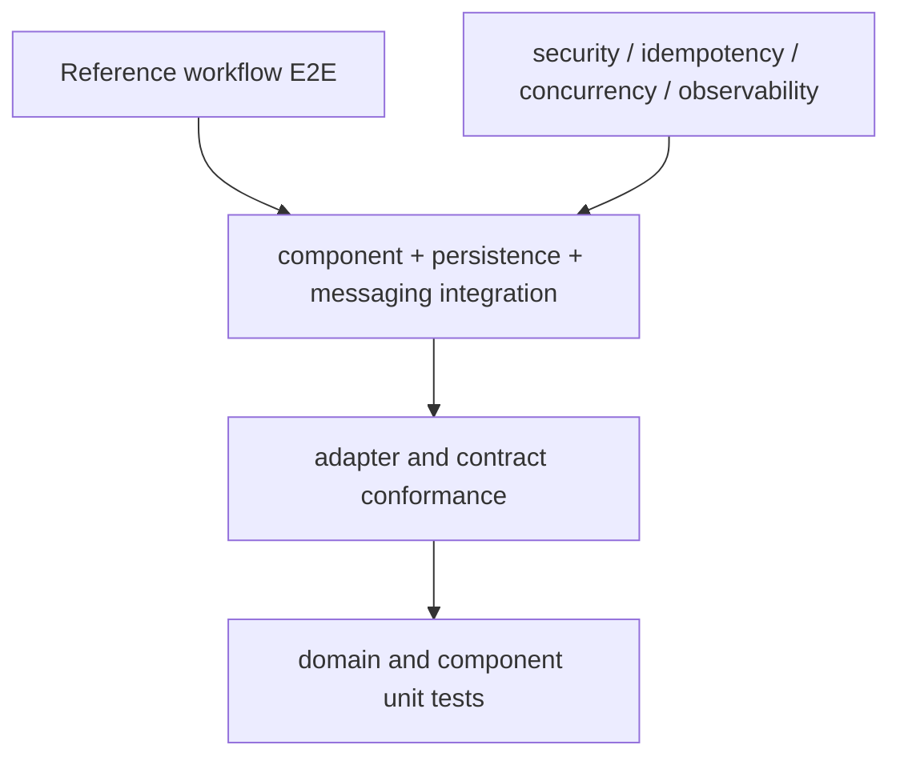
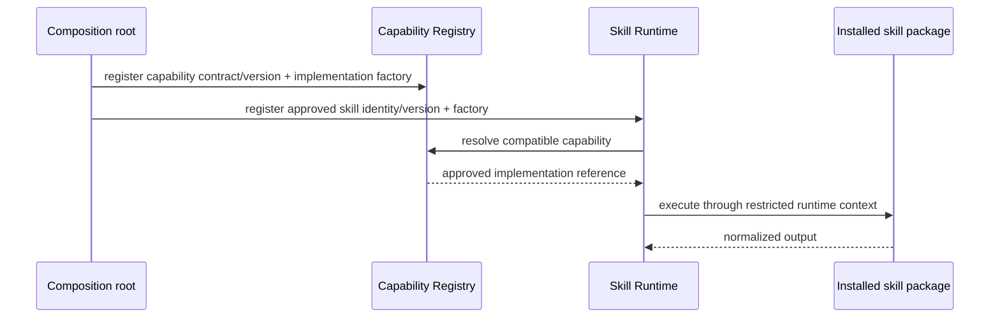

# Runtime Architecture v1.0

## 1. Purpose and authority

This document maps AIEOS's frozen design into a concrete first runtime. It is implementation-ready while remaining subordinate to [Architecture v1.0](../03-architecture/EngineeringBlueprint.md), [Domain v1.0](../architecture/DomainModel.md), [Execution Flow](../architecture/ExecutionFlow.md), and [ES-004 through ES-008](../engineering-specifications/README.md).

The initial runtime SHALL be a Python 3.13 modular monolith in one monorepo, assembled by one explicit composition root. It SHALL expose ports for command dispatch, event delivery, persistence, AI providers, observability, configuration, clocks, identifiers, and external tools. Provider adapters SHALL depend inward. No frozen business component becomes a microservice merely because it has a module boundary.

## 2. Goals, qualities, and non-goals

Runtime goals are correctness of frozen contracts, deterministic tests, resumability, idempotency, replaceable providers, clear ownership, strong typing, safe async I/O, tenant isolation, and diagnosability. Priorities are maintainability, correctness, testability, security, and delivery speed before throughput optimization.

The following are non-goals:

- production runtime implementation or database schema;
- business workflows or AI YouTube Employee logic;
- cloud provisioning, production deployment, dashboards, or runbooks;
- provider credentials or production integrations;
- microservices, Kubernetes, remote plugin execution, or untrusted dynamic code;
- changing any frozen contract, lifecycle, identity, or component boundary.

## 3. Technology baseline

The selected baseline is CPython 3.13, `uv` workspace management, Pydantic v2 contract validation, FastAPI for the initial HTTP host, pytest with AnyIO, PostgreSQL through SQLAlchemy 2.x adapters, explicit constructor injection, and OpenTelemetry-compatible observability ports. These are runtime decisions, not domain dependencies. The [decision records](decisions/README.md) contain alternatives, consequences, and revisit triggers.

## 4. Layers and modules

The layers are:

1. **Domain** — identities, value objects, state transition rules, and invariants; no framework or I/O imports.
2. **Contracts** — immutable Command, Event, Result, Error, observability, and service-interface models.
3. **Application/runtime components** — frozen component behavior expressed against ports.
4. **Ports** — owned abstract interfaces for persistence, dispatch, events, providers, time, IDs, configuration, and telemetry.
5. **Adapters** — concrete database, HTTP, AI provider, tool, telemetry, and local transport implementations.
6. **Hosts/composition** — lifecycle, startup validation, wiring, ingress, shutdown, and process concerns.

### 4.1 Canonical module contracts

| Module | Responsibility and owned state | Public boundary | Allowed dependencies | Forbidden dependencies | Initialization, tests, extension |
| --- | --- | --- | --- | --- | --- |
| **Manager** | Interpret requests, accept/reject them, initiate approved workflows, manage interaction. Owns Request boundary state. | Manager service port and frozen Commands/Results. | Domain, contracts, auth/context ports, Workflow command port. | Skill execution, provider SDKs, direct workflow-state writes. | Stateless service wiring; unit and ingress contract tests; policies injected as ports. |
| **Authentication** | Establish and verify human/service identity and authentication-session boundaries. | Authentication service port and verified identity context. | Domain/contracts, credential/configuration ports, Logging. | Business authorization, workflow execution, credentials in AI context. | Startup adapter validation; identity, renewal, revocation, and credential-boundary tests. |
| **Workspace** | Own Workspace membership, resource ownership, policy references, and authorization decisions. | Workspace service and authorization ports. | Domain/contracts, Authentication context, Configuration, Logging. | Workflow or Skill execution, provider access, implicit single-user bypass. | Loads scoped policy state; membership, ownership, and cross-scope isolation tests. |
| **Workflow Engine** | Workflow definitions/instances, step state, retry decisions, new `ExecutionId`, pause/resume/cancel. | Workflow service and command handlers. | Domain, contracts, workflow repositories, Command Dispatcher, Event consumer port, clock/ID. | Skill implementations, provider SDKs, Event Bus command dispatch. | Recovers durable state before work; state-machine, concurrency, idempotency, replay tests. |
| **Skill Registry** | Catalog immutable Skill versions, contracts, required capabilities/tools, ownership, and compatibility status. | Skill lookup/registration port. | Domain/contracts, Capability Registry, Configuration, Logging. | Skill execution, workflow state, task dispatch, permission expansion. | Static approved registration initially; compatibility, duplicate, and unavailable-version tests. |
| **Skill Runtime** | Validate and run exactly one instructed execution attempt; normalize its Result/Error. | `DispatchExecutionAttempt` handler and execution port. | Domain/contracts, Skill Registry metadata port, Capability Registry, AI Gateway, Memory Service, tools, telemetry. | Retry decisions, workflow mutation, direct providers. | Registers approved local skill factories; attempt, cancellation, timeout, sandbox-boundary tests. |
| **AI Gateway** | Provider-neutral invocation, bounded provider retry/failover allowed by policy, normalization and usage. | AI invocation service port. | Contracts, policy/config ports, provider adapter ports, telemetry. | Workflow orchestration, skill loading, provider models escaping boundary. | Validates adapters/config at startup; adapter contract and fallback tests. |
| **Memory Service** | Scoped memory read/write/search and memory-record ownership. | Memory service port. | Domain/contracts, memory repository port, auth/scope, clock/telemetry. | Workflow state, provider-specific storage types. | Validates persistence capability; isolation, concurrency, and adapter contract tests. |
| **Capability Registry** | Register, discover, validate, and resolve versioned capability contracts to approved implementations. | Capability lookup/registration port. | Domain/contracts, manifest/config source, telemetry. | Skill execution, retry decisions, business workflow. | Static allowlisted registration at startup; compatibility and duplicate-registration tests. |
| **Scheduler** | Own schedules, time-zone/misfire rules, and production of idempotent due Workflow Commands. | Schedule service and due-command port. | Domain/contracts, Workflow command port, clock, persistence, Configuration, Logging. | Skill execution, publication, duplicate work after restart, retry decisions. | Disabled unless configured; schedule, restart-deduplication, time-zone, and misfire tests. |
| **Analytics** | Derive operational, cost, quality, and product measures with declared provenance. | Analytics ingestion/query ports. | Domain/contracts, Event consumer port, analytical persistence, Configuration. | Authoritative workflow state, retry decisions, silent success-definition changes. | Consumer registration from composition; definition, attribution, and provenance tests. |
| **Notification** | Deliver policy-approved informational, approval, escalation, and incident messages. | Notification command handler and delivery-status contracts. | Domain/contracts, Workspace context, Configuration, Event Bus, channel adapters. | Underlying decisions, approval inference, unnecessary protected context. | Approved adapters only; policy, minimization, delivery, and escalation tests. |
| **Logging** | Own structured diagnostic and audit-relevant record handling under ES-008. | Logging service port aligned with observability contracts. | Domain/contracts, Configuration, telemetry/audit persistence ports. | Authoritative domain state, secrets, hidden reasoning, business decisions. | Safe/no-op adapter available; identity, redaction, retention, and failure-policy tests. |
| **Configuration** | Own versioned validated settings, policies, feature controls, provider eligibility, and non-secret values/references. | Configuration snapshot and change-validation ports. | Domain/contracts, Authentication/Workspace context, Logging, secret-reference port. | Secret values, source-code behavior, unsafe defaults, unreviewed activation. | Immutable startup snapshot; precedence, rollback, compatibility, and reload-safety tests. |
| **Command Dispatcher** | Validate immutable envelope/routing metadata and invoke exactly one registered accountable target. | `dispatch(command) -> acknowledgement/result`. | Command contracts, handler registry, context/telemetry. | Target-owned authorization or idempotency, Event publication as command transport, workflow retry policy. | Fails startup on duplicate/missing targets; routing and metadata-propagation tests. |
| **Event Bus abstraction** | Publish and deliver immutable Event envelopes to registered consumers. | `publish(event)` and consumer registration. | Event contracts, event record/outbox ports, telemetry. | Commands, business transitions, global-order promises. | In-process adapter initially; duplicate, ordering-boundary, replay, consumer idempotency tests. |
| **Domain/contracts** | Canonical frozen semantics. | Versioned immutable models and pure validation. | Standard library and approved validation primitives only. | Hosts, framework, database, network, provider SDKs. | Imported everywhere inwardly; exhaustive unit/compatibility tests. |
| **Result/Error support** | Factories and validation implementing ES-007 without redefining it. | Frozen Result/Error models and constructors. | Contracts/domain only. | Retry decisions, logging side effects. | Pure; mapping and partial-result property tests. |
| **Observability support** | Context propagation and abstract log/trace/metric/audit/health ports. | ES-008-aligned ports and middleware contracts. | Contracts/domain. | Business-state mutation or retry authority. | No-op/test adapter always available; conformance and redaction tests. |
| **Security support** | Carry trusted component identity, authorization context, and secret-reference access for owning components. | Security context and secret-reference support ports. | Contracts/domain; host environment adapter. | Business authorization ownership, embedded secrets, domain behavior. | Fail-fast validation; isolation and redaction tests. |

## 5. Composition and process boundaries

The initial executable is one API/worker host process. One composition root creates adapters, repositories, component instances, command handlers, event consumers, middleware, and lifecycle hooks. Imports never resolve dependencies from a global service locator. Background execution MAY use tasks inside the host during development, but durable workflow state remains authoritative.

The modular boundary is designed for later extraction: every component communicates through frozen contracts and owned ports. Extraction requires measured independent scaling, failure-isolation, deployment-cadence, security, or ownership need plus an ADR. Network latency is not introduced pre-emptively.

Horizontal scaling is deferred until persistence leases/optimistic concurrency, event claiming, and handler idempotency are implemented. Stateless hosts may then scale while Workflow and execution state remain in owned persistence. One logical Workflow Engine owner is enforced by concurrency control, not process identity.

## 6. Runtime execution

All ingress creates or propagates verified `TenantId`, `WorkspaceId`, `RequestId`, `CorrelationId`, authorization context, and observability context. Commands are dispatched directly to one accountable handler; they never use Event Bus. Events are immutable and may be duplicated. Consumers persist idempotency evidence with their owned state transition.

### 6.1 Cancellation, timeout, and retry

Cancellation travels as a directed command to the owning component and propagates to the active attempt through its cancellation port. A timeout terminates that attempt with a distinct TimedOut Result. Late results cannot overwrite terminal state.

Only Workflow Engine decides a workflow retry. Every retry creates a new `ExecutionId`; the prior attempt remains immutable. AI Gateway's bounded provider-level retry stays inside one `AIInvocationId` and never creates a workflow attempt.

## 7. Persistence architecture

Each frozen owner defines a repository port and controls writes to its logical data. One physical PostgreSQL database is selected initially, with separate schemas or table namespaces per owner and no cross-owner writes. SQLAlchemy adapters remain outside domain/contracts.

| Data | Logical owner | Atomic boundary and concurrency |
| --- | --- | --- |
| Request acceptance | Manager | Request state plus required audit acceptance where policy mandates it. |
| Workflow/step/retry decision | Workflow Engine | Workflow transition, new attempt identity, and event/outbox reference in one transaction where required. Optimistic version check. |
| Execution attempt | Skill Runtime | Attempt lifecycle and terminal Result reference; compare-and-set terminal transition. |
| Event record/outbox | Authoritative producer | Immutable Event and publish intent atomically recorded with owned state; delivery state is infrastructure metadata. |
| Command/idempotency receipt | Accountable target | Receipt, validation disposition, and duplicate response reference. |
| Result/Error | Producing owner | Immutable records; lineage references only. |
| Memory records | Memory Service | Tenant/Workspace-scoped versioned record transaction. |
| Capability contracts/versions | Capability Registry | Immutable version plus active registration metadata. |
| Audit records | Governance evidence boundary | Durable acceptance before governed effect when ES-008 requires it. |
| Configuration metadata | Configuration owner | Non-secret versions and secret references; never secret values. |

Repositories expose domain values, not rows. Migrations are ordered, reversible when practical, reviewed, and compatible by expand/migrate/contract. Schema details belong to a later data-design phase. Transaction isolation is chosen per invariant; cross-owner workflows use events and idempotency rather than distributed transactions.

## 8. Messaging architecture

The Command Dispatcher is an application port backed initially by an in-process registry keyed by canonical target and command type/version. Startup rejects duplicate handlers. Dispatch validates immutable envelope integrity, target/routing metadata, supported routing version, and required context propagation before invoking one handler. The accountable target revalidates schema and semantics, authorization, invariants, scope, version support, time constraints, and its target-owned idempotency receipt before accepting execution. Acknowledgement is a distinct immutable Result.

The Event Bus port publishes immutable event envelopes only. Its initial in-process adapter dispatches to registered consumers after authoritative event recording. A durable pending-delivery record is claimed at startup and during a bounded delivery loop; delivery disposition is recorded per `EventId` and consumer identity. A crash after recording but before or during delivery therefore leaves recoverable pending work. Unsuccessful delivery is redelivered under bounded infrastructure policy, while consumers remain idempotent and never infer a workflow retry decision. It does not promise global ordering; ordering is scoped only where a frozen contract declares it. A future broker adapter replaces only the transport/delivery port, not authoritative Event identity or consumer disposition semantics.

## 9. Configuration and secrets

Configuration is a typed, immutable startup snapshot assembled from safe defaults, versioned files, environment overrides, and secret references. Precedence is explicit. Production-impacting values require explicit configuration. Startup validates completeness, types, compatibility, scopes, and provider policy before accepting work.

Secret values are resolved only inside the adapter/composition boundary, never stored in config models, Commands, Events, prompts, logs, traces, fixtures, or client responses. Rotation uses stable references and adapter refresh hooks; hot reload is allowed only for fields declared reload-safe. Tenant/Workspace overrides are keyed by verified scope and cannot weaken platform policy. Tests use deterministic fake secrets and local development uses ignored environment files.

## 10. Security architecture

Ingress authenticates a principal and creates a signed/trusted authorization context. Each component revalidates permissions at its public boundary; scope is propagated but never inferred from payload. Repository ports require `TenantId` and `WorkspaceId`, and adapters enforce scope predicates. Component identities receive least-privilege access to their owned stores and external providers.

Provider credentials terminate at AI Gateway adapters. Tool credentials terminate at controlled tool adapters. Skill code receives capabilities, never raw credentials. Sensitive diagnostics follow ES-008 classification and redaction, and mandatory Audit Record acceptance precedes governed effects. Unknown contract versions, missing scope, invalid signatures, or ambiguous authority fail closed with ES-007 Errors.

## 11. Observability implementation

Runtime code depends on small observability ports: `Logger`, `Tracer`, `Meter`, `AuditWriter`, `HealthReporter`, and context propagation middleware. A context interceptor wraps every command handler, event consumer, service operation, and provider call. It validates `DataClassification` and `RedactionStatus`, preserves canonical lineage, and creates immutable record identities.

Adapters may implement OpenTelemetry-compatible tracing/metrics and structured logging, but no vendor model enters the ports. Audit persistence is separate from logs. Telemetry failure follows ES-008: mandatory audit acceptance gates governed effects; other telemetry failure is bounded and policy-driven without changing authoritative Results or retry ownership.

## 12. Testing architecture

- **Domain unit tests** exercise identities, values, transitions, and invariants with no I/O.
- **Contract tests** validate schemas, compatibility, Result/Error mapping, and unknown versions.
- **Component tests** use in-memory ports but real component logic.
- **Adapter contract tests** run every adapter against the same port suite.
- **Integration tests** use real persistence and local messaging boundaries.
- **Concurrency/idempotency tests** race duplicate commands/events and optimistic transitions.
- **Security tests** prove Tenant/Workspace isolation and least privilege.
- **Observability conformance tests** verify context, redaction, identities, and mandatory audit gating.
- **E2E tests** execute the Hello World workflow with mock external providers.

Do not mock domain objects, frozen contracts, state machines, serialization validation, or repository conformance. Mock only external provider boundaries and nondeterministic infrastructure. Inject `Clock`, `IdGenerator`, delay/backoff, provider behavior, and cancellation to make time, IDs, retries, and failures deterministic.

## 13. Extension model

Capabilities and skills are loaded only from trusted, locally installed, allowlisted packages in v1. Registration is explicit at composition time or through signed static manifests. No remote code download or runtime evaluation is allowed.

An extension declares identity/version, compatible contract versions, required capabilities, configuration schema, permissions, lifecycle hooks, and conformance tests. It may depend on public contracts and its own internals, never component internals or provider adapters. Activation validates compatibility and conflicts at startup. Isolation evolves to a process boundary only when risk or workload evidence justifies an ADR.

## 14. Coding and package conventions

- Python packages use `aieos_<area>` distribution names and `aieos.<area>` import namespaces where packaging permits; modules and operations use `snake_case`, types `PascalCase`.
- Public exports are explicit; `_internal` modules and adapter implementations are never imported across package boundaries.
- Commands use imperative names; Events use past-tense facts; handlers name their target operation.
- Contract/domain models are immutable and timezone-aware; identifiers are typed wrappers created by injected factories.
- Async APIs are used only for genuine I/O or cancellation boundaries; pure domain code remains synchronous.
- Cancellation and deadlines are explicit parameters/context, never hidden globals.
- Results/Errors follow ES-007; exceptions are translated at the owning boundary and never reported as success.
- Every public operation documents scope, authorization, idempotency, preconditions, postconditions, emitted Events, and failure Results.

## 15. Implementation plan

| Phase | Entry criteria | Deliverables | Validation and exit criteria |
| --- | --- | --- | --- |
| **2 — repository/tooling bootstrap** | Runtime Architecture approved. | `pyproject.toml`, uv workspace, package skeletons, formatting/lint/type/test commands, boundary checker, minimal CI. | Clean bootstrap on supported machines; no business behavior; CI green. |
| **3 — shared domain/contracts** | Tooling stable. | Typed IDs, immutable envelopes, Results/Errors, observability context, schemas. | Frozen contract fixtures and compatibility tests pass. |
| **4 — command/event infrastructure** | Shared contracts stable. | In-process Command Dispatcher and Event Bus ports/adapters; idempotency test stores. | Directed commands, events-only bus, duplicate tests, no business components. |
| **5 — component skeletons** | Messaging conformance passes. | Minimal ports/implementations for all frozen components: Authentication, Workspace, Manager, Workflow Engine, Capability Registry, Skill Registry, Skill Runtime, AI Gateway, Memory Service, Event Bus, Scheduler, Analytics, Notification, Logging, and Configuration. | Every frozen owner maps to one module; dependency rules and component contract suites pass. |
| **6 — mock adapters** | Component skeletons stable. | In-memory persistence, mock AI, memory, tools, telemetry, clock/IDs. | Deterministic failure/cancellation/timeout suites pass. |
| **7 — Hello World workflow** | Mocks and components pass. | Request-to-Result reference workflow exercising every boundary. | E2E success, failure, retry/new `ExecutionId`, cancellation, resume, and telemetry conformance. |
| **8 — hardening** | Reference flow passes. | Concurrency, persistence adapter, security isolation, recovery, performance baseline. | Architecture conformance review and runtime-v1 freeze candidate. |

## 16. Risks, mitigations, and revisit triggers

| Risk/trade-off | Mitigation | Revisit trigger |
| --- | --- | --- |
| Overengineering | Build only reference-flow-required ports/adapters. | A package has no consumer after Phase 7. |
| Premature distribution | One process and database; preserve ports. | Measured scaling, isolation, cadence, or ownership conflict. |
| Contract drift | Generated schemas/fixtures and compatibility gates. | Approved contract version change. |
| Provider leakage | Adapter contract tests and forbidden imports. | Provider feature cannot be represented safely. |
| Retry ownership drift | Workflow-only decision API; property tests. | Any component requests autonomous retries. |
| Observability coupling | Narrow ports and no business decisions in telemetry. | Mandatory evidence latency threatens objectives. |
| Persistence leakage | Repository ports and domain mapping. | Invariant cannot be expressed without persistence detail. |
| Plugin isolation | Trusted static allowlist; no remote loading. | Third-party ecosystem or untrusted extensions. |
| Multi-tenant security | Scope-required APIs, row predicates, isolation tests. | External tenants or regulatory obligations. |
| Schema/version evolution | Immutable versions, expand-contract migrations. | First breaking compatibility need. |
| Operational complexity | Single host, mock/local adapters, few dependencies. | Reliability evidence requires stronger infrastructure. |
| Python performance | Async I/O, profiling, process scaling before rewrite. | Sustained measured CPU bottleneck after optimization. |

## 17. Governance and traceability

Technology decisions use [TDRs](decisions/README.md). A new provider adapter that preserves ports is a runtime-only reviewed change. A new material dependency or topology requires a TDR/ADR. Changes to frozen ownership, identities, domain semantics, commands/events, retry authority, Results/Errors, or observability require the applicable architecture/domain/contract review and version change.

## 18. Acceptance criteria

- [ ] Every frozen component maps to one runtime module and retains its owner.
- [ ] Dependency direction and forbidden imports are explicit and enforceable.
- [ ] Every material technology choice has a decision record.
- [ ] Commands use directed dispatch; Event Bus carries Events only.
- [ ] Workflow Engine alone decides retries; every retry creates a new `ExecutionId`.
- [ ] Provider SDKs and persistence implementations remain adapters.
- [ ] Tenant/Workspace scope is explicit at every public and persistence boundary.
- [ ] Initial topology and future extraction criteria are justified.
- [ ] Build, test, release, local development, and implementation phases are actionable.
- [ ] Mermaid diagrams match prose, relative links resolve, and formatting validation passes.
